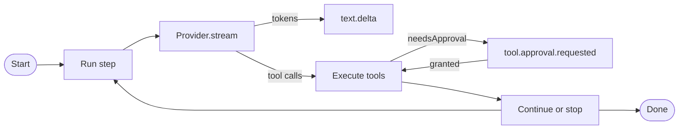
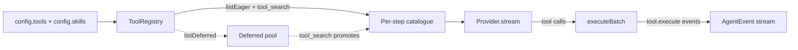

# Agent runtime

`@graphorin/agent` is the runtime layer of the framework. It owns the typed `model -> tool calls -> model` loop, the streaming event surface, durable human-in-the-loop approvals, multi-agent handoffs, agent-level model fallback, post-compaction hooks, per-tool model-tier hints, and a lateral-leak defense layer.

## Library-mode-first

Every primitive that is useful from a script ships from the npm package without the optional standalone server:

- `createAgent({...})`
- `runStateToJSON(state)` / `runStateFromJSON(serialized)`
- The filter library
- `evaluatorOptimizer({...})`
- `agent.fanOut({...})`
- `agent.progress.write(...)` / `agent.progress.read(...)`

Promote to the [standalone server](/guide/standalone-server) only when your assistant has to outlive a single Node.js process or expose a network API.

## Quick start

```ts
import { createAgent } from '@graphorin/agent';
import { createProvider, ollamaAdapter } from '@graphorin/provider';

const agent = createAgent({
  name: 'helpful-assistant',
  instructions: 'You are a helpful, concise assistant.',
  provider: createProvider(
    ollamaAdapter({ baseUrl: 'http://127.0.0.1:11434', model: 'qwen2.5:7b-instruct' }),
    { acceptsSensitivity: ['public', 'internal'] },
  ),
});

for await (const event of agent.stream('Plan a trip to Mars')) {
  if (event.type === 'text.delta') process.stdout.write(event.delta);
}
```

## Streaming-first

Every operation returns `AsyncIterable<AgentEvent<TOutput>>`. `agent.run(...)` is a thin "collect" helper that exhausts the stream. The discriminated `AgentEvent<TOutput>` union is exhaustive - every event type is its own typed interface - so an `assertNever(...)` default branch in YOUR handler (the helper ships in `@graphorin/core`; the example below defines it inline) turns an unhandled new event type into a compile error:

```ts twoslash
// A simplified shape that mirrors the @graphorin/core
// `AgentEvent<TOutput>` discriminated union. Hover any
// identifier below to see the inferred type.
type AgentResult<TOutput> = {
  output: TOutput;
  status: 'completed' | 'failed' | 'aborted' | 'awaiting_approval';
};
type AgentEvent<TOutput> =
  | { type: 'agent.start'; runId: string }
  | { type: 'step.start'; stepNumber: number }
  | { type: 'text.delta'; delta: string }
  | { type: 'tool.call.start'; toolCallId: string; toolName: string }
  | { type: 'tool.call.end'; toolCallId: string }
  | { type: 'tool.execute.start'; toolCallId: string }
  | { type: 'tool.execute.end'; toolCallId: string }
  | { type: 'tool.approval.requested'; toolCallId: string; reason?: string }
  | { type: 'context.compacted'; beforeTokens: number; afterTokens: number }
  | { type: 'agent.model.fellback'; from: string; to: string }
  | { type: 'agent.end'; runId: string; result: AgentResult<TOutput> };

function assertNever(value: never): never {
  throw new Error(`Unhandled event: ${JSON.stringify(value)}`);
}

function handle<TOutput>(event: AgentEvent<TOutput>): void {
  switch (event.type) {
    case 'text.delta':
      process.stdout.write(event.delta);
      return;
    case 'tool.call.start':
    case 'tool.call.end':
    case 'tool.execute.start':
    case 'tool.execute.end':
      console.log(event.toolCallId);
      return;
    case 'tool.approval.requested':
      console.log('approval needed for', event.toolCallId);
      return;
    case 'agent.model.fellback':
      console.log('fellback', event.from, '->', event.to);
      return;
    case 'agent.start':
    case 'step.start':
    case 'context.compacted':
    case 'agent.end':
      return;
    default:
      assertNever(event);
  }
}
```



## Tool execution in the loop

At `createAgent(...)` warm-up the runtime assembles one [`ToolRegistry`](/guide/tools) from `config.tools` and `config.skills`, resolves cross-source name collisions (`'auto-prefix'` by default), and binds a [`ToolExecutor`](/guide/tools) to it. You never construct either yourself - passing `tools` / `skills` is the whole wiring. The read-only `agent.registry` exposes the assembled registry for inspection.



Each step advertises only the **eager** tools (`registry.listEager()`) plus the built-in `tool_search`, sends them to the model with each tool's worked `examples` rendered into its `ToolDefinition` (see [worked examples](/guide/tools#worked-examples)), then dispatches the resulting calls through `executor.executeBatch(...)`. Handoff tools are advertised too, but routed to sub-agents rather than the executor.

Because execution now flows through the executor, several tool-classification fields documented in [Tools](/guide/tools) take effect **at runtime in the agent loop**:

| Field | Behaviour in the agent loop |
|---|---|
| `secretsAllowed` | **Enforced** - per-tool secrets ACL; a tool requesting a ref outside its ACL is denied. |
| `inboundSanitization` | **Enforced** - untrusted tool output is flagged / stripped / wrapped before it re-enters context. |
| `maxResultTokens` / `truncationStrategy` | **Enforced** - oversized results are truncated (default `16384` tokens), **text and structured object outputs alike**; the model sees the bounded text, never the full object. An over-cap structured output spills by default, storing the full body behind a handle (see [result handles](#result-handles-and-read-result)). |
| `needsApproval` | **Enforced** - the run suspends for durable HITL (below) *before* the call runs. |
| inline wall-clock timeout | **Enforced** (TL-4) - inline tools are bounded by the tier-resolved per-tool `timeoutMs` (or the executor default, 60s); a hanging tool that ignores `ctx.signal` fails with `ToolError({ kind: 'timeout' })` and the run continues. |
| `sandboxPolicy` | Resolved and surfaced on the `tool.execute` span / audit, but inline `config.tools` run **in-process** - out-of-process isolation applies to module-loadable skill / MCP tools and is wired when those land. |
| `memoryGuardTier` | **Enforced when `memory` is wired** (SDF-1) - the runtime binds a scope-aware region reader over working memory, and the executor snapshots/verifies the region around guarded calls. Without `memory` the guard is skipped with a one-time WARN. |

### Parallel dispatch

Independent tool calls in one step run **concurrently**, bounded by `maxParallelTools` (default `8`; set `1` to serialise). A tool tagged `executionMode: 'sequential'` never overlaps another. The loop emits `tool.execute.start` for every call up front in call order, and `tool.execute.end` / `tool.execute.error` after each settles - also in call order - so the lifecycle is deterministic regardless of completion order. Only the live `tool.execute.progress` / `tool.execute.partial` events interleave, each keyed by `toolCallId`.

### Deferred loading and `tool_search`

A tool declared `defer_loading: true` is **withheld** from the per-step catalogue to keep large tool sets out of context. When the registry holds at least one deferred tool, the runtime auto-registers the built-in `tool_search` tool. The model calls `tool_search({ query })` to find deferred tools by name / description; matched tools are promoted into the catalogue on the **next** step. Promotions are **append-only** - a newly promoted tool joins the *end* of the catalogue (in promotion order), so the eager prefix and any earlier promotions keep their byte position and the provider's prompt-cache breakpoint survives across steps. A deferred tool's `examples` stay out of context even once it is promoted.

### Result handles and `read_result`

A tool with `truncationStrategy: 'spill-to-file'` does more than truncate: the executor writes the full body to a run-scoped artifact and surfaces a `ResultHandle` on the result. The loop then inlines only the bounded **preview** plus a retrieval hint - so a large result never enters the context window **even when the tool returns a structured object** (which the executor now bounds and, on the default strategy, spills by default rather than inlining whole) - and auto-registers the built-in **`read_result`** tool whenever a registered tool **declares** `truncationStrategy: 'spill-to-file'` (or when `resultReaders` / code-mode are wired) - registration keys on the declared strategy, not on a runtime spill event. The model fetches just what it needs by byte range (`offset`/`length`) or line range (`startLine`/`endLine`). Handles are **opaque** (resolved only within the spill root - never an arbitrary-file read) and gated by **sensitivity**: a `sensitivity: 'secret'` tool is never spilled to the shared store. Reads also carry the **producer's taint** (TL-6): content read back from a handle whose producing tool was untrusted (MCP / web-search / untrusted skill) is re-sanitized with the producer's policy and recorded in the dataflow ledger under the producer's trust class - `read_result`'s own built-in trust never launders it. See [result handles](/guide/tools#result-handles-and-read-result) in the tools guide.

The same `read_result` path resolves **external** handles too. An MCP `resource_link` tool result surfaces a handle (the resource URI) rather than inlining the body; wire `createAgent({ resultReaders: [createMcpResourceReader({ clients })] })` and the loop composes those readers after the spill reader (tried in order, each rejecting handles it does not own), so the model pages an MCP resource on demand exactly like a spilled artifact. Supplying any `resultReaders` force-registers `read_result`. See the [MCP client guide](/guide/mcp-client#large-resources-and-result-handles).

### Code-mode (`toolInvocation: 'code-mode'`)

By default (`toolInvocation: 'direct'`) the model emits one provider tool-call per tool and each result is inlined into the conversation. Set `toolInvocation: 'code-mode'` to flip the model into **programmatic tool calling**: the agent advertises the meta-tools `code_execute` and `code_search` plus the built-in `read_result` (for paging spilled results out of scripts), and the model reaches every real tool by writing a script.

```ts no-check
const agent = createAgent({
  name: 'analyst',
  instructions: '…',
  provider,
  tools: [listOrders, fetchInvoice, summarize],
  toolInvocation: 'code-mode',
});
```

`code_execute({ source })` runs the model-written JavaScript in a `worker-threads` sandbox; inside, `await tools.<name>(args)` calls the real tool. **Only the script's `return` value re-enters the context window** - every intermediate result stays inside the sandbox. A workflow that would otherwise inline a dozen large tool results now costs context for the final answer alone (an order-of-magnitude reduction on result-heavy tasks). `code_search({ query })` returns the exact call signatures of tools on demand (progressive disclosure), so the model writes correct calls without every schema being inlined up front.

Governance is preserved: each in-script call runs through the **same executor**, so per-tool `secretsAllowed` / `inboundSanitization` / `maxResultTokens` still apply to the value handed back to the script (set a tool's `maxResultTokens` high when the script must process its full output). The sandbox blocks network and filesystem access and exposes **no** host object beyond the bound tools. Two limitations to note: **approval-gated tools** (`needsApproval`) are excluded from the code API (there is no durable-HITL suspend mid-script - call those in `'direct'` mode), and code-mode does **not** honour a per-step `prepareStep` `tools` override. The default `'direct'` path is completely unchanged. See [code-mode](/guide/tools#code-mode) in the tools guide for the building blocks.

## Tool-failure recovery envelope

Every failed tool call reaches the model with its typed kind plus a recovery envelope, not just a bare message:

```text
Error: upstream said slow down
[kind: rate_limited; recoverable: yes; suggested action: retry_later; retry after 1500ms]
```

The `recoverable` flag and `recoveryHint` (`retry_later` / `check_input` / `try_alternative` / `report_to_user`) are derived from the error kind in the executor; practitioner evidence consistently shows these two fields are what change model behaviour after a failure. Underneath, the executor also retries transient failures transparently: a `rate_limited` outcome from a `pure` / `read-only` tool (or one with an `idempotencyKey` - a retry must never double a side effect) is re-executed with exponential backoff up to 3 total attempts before the model ever sees it. Tune or widen via `toolRetry: { maxAttempts, backoffMs, kinds }`; a `ToolRateLimitError`'s `retryAfterMs` wins over the computed backoff. Tools that return an empty body render as an explicit `(tool ran successfully with no output)` marker instead of a blank message the model tends to read as a glitch.

## Verifiers

`verifiers` run when the model emits a terminal (no-tool-call) response - the last moment before the run completes. Each is a deterministic check (a lint runner, a test command, a format validator); a failure feeds its feedback back to the model as a user message and the loop continues, up to `maxVerifierRounds` (default 1) extra rounds:

```ts no-check
const agent = createAgent({
  name: 'coder',
  instructions: '...',
  provider,
  verifiers: [
    {
      id: 'compiles',
      verify: async ({ output }) => {
        const result = await runTsc(extractCode(output));
        return result.ok ? { ok: true } : { ok: false, feedback: result.stderr };
      },
    },
  ],
  maxVerifierRounds: 2,
});
```

Every check emits a `verifier.result` event (also on the final, passing round), and a verifier that throws is treated as passed - a buggy verifier must never take down a run. This is deliberately **not** an evidence-free "reflect on your answer" step: intrinsic self-correction without an external signal degrades performance (Huang et al., ICLR 2024); wire verifiers to real commands and exit codes.

## Deterministic replay

With `recordProviderResponses: true` the loop journals each step's raw model response (text + tool calls + model id) onto `RunState.steps[].providerResponse`. `createReplayProvider(state)` then serves those responses back in order, so the same input re-executes the entire run - tools really run, the transcript rebuilds - with zero live model calls:

```ts no-check
const original = createAgent({ name: 'a', instructions: '...', provider, tools, recordProviderResponses: true });
const result = await original.run('do the thing');

const replayed = createAgent({ name: 'a', instructions: '...', provider: createReplayProvider(result.state), tools });
const replayResult = await replayed.run('do the thing'); // deterministic, offline
```

The replay provider is strict: it throws when the state has no journaled responses and surfaces an error when the replayed run diverges (asks for more steps than were recorded) instead of inventing a response. Use it for reproducible integration tests of agent behaviour and for debugging a production run offline.

## Durable HITL

`runStateToJSON(runState)` / `runStateFromJSON(serialised)` round-trip the full run state through any storage the caller picks (file, SQLite, KV, S3). A pending approval can be persisted, the process can shut down, and another machine can resume by re-invoking `agent.run(savedRunState, { directive: { approvals: [...] } })`.

On resume a *granted* approval really runs: the approved call is dispatched through the same executor as any other tool call (taint / audit / result recording), so the side effect actually happens and its real output reaches the model (AG-1). The approved args are exactly what the human vetted: the pre-screen validates gated args *before* requesting approval (schema-invalid gated calls fail fast as `invalid_input` and never reach a human), and the resumed dispatch runs with the repair hook disabled, so nothing can rewrite an approved payload behind the grant.

**Exactly-once is a property of resuming from the latest state, and the runtime persists that state for you when a `checkpointStore` is wired:** before dispatching the approved call it writes a write-ahead intent checkpoint (`nodeName: 'agent.resume.intent'`), and after the call completes it writes the journaled post-dispatch state (`nodeName: 'agent.resume.dispatched'`). Resuming from the latest checkpoint - the normal operator flow, including a re-delivered resume from a queue - cannot double-fire: the granted call is no longer pending there and its journal entry + result message are present. In the manual JSON flow the same holds if you persist `result.state` after **every** resume and always resume from what you last persisted.

What re-resuming a **stale pre-execution snapshot** (the suspend-time state, after the call already ran via a different resume) does is bounded, not silent: the journal in that snapshot cannot know about the later execution, so the call is re-executed - at most once per stale resume. If a crash lands between the intent checkpoint and the post-dispatch checkpoint, a retry against the intent state re-dispatches the call (the same at-most-one-re-execution bound). Give payment-class tools an idempotency key (the executor supports per-tool idempotency-key callbacks) if a duplicate would be costly.

The `tool.approval.requested` event is deliberately small: `{ type, toolCallId, reason? }`. The tool name and the vetted arguments are not on the event - read them from `RunState.pendingApprovals` (keyed by the same `toolCallId`). Operators that need to suspend the run combine the event with a snapshot of the current `RunState`, exactly as the example below does:

```ts no-check
import { runStateToJSON } from '@graphorin/agent';

for await (const event of agent.stream('Summarise the status of my last order', {
  sessionId: 's1',
  userId: 'u1',
})) {
  if (event.type === 'tool.approval.requested') {
    const serialised = runStateToJSON(currentRunState);
    await persist(serialised);
    return; // process exits; humans look at the approval offline
  }
}
```

### Approvals across the sub-agent boundary

Durable HITL composes through handoffs and `toTool` sub-agents: a child that suspends on an approval-gated tool no longer surfaces as a terminal tool error. Instead the suspended child run **parks on the parent** (`RunState.pendingSubRuns`), the child's pending approvals are mirrored onto the parent's `pendingApprovals` with `subRunToolCallId` set to the parent-side call id, and the parent suspends exactly like a directly-gated call.

The operator protocol: read the pair (`toolCallId`, `subRunToolCallId`) from `RunState.pendingApprovals` and echo **both** fields back in each `ApprovalDecision`. Decisions match on the composite key, so child-local `toolCallId` collisions across two parked children can never cross-apply; a decision without `subRunToolCallId` applies only to the parent's own approvals - it silently skips parked ones, so omitting the echo is the common integration mistake. Nested parks compose to any depth: `subRunToolCallId` is a `/`-separated path (one segment per level), and each resume level strips one segment and routes the remainder down.

Resume the parked sub-run on the **same parent instance** (or one configured with the same handoff target / `toTool` tool under the same name): the router resolves the child through the handoff map or the tool's `SUBAGENT_TOOL` refs, and throws a typed `SubAgentResumeTargetNotFoundError` when neither exists. On grant the child's gated side effect executes exactly once inside the child, the child's shaped output becomes the parent's tool message for the parked call, and the child's usage folds into the parent's accounting. A child that suspends again (nested or partial grants) re-parks and the parent re-suspends with the remainder.

## Multi-agent

`agent.toTool({ name, description, exposeTurns, inputFilter })` wraps an agent as a typed tool the parent agent can call (AG-17). The parent's abort signal, `deps`, and `sessionId` propagate into the sub-run; a non-completed sub-run (failed/aborted) surfaces as a **tool error**, never an empty-string success.

Isolation at this boundary is **structural least authority**: without an `inputFilter` the sub-agent sees only the input string - no parent conversation crosses the boundary - and there is no secret-inheritance mechanism here at all (the sub-agent runs with its own configuration). With `inputFilter` supplied, the sub-agent is seeded with `[...inputFilter(parentMessages), { role: 'user', content: input }]`, mirroring the handoff filter discipline.

### Read-only capability (single-writer constraint)

`createAgent({ capability: 'read-only' })` - or per invocation, `agent.run(input, { capability: 'read-only' })` - makes a run side-effect-free **by construction** (D2): writer tools (`side-effecting` / `external-stateful`) and handoff tools are never advertised to the model, and the tool executor deterministically blocks any writer call the model fabricates anyway with a `capability_blocked` outcome (`recoveryHint: 'report_to_user'`). This is the single-writer constraint from multi-agent practice: run N parallel research workers read-only while exactly one agent in the topology holds the write pen. In code-mode a read-only run advertises only the read-safe surface (`code_search` and `read_result`) - `code_execute` is itself side-effecting and is filtered out. The capability is per-invocation state, not persisted in `RunState`: re-supply it when resuming.

### Context folding and taint propagation across the sub-agent boundary

Two `toTool` options complete the orchestrator-worker recipe (D2):

- `contextFold: true | { maxChars }` - instead of the child's raw output, the parent's tool result is a compact distilled outcome: status, step / tool-call counts, the tools used, and the final text clamped to `maxChars` (default 2000). Tool-heavy child runs stop flooding the parent window.
- `propagateTaint` (default `true`) - when the child run saw untrusted or sensitive content, the tool result carries a widen-only taint override (`sourceKind: 'sub-agent'`) that re-arms the **parent's** data-flow ledger, so provenance survives the fold. A no-op when the parent has no `dataFlowPolicy`.

```ts no-check
const worker = createAgent({ name: 'researcher', provider, tools: readOnlyTools });
const orchestrator = createAgent({
  name: 'lead',
  provider,
  dataFlowPolicy: { mode: 'enforce' },
  tools: [worker.toTool({ capability: 'read-only', contextFold: true })],
});
```

## Filter library

Handoffs use a built-in filter library to shape the payload that crosses the boundary. Every filter returns a serializable `HandoffInputFilterDescriptor` so a JSONL session export can replay the same boundary byte-equal.

| Filter | What it does |
|---|---|
| `filters.lastN(n)` | Keep only the last N messages. |
| `filters.lastUser()` | Keep only the latest user turn. |
| `filters.summary(text)` | Replace history with a caller-supplied summary. |
| `filters.bySensitivity({ maxTier? })` | Drop message parts above the `maxTier` sensitivity ceiling (default `'public'`). |
| `filters.stripReasoning()` | Drop reasoning content parts. |
| `filters.stripSensitiveOutputs()` | Drop sensitive tool outputs. |
| `filters.stripToolCalls()` | Drop tool calls. |
| `filters.compose(...)` | Compose any of the above. |

## Cancellation

`agent.abort({ drain, onPendingApprovals })` is hard-kill by default. The often-quoted 50 ms grace is a property of the **tools executor**, not the agent loop: in-flight tools observe the propagated signal and get `cancellationGraceMs` (default 50) to settle before their result is discarded. Set `drain: true` to let the in-flight provider stream finish instead of interrupting it mid-event.

`onPendingApprovals` decides what happens to approvals that were requested but unresolved at abort time - including the case where the abort races the suspend itself (the step collected gated calls and would otherwise park):

- `'deny'` (default) - every pending approval is auto-denied AND gets a matching tool message, so the persisted transcript keeps no dangling `tool_use`; the run ends `aborted`.
- `'hold'` - the run ends `aborted` with `pendingApprovals` intact (in the state and in the final checkpoint). A held state does not re-enter the provider loop on a bare `run(state)`; resume it with an explicit `directive.approvals`.
- `'fail'` - the run ends `failed` with `error.code: 'run-aborted'` **only when approvals are actually pending**; aborting with an empty queue ends `aborted`, never `failed`.

When the abort races a suspend, no `awaiting_approval` checkpoint is written first - the last persisted checkpoint reflects the final, policy-consistent state, so a later resume can never resurrect approvals that were already denied.

## Stop conditions

The loop consults `stopWhen` (default `isStepCount(50)`) at the top of every step. A run cut by its stop condition mid-task is **not** a clean finish: it ends `status: 'failed'` with `error.code: 'stop-condition'` and the condition's description in the message (plus an `agent.error` event), so a capped run is distinguishable from one that completed naturally. Raise the cap (`stopWhen: isStepCount(n)`) for legitimately long tool loops.

## Run budget

`agent.run(input, { budget })` enforces a per-run spend ceiling as a **between-step precheck** against the run's accumulated usage. Sub-agent usage counts: handoff and `toTool` children fold their tokens and cost into the parent run's accounting before the next check.

```ts no-check
const result = await agent.run('nightly digest', {
  budget: {
    maxCostUsd: 0.25, // needs USD cost data (pricing middleware)
    maxTokens: 200_000, // provider-independent ceiling
    onExceed: 'stop', // default; 'throw' rejects instead
  },
});
if (result.status === 'failed' && result.error?.code === 'budget-exceeded') {
  // partial state is on result.state - resumable like any failed run
}
```

Semantics:

- **Between-step enforcement.** The check runs at the top of every step, after the previous step's usage landed. The step that crosses a ceiling therefore completes - in-flight overshoot is inherent to between-step enforcement (the memory consolidator's `BudgetTracker` precheck behaves the same way). The final observed spend is at most one step (plus its sub-agent folds) past the ceiling.
- **`onExceed: 'stop'`** (default) ends the run through the normal terminal path: the result resolves with `status: 'failed'`, `error.code: 'budget-exceeded'` and an `agent.error` event - the stop-condition-cut precedent, so a budget-cut run is distinguishable and its partial state stays resumable.
- **`onExceed: 'throw'`** rejects the run with `AgentBudgetExceededError` (`resource`, `observed`, `limit`) after the `agent.error` event; graceful finalization (final checkpoint, `agent.end`) is deliberately skipped.
- **The cost leg needs priced usage.** `maxCostUsd` compares the accumulated `usage.cost` in USD, which exists only when the provider chain reports cost - wire `withCostTracking` from `@graphorin/provider` with a `@graphorin/pricing` snapshot (see [Pricing](/reference/pricing)). A cost ceiling without USD cost data is UNENFORCED and WARNs once per run; `maxTokens` works with any provider.
- The budget is a call option, not config: it is **not persisted** in `RunState` - re-supply it when resuming a suspended run.

The proactive primitives compose with this: heartbeat `profile.budgetUsd` and the cron-leg per-fire budget pass through to `RunBudget` (see the [proactivity guide](/guide/proactivity)).

## One run per instance

An `Agent` instance carries exactly **one in-flight run**: `steer`, `followUp`, `abort`, and `compact` all address "the run" without a run handle, so two overlapping runs on the same instance would share the abort controller, steer queue, and executor bridge. Starting a second `run()` / `stream()` while one is active rejects with `ConcurrentRunError` (`code: 'concurrent-run'`). For parallel work, create separate `createAgent(...)` instances (or use [`agent.fanOut(...)`](#multi-agent)). Run-scoped state is reset at every run boundary - a `steer()` issued after a run has ended belongs to no run and is dropped rather than leaking into the next one.

`followUp(message)` is the exception by design: it queues **next-turn metadata**. The queued message does not touch the in-flight run (which still ends with its own terminal status); instead it rides into the next fresh `run()` / `stream()` as a leading user turn, before that call's own input. Resumed runs leave the queue intact.

## Reasoning preservation

Tool-use loops round-trip `reasoning` content parts (with opaque `meta` such as `signature` / `data`) into the next provider call when the effective `reasoningRetention` is not `'strip'`. The handoff boundary is independent of the intra-loop policy: the default handoff filter and every `filters.compose(...)` chain append `filters.stripReasoning()` unconditionally, so reasoning crosses to a sub-agent only if you pass a bare, non-composed filter that keeps it.

## Agent-level model fallback

```ts
import { createAgent } from '@graphorin/agent';
import { createProvider, ollamaAdapter, vercelAdapter } from '@graphorin/provider';

// Vercel AI SDK model values (e.g. `openai('gpt-4o')` from `@ai-sdk/openai`).
declare const gpt4o: Parameters<typeof vercelAdapter>[0];
declare const gpt4oMini: Parameters<typeof vercelAdapter>[0];

const agent = createAgent({
  name: 'helpful-assistant',
  instructions: 'You are a helpful, concise assistant.',
  provider: createProvider(vercelAdapter(gpt4o)),
  fallbackModels: [
    {
      provider: createProvider(vercelAdapter(gpt4oMini)),
      model: 'gpt-4o-mini',
    },
    {
      provider: createProvider(ollamaAdapter({ model: 'qwen2.5:7b-instruct' })),
      model: 'qwen2.5:7b-instruct',
    },
  ],
});
```

`fallbackModels: ReadonlyArray<ModelSpec>` retries the whole step against the next model on rate-limit, capacity, or context-length errors. A `ModelSpec` is either a `Provider` instance or `{ provider, model }`. The `agent.model.fellback` event fires per transition, and per-model usage attribution lands in `RunState.usageByModel`.

## Context management in the loop

When `config.memory` is wired, the runtime bounds context growth automatically. Before every `provider.stream(...)` call it asks the memory `ContextEngine` whether the in-flight buffer has crossed the per-provider compaction threshold (`shouldCompact`); when it has, it summarises the older turns (`compactNow`), splices the summary back over them, keeps the most-recent turns verbatim, and emits a `context.compacted` event. Compaction is configured on the memory facade - `createMemory({ contextEngine: { compaction, providerContextWindow, summarizer } })` (RB-46) - so there is no separate agent-level knob. **`providerContextWindow` is required for compaction to fire**: the trigger threshold is derived from it, so without it the engine cannot tell when the buffer is "full" and compaction never runs. The engine no longer no-ops silently - it **warns** when compaction is on by the default trust policy but no window was supplied, and **throws** when you configured `compaction` explicitly without one; `config().compactionEffective` reports `false` in that state. (Auto-detecting the window from the provider is not yet wired.) An agent with no memory, with compaction disabled, or below threshold simply skips the step, so the happy-path event stream is unchanged. The trigger is best-effort: a misconfigured engine (for example, no summarizer) is swallowed and the run proceeds uncompacted rather than aborting mid-flight.

### Memory-aware system prompt (opt-in)

By default the agent's system prompt is its `instructions` alone, and the model reaches memory only through the memory tools it calls - the explicit pattern. Pass `createAgent({ memory, autoAssembleContext: true })` to instead build the per-run system prompt from the memory **context engine**: the runtime calls `memory.contextEngine.assemble(...)` once at run start, so `instructions` become Layer 2 and the engine prepends the memory base and appends working blocks, procedural rules, skill cards, the metadata counts, and - when `factsAutoRecall` is configured - auto-recalled facts. The flag is **off by default** (no behaviour change; the quickstart pattern is unchanged) and has no effect without `memory`.

The `context.compacted` event carries `beforeTokens`, `afterTokens`, `summaryTokens`, `durationMs`, `hooksFiredCount`, and `source: 'auto-trigger'` (manual `agent.compact(...)` and pre-step compaction reuse the same event shape with their own `source`).

**Zero-LLM clearing tier.** Beyond the default summarize strategy, `compaction.strategy` accepts `{ kind: 'clear-old-tool-results' }` - a cheaper pre-compaction tier that replaces the oldest tool results with compact placeholders *without* an LLM call. `keepToolUses` keeps the most-recent results verbatim, `excludeTools` are never touched, and `clearAtLeast` skips clearing entirely when it would reclaim fewer than that many tokens. The summarizer runs only if clearing left the buffer over threshold (`summarizeFallback`, default on; set `false` for a pure zero-LLM tier) - and then over the already-reduced window, so a buffer with a few large tool results compacts for free. A `clear-old-tool-results` result reports `summary: ''` plus the cleared message indices. By default the cleared content is dropped (the placeholder says "re-run the tool"); wire `externalize` to make clearing **recoverable** - the original tool-result is saved behind a handle and the placeholder references it, so the model can re-fetch the full result via `read_result` instead of losing it (it fires only for clears that actually commit, so a `clearAtLeast`-rejected pass never spills). Two parity options complete the `clear_tool_uses_20250919` shape: `clearToolInputs: true` additionally blanks the PAIRED assistant tool-call arguments for every cleared result, and `readResultToolName: null` makes the handle placeholder tool-neutral when your runtime does not register `read_result` (so the placeholder never promises a tool the model cannot call). Separately, `compaction.trigger.minReclaimTokens` defers any compaction whose older (compactable) portion is below that floor, avoiding compact-thrash near the threshold; unset means no floor.

**Manual `agent.compact(...)`.** The run loop owns the live message buffer, so a manual compaction is serviced *through the loop*: `compact()` enqueues the request and the loop picks it up at the next step boundary, runs the summarizer with `source: 'manual'` (or your `'pre-step'`), applies the **same prefix-pinned splice** as auto-compaction, and emits `context.compacted` - the next provider request really does carry the summary plus the trimmed tail. `preserveRecentTurns` is forwarded to the engine as a per-call strategy override. The returned `CompactionApiResult` is honest about what happened: `applied: true` after a real splice, otherwise `applied: false` with a `skippedReason` - `'no-memory'`, `'no-active-run'` (idle call, or the run ended before the loop reached another step), `'nothing-to-trim'` (the body already fits within the preserve-recent window), or `'sensitivity-gated'` (the `'secret'`-tier gate below applies to manual compaction too). `hooksFiredCount` reports the number of post-compaction hooks that actually fired, matching the event. Because the request is serviced at the next step boundary, do not `await agent.compact()` from inside a tool handler - the loop cannot reach the next step until the tool returns; fire it without awaiting and inspect the promise after the run if you need the result.

**Failure hardening and verbatim user turns.** A failing summarizer is retried once with a short backoff; a pass that drops messages without shrinking the buffer counts as a failure (the compression-loop class), and after 3 consecutive failed passes the AUTO trigger disables itself (one WARN) until a later successful pass - manual `compactNow` keeps working throughout and re-arms it. The summarize strategy also keeps the most recent user messages verbatim across compaction (`preserveUserMessages`, default 2; `0` disables): user words are the task statement, and only assistant/tool content is summarized away. The summary itself is framed as a handoff to another LLM, must quote identifiers (paths, ids, error strings) verbatim, and carries a dedicated "Constraints and non-negotiables" section (template id `summary-sections`, v1.3). Post-compaction hooks now receive `ctx.droppedMessages`, and the new `reanchorRecentResults({ maxResults, maxChars, readPreview? })` hook re-injects the result handles the compaction just dropped - with bounded previews when you wire `readPreview` to your result reader - so the model picks its working set back up via `read_result` instead of re-running tools.

**Emergency tier at hard context overflow.** The threshold trigger can still be outrun by a single oversized step, and the run then hits a provider error with kind `'context-length'`. Before that error is surfaced, the loop fires one emergency compaction (at most once per run): a forced, aggressive pass with `preserveRecentTurns: 2` that bypasses trigger evaluation, then retries the same provider candidate, since the members of a fallback chain usually share the same window. This is a last-resort safety net, distinct from the threshold trigger above. It is skipped when no `memory` is wired or the run is `'secret'`-tier, and when the pass trims nothing the original error proceeds to the fallback chain or the terminal failure as usual; a committed emergency pass emits the same `context.compacted` event.

**KV-cache prefix stability.** Auto-compaction never rewrites the trusted system-prompt prefix: the leading run of `system` messages established at run start is pinned, and only the conversational body after it is summarised. The prefix stays byte-identical across every step, so the provider's cache breakpoint is real and a long run never re-pays for the system prompt. Each compaction inserts its summary *after* the prefix, where the next pass folds it into a fresh summary-of-summary - so summaries never stack unbounded.

**Sensitivity gate.** A run whose `sensitivity` is `'secret'` is never auto-compacted: summarisation is an LLM call, and secret-tier history is not shipped to a (potentially less-trusted) summarizer. Large individual tool outputs leave context the complementary way - via [result handles](#result-handles-and-read-result), which likewise refuse to spill a `'secret'`-tier body to the shared store.

**Summary trust (CE-15).** The spliced summary is a `system`-role message, but it is **not unconditionally trusted**: when the compacted window contained `<<<untrusted_content>>>`-wrapped tool results - or the injection heuristics flag the summarizer's own output - the compactor commits the LLM-authored body inside a `<<<untrusted_content trust="derived" tool="compaction-summarizer">>>` envelope (marker sequences in the body are neutralized so injected text cannot break out, and the envelope stays sticky across repeated compactions). The classification is surfaced as `CompactionResult.summaryTrust`. See [Security § Compaction summary trust](/guide/security#compaction-summary-trust).

## Post-compaction hooks

When `@graphorin/memory.contextEngine` auto-compacts the buffer, the runtime fires every registered `postCompactionHooks[i]` between the trim and the next `provider.stream(...)` call, then re-injects each hook's returned Context Essentials into the trimmed buffer as a trailing `system` message. Failed hooks are isolated; the harness continues with the survivors.

## Agent-step-level fan-out

```ts no-check
const result = await agent.fanOut({
  children: [
    { agentId: 'researcher', invoke: () => childA.run('Research the topic') },
    { agentId: 'writer', invoke: () => childB.run('Draft the section') },
  ],
  mergeStrategy: { kind: 'concat', separator: '\n\n' },
  perBudget: { tokens: 4000, toolCalls: 8, durationMs: 30_000 },
  maxConcurrentChildren: 4,
});
```

`agent.fanOut(...)` is a thin wrapper over the standalone `runFanOut(...)` helper. It spawns N sub-agents under a bounded-fanout cap (default `maxConcurrentChildren: 4`) with per-child token / tool-call / duration budgets and four built-in merge strategies:

| `mergeStrategy.kind` | Shape | Behaviour |
|---|---|---|
| `'concat'` | `{ kind: 'concat'; separator?: string }` (default) | Concatenate every successful child output. |
| `'first-success'` | `{ kind: 'first-success' }` | Pick the first child that completes successfully. |
| `'judge-merge'` | `{ kind: 'judge-merge'; judge: (children) => Promise<TOutput> }` | Operator-supplied judge function. Guarded by the merge guard. |
| `'custom'` | `{ kind: 'custom'; merge: (children) => Promise<TOutput> }` | Operator-supplied merge function. |

## Evaluator-optimizer loop

`evaluatorOptimizer({...})` is a Generator → Evaluator iteration loop with three rubric kinds (`'free-form'`, `'zod'`, `'llm-judge'`) and a required iteration cap.

## Structured plan & attention recitation (D6)

`createAgent({ plan: true })` registers the `update_plan` tool (TodoWrite-style: a full-replace checklist of `{ id, content, status }` items) and turns on **attention recitation**. The plan is journaled in `RunState.todos` so it survives suspend/resume, and each step re-renders it into a compact `<plan>` block appended near the END of the request messages:

```
<plan reminder="stay on task; keep one item in progress">
[x] gather sources
[~] write the summary
[ ] cite the evidence
</plan>
```

Recitation combats lost-in-the-middle drift on long runs (Manus todo.md evidence). It is **request-only and cache-layout-aware**: the block is appended to the per-step request copy (alongside the structured-output instruction), never to the shared message buffer or the persisted `RunState`, so it rides the last prompt-cache anchor and leaves the stable prefix untouched. Off by default; the tool surface is unchanged unless `plan: true` is set.

## Guardrails

`createAgent({ guardrails: { input: [...], output: [...] } })` wires deterministic screening around the run boundary (AG-2). The canonical contract lives in `@graphorin/security/guardrails`: a `GuardrailDefinition<TValue>` is `{ kind: 'input' | 'output', name, check(value, ctx) }`, and `check` returns a `GuardrailResult`: `{ ok: true }` to pass, or `{ ok: false, action, message, rewrite? }` to trip. The `GuardrailContext` handed to every check carries the stage plus the run / session / agent ids. Build your own with `defineInputGuardrail(...)` / `defineOutputGuardrail(...)`; `composeGuardrails(...)` is the underlying runner (the first `'block'` short-circuits, `'rewrite'` threads the rewritten value forward through the remaining checks).

**Input guardrails** run over each fresh-run seed user message (string content) *before* the first provider call, so a blocked run never reaches the model. Resumed runs skip the pass; their seed was screened when first submitted. **Output guardrails** run over the final output on the completed path, immediately before `agent.end`. With a structured [`outputType`](#structured-output-outputtype) they screen the *parsed* value, not the raw text.

| Action | Input stage | Output stage |
|---|---|---|
| `'block'` | The run fails with `error.code: 'guardrail-blocked'`; the model is never called. | The run fails with `error.code: 'guardrail-blocked'`. |
| `'rewrite'` | Replaces the message content; the rewrite is mirrored into the persisted `RunState`, so the original text reaches neither the provider nor storage. | Replaces the durable `result.output`. Text deltas were already streamed; the rewrite governs what is persisted and returned, not the live token stream. |
| `'warn'` | Advisory; the run continues unchanged. | Advisory; the run continues unchanged. |

A blocking trip emits a `guardrail.tripped` event (`guardrailName`, `phase: 'input' | 'output'`, `reason`) ahead of the `agent.error`.

Seven built-ins ship as the `guardrails.*` namespace, imported from `@graphorin/security/guardrails`:

| Built-in | Stage | What it does |
|---|---|---|
| `guardrails.maxLength({ chars?, tokens?, countTokens? })` | `stage` option (default input) | Hard character / token ceiling; token counting via an injectable counter. |
| `guardrails.promptInjectionHeuristics()` | input | Conservative regex catalogue for the canonical injection phrasings ("ignore previous instructions", system-prompt override); also matches the NFKC / zero-width-stripped fold of the text. |
| `guardrails.piiDetection()` | `stage` option (default input) | Detects common PII patterns; default action `'rewrite'` (masked value). |
| `guardrails.languageWhitelist({ allowed })` | input | Blocks input outside the allowed language set (`'unknown'` accepted by default). |
| `guardrails.llmModeration({ provider })` | input | Moderation via an injectable `ModerationProvider` callback. |
| `guardrails.outputModeration({ provider })` | output | The same decision surface, over the final output. |
| `guardrails.toolUsageValidator({ requiredTools?, forbiddenTools?, maxCalls?, maxPerTool?, predicate? })` | output | Validates observed tool usage against required / forbidden / cardinality rules. |

One typing note: `maxLength` and `piiDetection` pick their stage at runtime via the `stage` option and are therefore typed as the unnarrowed `GuardrailDefinition`; narrow them (for example `as InputGuardrail<string>`) when placing them in the typed config arrays. The other five return the stage-narrowed type directly.

```ts
import { createAgent } from '@graphorin/agent';
import { createProvider, ollamaAdapter } from '@graphorin/provider';
import {
  defineInputGuardrail,
  defineOutputGuardrail,
  guardrails,
} from '@graphorin/security/guardrails';

const agent = createAgent({
  name: 'guarded-assistant',
  instructions: 'You are a helpful, concise assistant.',
  provider: createProvider(
    ollamaAdapter({ baseUrl: 'http://127.0.0.1:11434', model: 'qwen2.5:7b-instruct' }),
    { acceptsSensitivity: ['public', 'internal'] },
  ),
  guardrails: {
    input: [
      guardrails.promptInjectionHeuristics<string>(),
      defineInputGuardrail<string>({
        name: 'mask-card-numbers',
        check: (value) =>
          /\b\d{16}\b/.test(value)
            ? {
                ok: false,
                action: 'rewrite',
                message: 'card number masked',
                rewrite: value.replace(/\b\d{16}\b/g, '[card]'),
              }
            : { ok: true },
      }),
    ],
    output: [
      defineOutputGuardrail<string>({
        name: 'no-internal-hosts',
        check: (value) =>
          value.includes('.internal.example.com')
            ? { ok: false, action: 'block', message: 'internal hostname in output' }
            : { ok: true },
      }),
    ],
  },
});
```

## Structured output (`outputType`)

`createAgent({ outputType })` accepts an `OutputSpec<TOutput>`:

| Field | Meaning |
|---|---|
| `kind` | `'text'` (the default behaviour) or `'structured'`. |
| `schema` | Local validator: anything with `parse(value: unknown): TOutput` (a zod schema qualifies). Applied to the final model output on the completed path. |
| `description` | Optional description shown to the model alongside the schema. |
| `jsonSchema` | Wire-format JSON Schema: forwarded on `ProviderRequest.outputType` for adapters with native structured output, and embedded in the fallback JSON instruction appended as a trailing system message. |

On the completed path the loop parses the final text as JSON (a fenced JSON code block is unwrapped first) and runs it through `schema.parse`; `result.output` is the typed value. A parse failure fails the run with `error.code: 'output-validation-failed'`; there is never a silent cast to the declared type. [Output guardrails](#guardrails) run *after* the parse, so they screen the typed value. Providers with native JSON mode consume the `jsonSchema` (mapped onto OpenAI-shaped `response_format` / Ollama's `format`); see [structured output on the provider side](/guide/providers#request-timeouts-structured-output).

```ts
import { createAgent } from '@graphorin/agent';
import { createProvider, ollamaAdapter } from '@graphorin/provider';
import { z } from 'zod';

const TripPlan = z.object({
  destination: z.string(),
  days: z.number().int().min(1),
  activities: z.array(z.string()),
});

const agent = createAgent<unknown, z.infer<typeof TripPlan>>({
  name: 'planner',
  instructions: 'You plan trips. Answer as JSON.',
  provider: createProvider(
    ollamaAdapter({ baseUrl: 'http://127.0.0.1:11434', model: 'qwen2.5:7b-instruct' }),
    { acceptsSensitivity: ['public', 'internal'] },
  ),
  outputType: {
    kind: 'structured',
    schema: TripPlan,
    description: 'The final trip plan envelope.',
    jsonSchema: {
      type: 'object',
      properties: {
        destination: { type: 'string' },
        days: { type: 'number' },
        activities: { type: 'array', items: { type: 'string' } },
      },
      required: ['destination', 'days', 'activities'],
    },
  },
});

const result = await agent.run('Plan a 3-day trip to Tbilisi');
if (result.status === 'completed') {
  for (const activity of result.output.activities) console.log(activity);
}
```

## Progress artifacts

`agent.progress.write(content, { role, seq, sensitivity, tags })` and `agent.progress.read({ runId, role, sinceSeq, maxArtifacts })` persist UTF-8 text artifacts to the artifact root via atomic-write `.tmp + rename` discipline so cross-session continuity holds even on hard crashes.

## Per-tool model-tier hints

```ts
import { tool } from '@graphorin/tools';
import { z } from 'zod';

const planTool = tool({
  name: 'plan',
  description: 'Generate a multi-step plan',
  preferredModel: 'smart',
  inputSchema: z.object({ objective: z.string() }),
  async execute({ objective }) {
    return `1. Research ${objective}\n2. Draft\n3. Review`;
  },
});
```

`Agent.modelTierMap` resolves the cost-tier vocabulary (`'fast' | 'balanced' | 'smart'`) to concrete `Provider` instances at agent warm-up. The per-step planner walks the precedence ladder once per step:

```text
'prepare-step' > 'tier-map' | 'spec' > 'agent-preferred' > 'fallthrough-default'
```

## Lateral-leak defense layer

Two opt-in agent-level guards configured on `createAgent({ causalityMonitor, mergeGuard })`. They compose orthogonally with the other security layers (handoff input filter, outbound redaction, inbound sanitisation):

- **`causalityMonitor`** - implements an Agentic Reference Monitor pattern: every cross-agent flow is checked against the stated capability, with a configurable strictness level.
- **`mergeGuard`** - per-child trust scoring + bias detection on the `'judge-merge'` fan-out strategy (AG-7): each child's source trust × contribution weight is scored against the judge's merged output; a biased merge emits `agent.lateral-leak.detected` (vector `sideways-injection`) and `strictness: 'detect-and-block'` throws `MergeBlockedError`.
- **Protocol-injection guard** - the control-character escape catalogue (`guardOutboundContent`) is an exported helper for **server-boundary** wiring (SSE/session export), not an `AgentConfig` knob - the agent itself has no protocol boundary.
- **Commentary-phase trace sanitisation** runs at the session-output boundary in `@graphorin/sessions`.

## Provenance / data-flow policy (`dataFlowPolicy`)

Where the lateral-leak guards above match *patterns*, `dataFlowPolicy` (P1-3, opt-in) enforces *provenance* - a data-flow defence toward [CaMeL](https://arxiv.org/abs/2503.18813). It uses the metadata Graphorin already tracks (trust class + source + sensitivity) to defuse the **lethal trifecta**: untrusted content + private data + an exfiltration/mutation sink.

**Handle-level taint inheritance (TL-6/SDF-7).** Content fetched back through `read_result` carries its *producer's* taint, not the reader's built-in trust - so a spilled untrusted body re-entering context records as untrusted, and a sink echoing it verbatim trips the gate exactly as a direct flow would. Practically, enforce mode blocks *more* than it did before handle inheritance: flows that previously laundered through spill+fetch are now gated.

```ts no-check
const agent = createAgent({
  name: 'assistant',
  instructions: '…',
  provider,
  tools: [webFetch, readSecret, sendEmail],
  dataFlowPolicy: { mode: 'enforce' }, // or 'shadow' to audit-only first
});
```

The executor gates every **sink** - a `side-effecting` / `external-stateful` tool - before it runs, and records the provenance of every tool output for later sink checks. A sink trips the policy when:

- **`untrusted-to-sink`** - its arguments carry a verbatim span of previously-seen untrusted content (`mcp-derived` / `web-search` / `skill-untrusted` output): direct exfiltration; or
- **`lethal-trifecta`** - it fires while *both* untrusted content **and** secret-tier (`sensitivity: 'secret'`) data have entered the run, even without a provable verbatim carry (the conservative signal; disable with `guardTrifecta: false`); or
- **`derived-untrusted-to-sink`** - with `derivedTaint: 'strict'` (opt-in), ANY sink fires after untrusted content entered the run - CaMeL-style control-flow integrity that is paraphrase-robust by construction (deliberately coarse; size it in shadow mode first).

Note that the trifecta leg **cannot arm without sensitivity tags**: no built-in tool ships with `sensitivity: 'secret'`, so if none of your tools declares a sensitivity within `sensitiveTiers` (and `treatPiiAsSensitive` is off) the only active default signal is the verbatim probe - which paraphrasing bypasses. The runtime prints one warning at agent construction when it detects this configuration; tag the tools that read private data, or widen `sensitiveTiers` / enable `treatPiiAsSensitive`, and consider `derivedTaint: 'strict'` for paraphrase-robust enforcement (see the [security guide](./security.md) for the full adoption ladder).

Modes: **`'shadow'`** audits a tripped flow (`tool:dataflow:flagged` audit row + counter) but never blocks - ship this first to surface false positives; **`'enforce'`** blocks the sink (the call yields a `dataflow_policy_blocked` error surfaced as `tool.execute.error`) unless its name is in `declassifySinks` - the explicit, audited operator escape hatch (`tool:dataflow:declassified`). The policy **composes with `'code-mode'`**: each in-script tool call runs through the same executor gate, so an injection cannot exfiltrate through a sandbox either. Taint is tracked in-memory per run; the persisted `RunState.taintSummary` carries the **coarse trifecta-gate flags** (`untrusted`/`sensitive`/source kinds) **plus one-way FNV-1a hashes of the tracked spans' tiles** - never the untrusted text itself - and both are rehydrated on resume (AG-19/C6). So an enforce-mode sink stays gated across a suspend/resume boundary, and a resumed run re-detects verbatim copies of pre-suspend untrusted content at tile granularity (such matches report the `resumed-untrusted` source kind; fragments shorter than a tile are the residual the probe cannot see after resume). Verbatim detection is best-effort to begin with (it catches verbatim/near-verbatim forwarding, not paraphrase - which is what the trifecta and derived-taint signals are for). Absent (the default) the loop is unchanged.

## Inbound sanitisation preamble

The preamble is a `ContextEngine` feature: when `assemble({ upstreamAnnotations })` receives any non-trusted content annotation, the engine appends the locale-resolved preamble fragment to the system prompt **after** the cache breakpoint so the trusted-only cache prefix is not invalidated. The agent loop's own run-start assembly passes no `upstreamAnnotations`, so the fragment fires only for callers that assemble with them explicitly (untrusted tool results are instead defended per-result by the `<<<untrusted_content>>>` envelope).

## Next steps

- [Memory system](/guide/memory-system) - what `memory.tools` exposes.
- [Tools](/guide/tools) - how to declare your own typed tools.
- [Workflow engine](/guide/workflow-engine) - durable graph runs that span multiple agent steps.
- [Sessions](/guide/sessions) - multi-agent attribution and replay.

