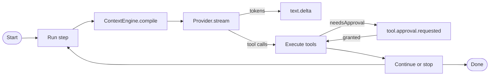

# Agent runtime

`@graphorin/agent` is the runtime layer of the framework. It owns the typed `model -> tool calls -> model` loop, the streaming event surface, durable human-in-the-loop approvals, multi-agent handoffs, agent-level model fallback, post-compaction hooks, per-tool model-tier hints, and a lateral-leak defense layer.

## Library-mode-first

Every primitive that is useful from a script ships from the npm package without the optional standalone server:

- `createAgent({...})`
- `RunState.toJSON()` / `RunState.fromJSON(serialized, agent)`
- The filter library
- `evaluatorOptimizer({...})`
- `agent.fanOut({...})`
- `agent.progress.write(...)` / `agent.progress.read(...)`

Promote to the [standalone server](/guide/standalone-server) only when your assistant has to outlive a single Node.js process or expose a network API.

## Quick start

```ts
import { createAgent } from '@graphorin/agent';
import { createProvider, ollamaAdapter } from '@graphorin/provider';

const agent = createAgent({
  name: 'helpful-assistant',
  instructions: 'You are a helpful, concise assistant.',
  provider: createProvider(
    ollamaAdapter({ baseURL: 'http://127.0.0.1:11434', model: 'qwen2.5:7b-instruct' }),
    { acceptsSensitivity: ['public', 'internal'] },
  ),
});

for await (const event of agent.stream('Plan a trip to Mars')) {
  if (event.type === 'text.delta') process.stdout.write(event.delta);
}
```

## Streaming-first

Every operation returns `AsyncIterable<AgentEvent<TOutput>>`. `agent.run(...)` is a thin "collect" helper that exhausts the stream. The discriminated `AgentEvent<TOutput>` union is exhaustive — every event type is its own typed interface — and the runtime uses an `assertNever(...)` default branch so the compile fails the moment a new event type lands without a handler:

```ts twoslash
// A simplified shape that mirrors the @graphorin/core
// `AgentEvent<TOutput>` discriminated union. Hover any
// identifier below to see the inferred type.
type AgentEvent<TOutput> =
  | { type: 'agent.start'; runId: string }
  | { type: 'step.start'; stepNumber: number }
  | { type: 'text.delta'; delta: string }
  | { type: 'tool.call.start'; toolCallId: string; toolName: string }
  | { type: 'tool.call.end'; toolCallId: string }
  | { type: 'tool.execute.start'; toolCallId: string }
  | { type: 'tool.execute.end'; toolCallId: string }
  | { type: 'tool.approval.requested'; toolCallId: string }
  | { type: 'context.compacted'; trimmedTokens: number }
  | { type: 'agent.model.fellback'; previousModel: string; nextModel: string }
  | { type: 'agent.end'; output: TOutput };

function assertNever(value: never): never {
  throw new Error(`Unhandled event: ${JSON.stringify(value)}`);
}

function handle<TOutput>(event: AgentEvent<TOutput>): void {
  switch (event.type) {
    case 'text.delta':
      process.stdout.write(event.delta);
      return;
    case 'tool.call.start':
    case 'tool.call.end':
    case 'tool.execute.start':
    case 'tool.execute.end':
      console.log(event.toolCallId);
      return;
    case 'tool.approval.requested':
      console.log('approval needed for', event.toolCallId);
      return;
    case 'agent.model.fellback':
      console.log('fellback', event.previousModel, '->', event.nextModel);
      return;
    case 'agent.start':
    case 'step.start':
    case 'context.compacted':
    case 'agent.end':
      return;
    default:
      assertNever(event);
  }
}
```



## Durable HITL

`runStateToJSON(runState)` / `runStateFromJSON(serialised, agent)` round-trip the full run state through any storage the caller picks (file, SQLite, KV, S3). A pending approval can be persisted, the process can shut down, and another machine can pick up exactly where the first left off by re-invoking `agent.run(savedRunState, { directive: { approvals: [...] } })`.

The `tool.approval.requested` event carries the `toolCallId` plus the tool's classification metadata. Operators that need to suspend the run combine the event with a snapshot of the current `RunState`:

```ts
import { runStateToJSON } from '@graphorin/agent';

for await (const event of agent.stream('Refund the last order if it qualifies', {
  sessionId: 's1',
  userId: 'u1',
})) {
  if (event.type === 'tool.approval.requested') {
    const serialised = runStateToJSON(currentRunState);
    await persist(serialised);
    return; // process exits; humans look at the approval offline
  }
}
```

## Multi-agent

`agent.toTool({ name, description, exposeTurns, secretsInheritance, inheritSecrets, inputFilter })` wraps an agent as a typed tool the parent agent can call. The default `secretsInheritance: 'inherit-allowlist'` with an empty `inheritSecrets` array enforces the **principle of least authority** — sub-agents inherit nothing unless explicitly granted.

| `secretsInheritance` | Behaviour |
|---|---|
| `'inherit-allowlist'` (default) | Sub-agent inherits only the secret refs explicitly listed in `inheritSecrets`. |
| `'forward-explicit'` | Sub-agent receives only the secret refs forwarded for this specific call. |
| `'isolated'` | Sub-agent receives no inherited secrets at all. |

## Filter library

Handoffs use a built-in filter library to shape the payload that crosses the boundary. Every filter returns a serializable `HandoffInputFilterDescriptor` so a JSONL session export can replay the same boundary byte-equal.

| Filter | What it does |
|---|---|
| `filters.lastN(n)` | Keep only the last N messages. |
| `filters.lastUser` | Keep only the latest user turn. |
| `filters.summary({...})` | Replace history with a summary. |
| `filters.bySensitivity({...})` | Keep / drop / require by `Sensitivity`. |
| `filters.stripReasoning()` | Drop reasoning content parts. |
| `filters.stripSensitiveOutputs()` | Drop sensitive tool outputs. |
| `filters.stripToolCalls()` | Drop tool calls. |
| `filters.compose(...)` | Compose any of the above. |

## Cancellation

`agent.abort({ drain, onPendingApprovals })` is hard-kill by default with a 50 ms grace window. Set `drain: true` to wait for the current step to complete; choose how pending approvals behave with `onPendingApprovals: 'deny' | 'hold' | 'fail'` (default `'deny'`).

## Reasoning preservation

Tool-use loops round-trip `reasoning` content parts (with opaque `meta` such as `signature` / `data`) into the next provider call when the effective `reasoningRetention` is not `'strip'`. The handoff boundary is independent: `filters.stripReasoning()` is always applied to messages forwarded to a sub-agent regardless of the intra-loop policy.

## Agent-level model fallback

```ts
import { createProvider, ollamaAdapter, vercelAdapter } from '@graphorin/provider';

const agent = createAgent({
  name: 'helpful-assistant',
  instructions: 'You are a helpful, concise assistant.',
  provider: createProvider(vercelAdapter({ provider: 'openai', model: 'gpt-4o' })),
  fallbackModels: [
    {
      provider: createProvider(vercelAdapter({ provider: 'openai', model: 'gpt-4o-mini' })),
      model: 'gpt-4o-mini',
    },
    {
      provider: createProvider(ollamaAdapter({ model: 'qwen2.5:7b-instruct' })),
      model: 'qwen2.5:7b-instruct',
    },
  ],
});
```

`fallbackModels: ReadonlyArray<ModelSpec>` retries the whole step against the next model on rate-limit, capacity, or context-length errors. A `ModelSpec` is either a `Provider` instance or `{ provider, model }`. The `agent.model.fellback` event fires per transition, and per-model usage attribution lands in `RunState.usage.byModel`.

## Post-compaction hooks

When `@graphorin/memory.contextEngine` auto-compacts the buffer, the runtime fires every registered `postCompactionHooks[i]` between the trim and the next `provider.stream(...)` call. Failed hooks are isolated; the harness continues with the survivors.

## Agent-step-level fan-out

```ts
const result = await agent.fanOut({
  children: [
    { agentId: 'researcher', invoke: () => childA.run('Research the topic') },
    { agentId: 'writer', invoke: () => childB.run('Draft the section') },
  ],
  mergeStrategy: { kind: 'concat', separator: '\n\n' },
  perBudget: { tokens: 4000, toolCalls: 8, durationMs: 30_000 },
  maxConcurrentChildren: 4,
});
```

`agent.fanOut(...)` is a thin wrapper over the standalone `runFanOut(...)` helper. It spawns N sub-agents under a bounded-fanout cap (default `maxConcurrentChildren: 4`) with per-child token / tool-call / duration budgets and four built-in merge strategies:

| `mergeStrategy.kind` | Shape | Behaviour |
|---|---|---|
| `'concat'` | `{ kind: 'concat'; separator?: string }` (default) | Concatenate every successful child output. |
| `'first-success'` | `{ kind: 'first-success' }` | Pick the first child that completes successfully. |
| `'judge-merge'` | `{ kind: 'judge-merge'; judge: (children) => Promise<TOutput> }` | Operator-supplied judge function. Guarded by the merge guard. |
| `'custom'` | `{ kind: 'custom'; merge: (children) => Promise<TOutput> }` | Operator-supplied merge function. |

## Evaluator-optimizer loop

`evaluatorOptimizer({...})` is a Generator → Evaluator iteration loop with three rubric kinds (`'free-form'`, `'zod'`, `'llm-judge'`) and a required iteration cap.

## Progress artifacts

`agent.progress.write(content, { role, seq, sensitivity, tags })` and `agent.progress.read({ runId, role, sinceSeq, maxArtifacts })` persist UTF-8 text artifacts to the artifact root via atomic-write `.tmp + rename` discipline so cross-session continuity holds even on hard crashes.

## Per-tool model-tier hints

```ts
import { tool } from '@graphorin/tools';

const planTool = tool({
  name: 'plan',
  description: 'Generate a multi-step plan',
  preferredModel: 'smart',
  // …
});
```

`Agent.modelTierMap` resolves the cost-tier vocabulary (`'fast' | 'balanced' | 'smart'`) to concrete `Provider` instances at agent warm-up. The per-step planner walks the precedence ladder once per step:

```text
'prepare-step' > 'tier-map' | 'spec' > 'agent-preferred' > 'fallthrough-default'
```

## Lateral-leak defense layer

Three opt-in agent-level guards configured on `createAgent({ causalityMonitor, mergeGuard, protocolGuard })`. They compose orthogonally with the other security layers (sub-agent secrets isolation, handoff input filter, outbound redaction, inbound sanitisation):

- **`causalityMonitor`** — implements an Agentic Reference Monitor pattern: every cross-agent flow is checked against the stated capability, with a configurable strictness level.
- **`mergeGuard`** — per-child trust scoring + bias detection on the `'judge-merge'` fan-out strategy.
- **`protocolGuard`** — control-character escape catalogue applied at protocol boundaries.
- **Commentary-phase trace sanitisation** runs at the session-output boundary in `@graphorin/sessions`.

## Inbound sanitisation preamble

When the assembled message list contains any non-trusted `MessageContent` part, the runtime appends the locale-resolved preamble fragment to the system prompt **after** the cache breakpoint so the trusted-only cache prefix is not invalidated.

## Next steps

- [Memory system](/guide/memory-system) — what `memory.tools` exposes.
- [Tools](/guide/tools) — how to declare your own typed tools.
- [Workflow engine](/guide/workflow-engine) — durable graph runs that span multiple agent steps.
- [Sessions](/guide/sessions) — multi-agent attribution and replay.

---

**Graphorin** · v0.1.0 · MIT License · © 2026 Oleksiy Stepurenko
