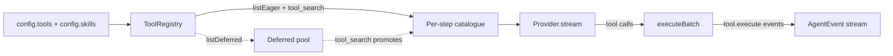

# Agent runtime

`@graphorin/agent` is the runtime layer of the framework. It owns the typed `model -> tool calls -> model` loop, the streaming event surface, durable human-in-the-loop approvals, multi-agent handoffs, agent-level model fallback, post-compaction hooks, per-tool model-tier hints, and a lateral-leak defense layer.

## Library-mode-first

Every primitive that is useful from a script ships from the npm package without the optional standalone server:

- `createAgent({...})`
- `RunState.toJSON()` / `RunState.fromJSON(serialized, agent)`
- The filter library
- `evaluatorOptimizer({...})`
- `agent.fanOut({...})`
- `agent.progress.write(...)` / `agent.progress.read(...)`

Promote to the [standalone server](/guide/standalone-server) only when your assistant has to outlive a single Node.js process or expose a network API.

## Quick start

```ts
import { createAgent } from '@graphorin/agent';
import { createProvider, ollamaAdapter } from '@graphorin/provider';

const agent = createAgent({
  name: 'helpful-assistant',
  instructions: 'You are a helpful, concise assistant.',
  provider: createProvider(
    ollamaAdapter({ baseURL: 'http://127.0.0.1:11434', model: 'qwen2.5:7b-instruct' }),
    { acceptsSensitivity: ['public', 'internal'] },
  ),
});

for await (const event of agent.stream('Plan a trip to Mars')) {
  if (event.type === 'text.delta') process.stdout.write(event.delta);
}
```

## Streaming-first

Every operation returns `AsyncIterable<AgentEvent<TOutput>>`. `agent.run(...)` is a thin "collect" helper that exhausts the stream. The discriminated `AgentEvent<TOutput>` union is exhaustive — every event type is its own typed interface — and the runtime uses an `assertNever(...)` default branch so the compile fails the moment a new event type lands without a handler:

```ts twoslash
// A simplified shape that mirrors the @graphorin/core
// `AgentEvent<TOutput>` discriminated union. Hover any
// identifier below to see the inferred type.
type AgentEvent<TOutput> =
  | { type: 'agent.start'; runId: string }
  | { type: 'step.start'; stepNumber: number }
  | { type: 'text.delta'; delta: string }
  | { type: 'tool.call.start'; toolCallId: string; toolName: string }
  | { type: 'tool.call.end'; toolCallId: string }
  | { type: 'tool.execute.start'; toolCallId: string }
  | { type: 'tool.execute.end'; toolCallId: string }
  | { type: 'tool.approval.requested'; toolCallId: string }
  | { type: 'context.compacted'; beforeTokens: number; afterTokens: number }
  | { type: 'agent.model.fellback'; previousModel: string; nextModel: string }
  | { type: 'agent.end'; output: TOutput };

function assertNever(value: never): never {
  throw new Error(`Unhandled event: ${JSON.stringify(value)}`);
}

function handle<TOutput>(event: AgentEvent<TOutput>): void {
  switch (event.type) {
    case 'text.delta':
      process.stdout.write(event.delta);
      return;
    case 'tool.call.start':
    case 'tool.call.end':
    case 'tool.execute.start':
    case 'tool.execute.end':
      console.log(event.toolCallId);
      return;
    case 'tool.approval.requested':
      console.log('approval needed for', event.toolCallId);
      return;
    case 'agent.model.fellback':
      console.log('fellback', event.previousModel, '->', event.nextModel);
      return;
    case 'agent.start':
    case 'step.start':
    case 'context.compacted':
    case 'agent.end':
      return;
    default:
      assertNever(event);
  }
}
```


## Tool execution in the loop

At `createAgent(...)` warm-up the runtime assembles one [`ToolRegistry`](/guide/tools) from `config.tools` and `config.skills`, resolves cross-source name collisions (`'auto-prefix'` by default), and binds a [`ToolExecutor`](/guide/tools) to it. You never construct either yourself — passing `tools` / `skills` is the whole wiring. The read-only `agent.registry` exposes the assembled registry for inspection.



Each step advertises only the **eager** tools (`registry.listEager()`) plus the built-in `tool_search`, sends them to the model with each tool's worked `examples` rendered into its `ToolDefinition` (see [worked examples](/guide/tools#worked-examples)), then dispatches the resulting calls through `executor.executeBatch(...)`. Handoff tools are advertised too, but routed to sub-agents rather than the executor.

Because execution now flows through the executor, several tool-classification fields documented in [Tools](/guide/tools) take effect **at runtime in the agent loop**:

| Field | Behaviour in the agent loop |
|---|---|
| `secretsAllowed` | **Enforced** — per-tool secrets ACL; a tool requesting a ref outside its ACL is denied. |
| `inboundSanitization` | **Enforced** — untrusted tool output is flagged / stripped / wrapped before it re-enters context. |
| `maxResultTokens` / `truncationStrategy` | **Enforced** — oversized results are truncated (default `16384` tokens), **text and structured object outputs alike**; the model sees the bounded text, never the full object. An over-cap structured output spills by default, storing the full body behind a handle (see [result handles](#result-handles-and-read_result)). |
| `needsApproval` | **Enforced** — the run suspends for durable HITL (below) *before* the call runs. |
| `sandboxPolicy` | Resolved and surfaced on the `tool.execute` span / audit, but inline `config.tools` run **in-process** — out-of-process isolation applies to module-loadable skill / MCP tools and is wired when those land. |
| `memoryGuardTier` | Reserved: the guard factory is wired, but the snapshot/verify step stays inert until a scope-free memory-region reader lands (a tracked follow-up). |

### Parallel dispatch

Independent tool calls in one step run **concurrently**, bounded by `maxParallelTools` (default `8`; set `1` to serialise). A tool tagged `executionMode: 'sequential'` never overlaps another. The loop emits `tool.execute.start` for every call up front in call order, and `tool.execute.end` / `tool.execute.error` after each settles — also in call order — so the lifecycle is deterministic regardless of completion order. Only the live `tool.execute.progress` / `tool.execute.partial` events interleave, each keyed by `toolCallId`.

### Deferred loading and `tool_search`

A tool declared `defer_loading: true` is **withheld** from the per-step catalogue to keep large tool sets out of context. When the registry holds at least one deferred tool, the runtime auto-registers the built-in `tool_search` tool. The model calls `tool_search({ query })` to find deferred tools by name / description; matched tools are promoted into the catalogue on the **next** step. A deferred tool's `examples` stay out of context even once it is promoted.

### Result handles and `read_result`

A tool with `truncationStrategy: 'spill-to-file'` does more than truncate: the executor writes the full body to a run-scoped artifact and surfaces a `ResultHandle` on the result. The loop then inlines only the bounded **preview** plus a retrieval hint — so a large result never enters the context window **even when the tool returns a structured object** (which the executor now bounds and, on the default strategy, spills by default rather than inlining whole) — and auto-registers the built-in **`read_result`** tool whenever some tool spills. The model fetches just what it needs by byte range (`offset`/`length`) or line range (`startLine`/`endLine`). Handles are **opaque** (resolved only within the spill root — never an arbitrary-file read) and gated by **sensitivity**: a `sensitivity: 'secret'` tool is never spilled to the shared store. See [result handles](/guide/tools#result-handles-and-read_result) in the tools guide.

The same `read_result` path resolves **external** handles too. An MCP `resource_link` tool result surfaces a handle (the resource URI) rather than inlining the body; wire `createAgent({ resultReaders: [createMcpResourceReader({ clients })] })` and the loop composes those readers after the spill reader (tried in order, each rejecting handles it does not own), so the model pages an MCP resource on demand exactly like a spilled artifact. Supplying any `resultReaders` force-registers `read_result`. See the [MCP client guide](/guide/mcp-client#large-resources-resource_link-result-handles).

### Code-mode (`toolInvocation: 'code-mode'`)

By default (`toolInvocation: 'direct'`) the model emits one provider tool-call per tool and each result is inlined into the conversation. Set `toolInvocation: 'code-mode'` to flip the model into **programmatic tool calling**: the agent advertises only two meta-tools — `code_execute` and `code_search` — and the model reaches every real tool by writing a script.

```ts
const agent = createAgent({
  name: 'analyst',
  instructions: '…',
  provider,
  tools: [listOrders, fetchInvoice, summarize],
  toolInvocation: 'code-mode',
});
```

`code_execute({ source })` runs the model-written JavaScript in a `worker-threads` sandbox; inside, `await tools.<name>(args)` calls the real tool. **Only the script's `return` value re-enters the context window** — every intermediate result stays inside the sandbox. A workflow that would otherwise inline a dozen large tool results now costs context for the final answer alone (an order-of-magnitude reduction on result-heavy tasks). `code_search({ query })` returns the exact call signatures of tools on demand (progressive disclosure), so the model writes correct calls without every schema being inlined up front.

Governance is preserved: each in-script call runs through the **same executor**, so per-tool `secretsAllowed` / `inboundSanitization` / `maxResultTokens` still apply to the value handed back to the script (set a tool's `maxResultTokens` high when the script must process its full output). The sandbox blocks network and filesystem access and exposes **no** host object beyond the bound tools. Two limitations to note: **approval-gated tools** (`needsApproval`) are excluded from the code API (there is no durable-HITL suspend mid-script — call those in `'direct'` mode), and code-mode does **not** honour a per-step `prepareStep` `tools` override. The default `'direct'` path is completely unchanged. See [code-mode](/guide/tools#code-mode) in the tools guide for the building blocks.

## Durable HITL

`runStateToJSON(runState)` / `runStateFromJSON(serialised, agent)` round-trip the full run state through any storage the caller picks (file, SQLite, KV, S3). A pending approval can be persisted, the process can shut down, and another machine can resume by re-invoking `agent.run(savedRunState, { directive: { approvals: [...] } })`.

> **Caveat — current behaviour.** On resume a *granted* approval is recorded, but the approved tool is **not re-executed**: the model receives a placeholder result rather than the real tool output, and a model that re-issues the call re-suspends. Do **not** rely on durable-HITL resume to actually perform a side-effecting action (payments, refunds, external writes) — use it to gate, persist, and audit the *decision*, and perform the side effect through your own code once approved. Re-executing approved calls through the executor on resume is a tracked follow-up.

The `tool.approval.requested` event carries the `toolCallId` plus the tool's classification metadata. Operators that need to suspend the run combine the event with a snapshot of the current `RunState`:

```ts
import { runStateToJSON } from '@graphorin/agent';

for await (const event of agent.stream('Summarise the status of my last order', {
  sessionId: 's1',
  userId: 'u1',
})) {
  if (event.type === 'tool.approval.requested') {
    const serialised = runStateToJSON(currentRunState);
    await persist(serialised);
    return; // process exits; humans look at the approval offline
  }
}
```

## Multi-agent

`agent.toTool({ name, description, exposeTurns, secretsInheritance, inheritSecrets, inputFilter })` wraps an agent as a typed tool the parent agent can call. The default `secretsInheritance: 'inherit-allowlist'` with an empty `inheritSecrets` array enforces the **principle of least authority** — sub-agents inherit nothing unless explicitly granted.

| `secretsInheritance` | Behaviour |
|---|---|
| `'inherit-allowlist'` (default) | Sub-agent inherits only the secret refs explicitly listed in `inheritSecrets`. |
| `'forward-explicit'` | Sub-agent receives only the secret refs forwarded for this specific call. |
| `'isolated'` | Sub-agent receives no inherited secrets at all. |

## Filter library

Handoffs use a built-in filter library to shape the payload that crosses the boundary. Every filter returns a serializable `HandoffInputFilterDescriptor` so a JSONL session export can replay the same boundary byte-equal.

| Filter | What it does |
|---|---|
| `filters.lastN(n)` | Keep only the last N messages. |
| `filters.lastUser` | Keep only the latest user turn. |
| `filters.summary({...})` | Replace history with a summary. |
| `filters.bySensitivity({...})` | Keep / drop / require by `Sensitivity`. |
| `filters.stripReasoning()` | Drop reasoning content parts. |
| `filters.stripSensitiveOutputs()` | Drop sensitive tool outputs. |
| `filters.stripToolCalls()` | Drop tool calls. |
| `filters.compose(...)` | Compose any of the above. |

## Cancellation

`agent.abort({ drain, onPendingApprovals })` is hard-kill by default with a 50 ms grace window. Set `drain: true` to wait for the current step to complete; choose how pending approvals behave with `onPendingApprovals: 'deny' | 'hold' | 'fail'` (default `'deny'`).

## Reasoning preservation

Tool-use loops round-trip `reasoning` content parts (with opaque `meta` such as `signature` / `data`) into the next provider call when the effective `reasoningRetention` is not `'strip'`. The handoff boundary is independent: `filters.stripReasoning()` is always applied to messages forwarded to a sub-agent regardless of the intra-loop policy.

## Agent-level model fallback

```ts
import { createProvider, ollamaAdapter, vercelAdapter } from '@graphorin/provider';

const agent = createAgent({
  name: 'helpful-assistant',
  instructions: 'You are a helpful, concise assistant.',
  provider: createProvider(vercelAdapter({ provider: 'openai', model: 'gpt-4o' })),
  fallbackModels: [
    {
      provider: createProvider(vercelAdapter({ provider: 'openai', model: 'gpt-4o-mini' })),
      model: 'gpt-4o-mini',
    },
    {
      provider: createProvider(ollamaAdapter({ model: 'qwen2.5:7b-instruct' })),
      model: 'qwen2.5:7b-instruct',
    },
  ],
});
```

`fallbackModels: ReadonlyArray<ModelSpec>` retries the whole step against the next model on rate-limit, capacity, or context-length errors. A `ModelSpec` is either a `Provider` instance or `{ provider, model }`. The `agent.model.fellback` event fires per transition, and per-model usage attribution lands in `RunState.usage.byModel`.

## Context management in the loop

When `config.memory` is wired, the runtime bounds context growth automatically. Before every `provider.stream(...)` call it asks the memory `ContextEngine` whether the in-flight buffer has crossed the per-provider compaction threshold (`shouldCompact`); when it has, it summarises the older turns (`compactNow`), splices the summary back over them, keeps the most-recent turns verbatim, and emits a `context.compacted` event. Compaction is configured on the memory facade — `createMemory({ contextEngine: { compaction, providerContextWindow, summarizer } })` (RB-46) — so there is no separate agent-level knob. An agent with no memory, with compaction disabled, or below threshold simply skips the step, so the happy-path event stream is unchanged. The trigger is best-effort: a misconfigured engine (for example, no summarizer) is swallowed and the run proceeds uncompacted rather than aborting mid-flight.

The `context.compacted` event carries `beforeTokens`, `afterTokens`, `summaryTokens`, `durationMs`, `hooksFiredCount`, and `source: 'auto-trigger'` (manual `agent.compact(...)` and pre-step compaction reuse the same event shape with their own `source`).

**KV-cache prefix stability.** Auto-compaction never rewrites the trusted system-prompt prefix: the leading run of `system` messages established at run start is pinned, and only the conversational body after it is summarised. The prefix stays byte-identical across every step, so the provider's cache breakpoint is real and a long run never re-pays for the system prompt. Each compaction inserts its summary *after* the prefix, where the next pass folds it into a fresh summary-of-summary — so summaries never stack unbounded.

**Sensitivity gate.** A run whose `sensitivity` is `'secret'` is never auto-compacted: summarisation is an LLM call, and secret-tier history is not shipped to a (potentially less-trusted) summarizer. Large individual tool outputs leave context the complementary way — via [result handles](#result-handles-and-read_result), which likewise refuse to spill a `'secret'`-tier body to the shared store.

## Post-compaction hooks

When `@graphorin/memory.contextEngine` auto-compacts the buffer, the runtime fires every registered `postCompactionHooks[i]` between the trim and the next `provider.stream(...)` call, then re-injects each hook's returned Context Essentials into the trimmed buffer as a trailing `system` message. Failed hooks are isolated; the harness continues with the survivors.

## Agent-step-level fan-out

```ts
const result = await agent.fanOut({
  children: [
    { agentId: 'researcher', invoke: () => childA.run('Research the topic') },
    { agentId: 'writer', invoke: () => childB.run('Draft the section') },
  ],
  mergeStrategy: { kind: 'concat', separator: '\n\n' },
  perBudget: { tokens: 4000, toolCalls: 8, durationMs: 30_000 },
  maxConcurrentChildren: 4,
});
```

`agent.fanOut(...)` is a thin wrapper over the standalone `runFanOut(...)` helper. It spawns N sub-agents under a bounded-fanout cap (default `maxConcurrentChildren: 4`) with per-child token / tool-call / duration budgets and four built-in merge strategies:

| `mergeStrategy.kind` | Shape | Behaviour |
|---|---|---|
| `'concat'` | `{ kind: 'concat'; separator?: string }` (default) | Concatenate every successful child output. |
| `'first-success'` | `{ kind: 'first-success' }` | Pick the first child that completes successfully. |
| `'judge-merge'` | `{ kind: 'judge-merge'; judge: (children) => Promise<TOutput> }` | Operator-supplied judge function. Guarded by the merge guard. |
| `'custom'` | `{ kind: 'custom'; merge: (children) => Promise<TOutput> }` | Operator-supplied merge function. |

## Evaluator-optimizer loop

`evaluatorOptimizer({...})` is a Generator → Evaluator iteration loop with three rubric kinds (`'free-form'`, `'zod'`, `'llm-judge'`) and a required iteration cap.

## Progress artifacts

`agent.progress.write(content, { role, seq, sensitivity, tags })` and `agent.progress.read({ runId, role, sinceSeq, maxArtifacts })` persist UTF-8 text artifacts to the artifact root via atomic-write `.tmp + rename` discipline so cross-session continuity holds even on hard crashes.

## Per-tool model-tier hints

```ts
import { tool } from '@graphorin/tools';

const planTool = tool({
  name: 'plan',
  description: 'Generate a multi-step plan',
  preferredModel: 'smart',
  // …
});
```

`Agent.modelTierMap` resolves the cost-tier vocabulary (`'fast' | 'balanced' | 'smart'`) to concrete `Provider` instances at agent warm-up. The per-step planner walks the precedence ladder once per step:

```text
'prepare-step' > 'tier-map' | 'spec' > 'agent-preferred' > 'fallthrough-default'
```

## Lateral-leak defense layer

Three opt-in agent-level guards configured on `createAgent({ causalityMonitor, mergeGuard, protocolGuard })`. They compose orthogonally with the other security layers (sub-agent secrets isolation, handoff input filter, outbound redaction, inbound sanitisation):

- **`causalityMonitor`** — implements an Agentic Reference Monitor pattern: every cross-agent flow is checked against the stated capability, with a configurable strictness level.
- **`mergeGuard`** — per-child trust scoring + bias detection on the `'judge-merge'` fan-out strategy.
- **`protocolGuard`** — control-character escape catalogue applied at protocol boundaries.
- **Commentary-phase trace sanitisation** runs at the session-output boundary in `@graphorin/sessions`.

## Provenance / data-flow policy (`dataFlowPolicy`)

Where the lateral-leak guards above match *patterns*, `dataFlowPolicy` (P1-3, opt-in) enforces *provenance* — a data-flow defence toward [CaMeL](https://arxiv.org/abs/2503.18813). It uses the metadata Graphorin already tracks (trust class + source + sensitivity) to defuse the **lethal trifecta**: untrusted content + private data + an exfiltration/mutation sink.

```ts
const agent = createAgent({
  name: 'assistant',
  instructions: '…',
  provider,
  tools: [webFetch, readSecret, sendEmail],
  dataFlowPolicy: { mode: 'enforce' }, // or 'shadow' to audit-only first
});
```

The executor gates every **sink** — a `side-effecting` / `external-stateful` tool — before it runs, and records the provenance of every tool output for later sink checks. A sink trips the policy when:

- **`untrusted-to-sink`** — its arguments carry a verbatim span of previously-seen untrusted content (`mcp-derived` / `web-search` / `skill-untrusted` output): direct exfiltration; or
- **`lethal-trifecta`** — it fires while *both* untrusted content **and** secret-tier (`sensitivity: 'secret'`) data have entered the run, even without a provable verbatim carry (the conservative signal; disable with `guardTrifecta: false`).

Modes: **`'shadow'`** audits a tripped flow (`tool:dataflow:flagged` audit row + counter) but never blocks — ship this first to surface false positives; **`'enforce'`** blocks the sink (the call yields a `dataflow_policy_blocked` error surfaced as `tool.execute.error`) unless its name is in `declassifySinks` — the explicit, audited operator escape hatch (`tool:dataflow:declassified`). The policy **composes with `'code-mode'`**: each in-script tool call runs through the same executor gate, so an injection cannot exfiltrate through a sandbox either. Taint is tracked in-memory per run (not persisted across suspend/resume); verbatim detection is best-effort (catches verbatim/near-verbatim forwarding, not paraphrase — which is what the trifecta gate is for). Absent (the default) the loop is unchanged.

## Inbound sanitisation preamble

When the assembled message list contains any non-trusted `MessageContent` part, the runtime appends the locale-resolved preamble fragment to the system prompt **after** the cache breakpoint so the trusted-only cache prefix is not invalidated.

## Next steps

- [Memory system](/guide/memory-system) — what `memory.tools` exposes.
- [Tools](/guide/tools) — how to declare your own typed tools.
- [Workflow engine](/guide/workflow-engine) — durable graph runs that span multiple agent steps.
- [Sessions](/guide/sessions) — multi-agent attribution and replay.

---

**Graphorin** · v0.4.0 · MIT License · © 2026 Oleksiy Stepurenko
