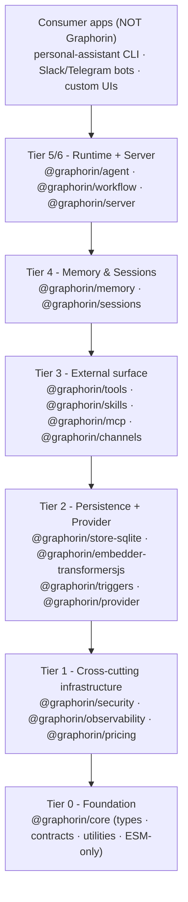
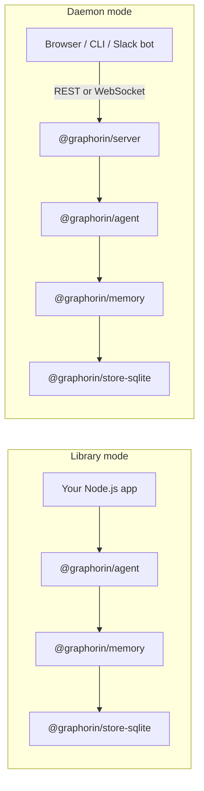
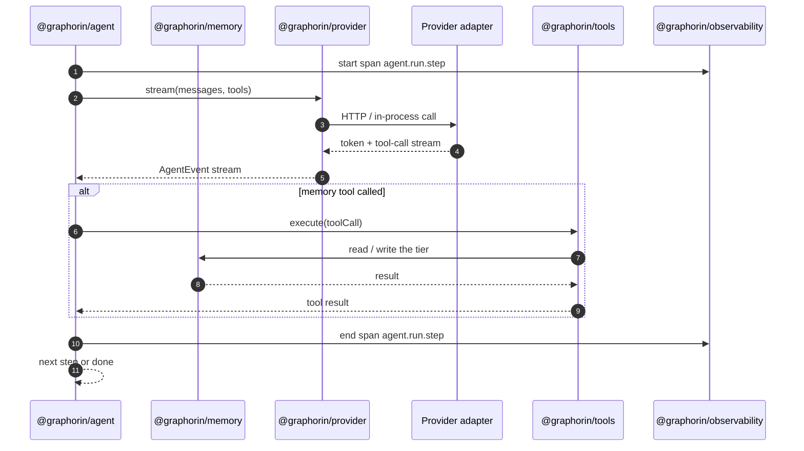

# Architecture

Graphorin is built as a stack of focused packages. Each layer depends only on the layers below it, so you can pick the slice that matches your application - from a 20-line embedded agent up to a long-running daemon with REST + WebSocket and durable triggers.

## Layered overview

Every arrow is a strict dependency edge. Nothing in the lower tier knows about the upper tier; nothing in the same tier imports across.

## What each tier owns

### Tier 0 - Foundation

`@graphorin/core` ships the **public type system** and the **cross-package contracts** for the framework. It contains no runtime. Every other package depends on these types.

Sub-paths:

- `@graphorin/core/types` - `Message`, `AgentEvent`, `WorkflowEvent`, `RunContext`, `RunState`, `Usage`, …
- `@graphorin/core/contracts` - `Provider`, `MemoryStore`, `Tracer`, `Sandbox`, …
- `@graphorin/core/utils` - tiny dependency-free helpers (`collect`, `mapStream`, `merge`, `withSignal`, `md5`, `xxhash`).
- `@graphorin/core/channels` - the Graphorin-named workflow primitive set: `LatestValue`, `Reducer`, `Stream`, `Barrier`, `Ephemeral`, `AnyValue`, `ListAggregate`.

### Tier 1 - Cross-cutting infrastructure

- **`@graphorin/security`** - `SecretValue`, `SecretRef` URI scheme, OS keychain integration, audit log, server-token auth, OAuth 2.1 with PKCE, sandbox tiers, supply-chain helpers.
- **`@graphorin/observability`** - OpenTelemetry tracer, the GenAI Semantic Conventions, sensitivity-aware redaction with 14 built-in PII patterns, replay primitives.
- **`@graphorin/pricing`** - bundled snapshot of LLM pricing (sourced from the public `@pydantic/genai-prices` dataset), refreshable on demand by `graphorin pricing refresh`. Never refreshed automatically.

### Tier 2 - Persistence & Provider

- **`@graphorin/store-sqlite`** - default storage adapter on top of `better-sqlite3`, the `sqlite-vec` extension, and FTS5.
- **`@graphorin/embedder-transformersjs`** - default in-process multilingual embedder backed by `@huggingface/transformers`.
- **`@graphorin/embedder-ollama`** - first-class opt-in alternative that talks to a local Ollama daemon over HTTP.
- **`@graphorin/triggers`** - background tasks (cron / interval / idle / event).
- **`@graphorin/provider`** - `Provider` interface + adapters (Vercel AI SDK, Ollama, OpenAI-compatible, llama.cpp HTTP server) and the middleware composer.
- **`@graphorin/provider-llamacpp-node`** - companion package: in-process GGUF execution via `node-llama-cpp`.

### Tier 3 - External surface

- **`@graphorin/tools`** - typed `tool({ ... })` builder, `ToolRegistry`, `ToolExecutor` (parallel / sequential dispatch, approvals, sandbox enforcement, inbound sanitisation).
- **`@graphorin/skills`** - loader for the public `SKILL.md` packaging format with three-tier progressive disclosure, plus Graphorin extensions namespaced under `graphorin-*` and `metadata.graphorin.*`.
- **`@graphorin/mcp`** - Model Context Protocol client over stdio and Streamable HTTP, wrapping `@modelcontextprotocol/sdk`.
- **`@graphorin/channels`** - messenger front door: the vendor-neutral `ChannelAdapter` SPI, identity routing, pairing access policy, the gateway runtime with the inbound trust boundary + outbound scaffolding sanitisation, and the adapter testkit. Ships no vendor adapters.

### Tier 4 - Memory & Sessions

- **`@graphorin/memory`** - six-tier memory facade (`createMemory({...})`), the eleven memory tools, the multi-stage conflict-resolution pipeline, the consolidator, and the context engine.
- **`@graphorin/sessions`** - hybrid session facade, agent registry, handoff records, JSONL export schema 1.0, replay reconstruction.

### Tier 5 - Runtime

- **`@graphorin/agent`** - agent runtime: typed `model -> tool calls -> model` loop, streaming events, durable HITL approvals, multi-agent handoffs, model fallback, fan-out, evaluator-optimizer loops, lateral-leak defenses.
- **`@graphorin/workflow`** - durable step-graph runtime with checkpoints, the `pause(value)` / `resume(directive)` lifecycle, `Dispatch(...)` for dynamic parallelism, seven channel kinds.

### Tier 6 - Standalone server + DX

- **`@graphorin/server`** - optional standalone server with REST + WebSocket + SSE fallback, durable triggers, replay endpoints, Prometheus metrics, health checks.
- **`@graphorin/cli`** - operator CLI (`graphorin start`, `graphorin init`, `graphorin migrate`, `graphorin migrate-config`, `graphorin doctor`, `graphorin token`, `graphorin secrets`, `graphorin storage`, `graphorin audit`, `graphorin memory`, `graphorin consolidator`, `graphorin triggers`, `graphorin auth`, `graphorin pricing`, `graphorin skills`, `graphorin traces`, `graphorin migrate-export`, `graphorin guard`, `graphorin telemetry`, `graphorin tools lint`).
- **`@graphorin/protocol`** - the WebSocket protocol contract - `graphorin.protocol.v1`.
- **`@graphorin/client`** - browser-friendly client for the standalone server.

## Two ways to ship

Same code. Different lifetime. The standalone server is a thin shell around the same library packages - promote when your assistant needs to outlive a single Node.js process or expose a network API.

## A typical agent step

> The agent builds the run's system prompt from `instructions`; it does not auto-compile a memory-aware prompt per step. By default the model reaches memory only through the memory tools it calls (registered via `tools: memory.tools`); `autoAssembleContext: true` opts in to compiling the memory context engine into the per-run prompt once at run start (see [memory-aware system prompt](/guide/agent-runtime#memory-aware-system-prompt-opt-in)). The `ContextEngine` runs separately for [auto-compaction](/guide/agent-runtime#context-management-in-the-loop).

## Privacy, security, observability - built in

- **No implicit network calls.** A repository CI check fails the build the moment any code path makes a forbidden socket call. See [Privacy & no-phone-home](/guide/privacy).
- **Sensitivity-aware payloads.** Every message and memory row carries a `Sensitivity` tag (`public` / `internal` / `secret`). Providers, traces, and exports all honour the tag.
- **OpenTelemetry GenAI Semantic Conventions** for every LLM call, tool, memory write, and workflow step.
- **`SecretValue` and `SecretRef`** - secrets cannot be accidentally logged or serialised; the runtime substitutes redacted placeholders in traces.

## Eighteen design principles

Eighteen design principles are encoded into the framework. If a feature contradicts a principle, the feature loses. The full list lives in [Design principles](/reference/design-principles).

## Next steps

- [Memory system](/guide/memory-system) - the six tiers in depth.
- [Workflow engine](/guide/workflow-engine) - durable HITL flows.
- [Standalone server](/guide/standalone-server) - promote your assistant to a daemon.
- [Packages reference](/reference/packages) - every `@graphorin/*` package, one line at a time.

