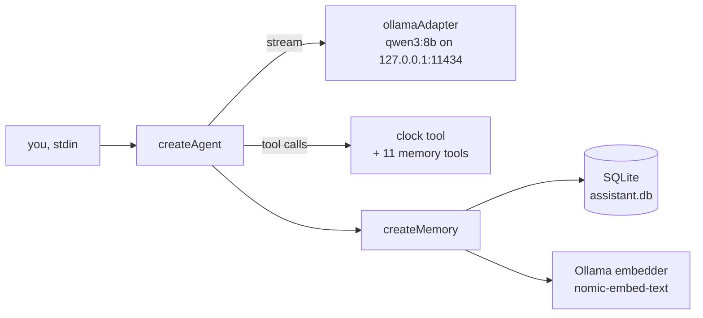

# Golden path: a local agent in 10 minutes

The shortest supported route to a working agent: one TypeScript file, a
local Ollama model, one custom tool, and memory that survives a process
restart. No API keys, no network beyond `127.0.0.1`.

The three golden paths build on each other: this page gets an agent
working on your machine, [Production API](/guide/golden-path-production)
turns the same building blocks into an authenticated server, and
[Safe code execution](/guide/golden-path-sandbox) adds an isolation
boundary for untrusted code.

## Architecture



Everything runs in your process except the two Ollama endpoints (chat +
embeddings), both loopback.

## Prerequisites

- Node.js >= 22.12
- [Ollama](https://ollama.com) running locally, with two models pulled:

```bash
ollama pull qwen3:8b-q4_K_M
ollama pull nomic-embed-text
```

## Step 1 - install

```bash
mkdir my-agent && cd my-agent && npm init -y && npm pkg set type=module
npm install @graphorin/core @graphorin/agent @graphorin/memory \
  @graphorin/provider @graphorin/store-sqlite @graphorin/embedder-ollama \
  @graphorin/tools zod tsx
```

## Step 2 - the whole agent

Save as `agent.ts`:

```ts
import { createAgent } from '@graphorin/agent';
import { createOllamaEmbedder } from '@graphorin/embedder-ollama';
import { createMemory } from '@graphorin/memory';
import { createProvider, ollamaAdapter } from '@graphorin/provider';
import { createSqliteStore } from '@graphorin/store-sqlite';
import { tool } from '@graphorin/tools';
import { z } from 'zod';

// 1. Provider: a local model over the Ollama HTTP API. Loopback, so
//    every sensitivity tier may flow to it.
const provider = createProvider(
  ollamaAdapter({
    baseUrl: 'http://127.0.0.1:11434',
    model: 'qwen3:8b-q4_K_M',
    think: false, // qwen3 thinks by default; false keeps replies fast
    keepAlive: '10m', // keep the model loaded between turns
  }),
  { acceptsSensitivity: ['public', 'internal', 'secret'] },
);

// 2. Persistence: one SQLite file holds facts, embeddings, sessions.
const store = await createSqliteStore({ path: './assistant.db' });
await store.init();

// 3. Memory: semantic recall over the store, embedded locally.
const memory = createMemory({
  store: store.memory,
  embeddings: store.embeddings,
  embedder: createOllamaEmbedder({
    baseUrl: 'http://127.0.0.1:11434',
    model: 'nomic-embed-text',
  }),
});

// 4. One custom tool beside the 11 built-in memory tools.
const clock = tool({
  name: 'current_time',
  description: 'Read the current wall-clock time as an ISO string.',
  inputSchema: z.object({}),
  outputSchema: z.object({ iso: z.string() }),
  sideEffectClass: 'read-only',
  async execute() {
    return { iso: new Date().toISOString() };
  },
});

// 5. The agent: provider + tools + auto-assembled memory context.
const agent = createAgent({
  name: 'local-assistant',
  instructions:
    'You are a concise local assistant. Use current_time for time questions; remember durable facts.',
  provider,
  memory,
  tools: [clock, ...memory.tools],
  autoAssembleContext: true,
});

// 6. Two turns that prove the loop: a fact goes in, the fact comes back.
const first = await agent.run('Remember that my project deadline is Friday. What time is it now?');
console.log('turn 1:', first.status === 'completed' ? first.output : first.status);

const second = await agent.run('What deadline am I working towards?');
console.log('turn 2:', second.status === 'completed' ? second.output : second.status);

await store.close();
```

Run it:

```bash
npx tsx agent.ts
```

## Expected output

Model wording varies; the shape does not. The first turn calls the
`current_time` tool and stores the fact, the second recalls it:

```
turn 1: It is 2026-07-22T15:04:11Z. I have noted that your project deadline is Friday.
turn 2: Your project deadline is Friday.
```

Delete nothing, run `npx tsx agent.ts` again with only the second
question, and the deadline still comes back: the fact lives in
`assistant.db`, not in the process. That restart-survival loop is the
same mechanism the [Quickstart](/guide/quickstart) walks through
offline with a stub provider.

## Troubleshooting

| Symptom | Cause and fix |
| --- | --- |
| `ProviderHttpError ... status: 0` immediately | Ollama is not running (or a firewall blocks loopback). Start `ollama serve`; the adapter fails fast on `ECONNREFUSED` rather than hanging. |
| `HTTP 404: model "..." not found` | The model is not pulled. `ollama pull qwen3:8b-q4_K_M` (and `nomic-embed-text` for the embedder). |
| First turn takes tens of seconds | Cold model load. The HTTP adapters budget for it (120 s default time-to-response timeout); `keepAlive: '10m'` keeps later turns warm. |
| Replies are empty on a thinking model | The model spent its output budget thinking. Keep `think: false` for a plain assistant, or raise `maxOutput`. |
| Long prompts truncate oddly | Set `numCtx` on `ollamaAdapter` (one number drives both the server request and `capabilities.contextWindow`). |
| Need a hard offline guarantee | Set `GRAPHORIN_OFFLINE=1`; anything that would leave loopback fails fast with exit code 2 (see [Privacy](/guide/privacy)). |

## Demo vs production

What this file deliberately skips, and where the next path picks it up:

| This page | Production ([next path](/guide/golden-path-production)) |
| --- | --- |
| No authentication - a single local process | Bearer tokens with scoped grants over HTTP |
| Plaintext `assistant.db` | Encrypted storage + encrypted audit log |
| Provider wired bare | `withRetry` / `withRedaction` middleware chain (redaction is mandatory under `NODE_ENV=production`) |
| Process dies, you rerun it | Health checks, durable suspended runs, systemd/Docker/k8s templates |
| Secrets not needed | `file:` / `keyring:` / encrypted-file secret refs |

## Where next

- The same stack as a maintained, runnable app: [`examples/local-stack-cli`](/guide/examples)
- How memory tiers, recall, and consolidation work: [Memory system](/guide/memory-system)
- Declaring richer tools (approval gates, side-effect classes): [Tools](/guide/tools)
- The full local-model matrix (llama.cpp server, in-process GGUF): [Providers](/guide/providers)
