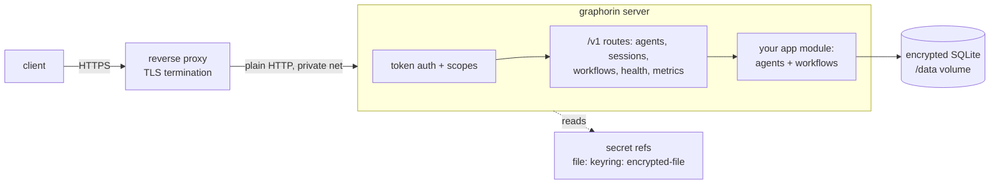

# Golden path: a production API server

The supported route from an empty directory to an authenticated HTTP
API serving an agent: scaffolded config, encrypted storage, scoped
bearer tokens, health and metrics, and the deployment templates that
CI actually exercises.

Comes after [a local agent in 10 minutes](/guide/golden-path-local);
pairs with [Operations runbooks](/guide/operations) for day-2 work
(backup, restore, upgrade, key rotation).

## Architecture



Two design points to internalize before deploying:

- **The server ships no in-process TLS.** Terminate TLS at a reverse
  proxy and acknowledge with `server.tlsTerminatedUpstream: true`;
  a non-loopback plaintext bind logs a WARN until you do
  ([Standalone server](/guide/standalone-server)).
- **Config is infrastructure-only.** Agents, workflows, and providers
  are code, composed in an app module the config points at - there is
  no "provider kind" string in config.

## Step 1 - scaffold

```bash
graphorin init --app --format json --out graphorin.config.json
```

The prompt walks through cloud-upload consent and storage encryption
(say yes to encryption), prints the server pepper ONCE, and scaffolds
two files: the config and a `graphorin.app.mjs` compose module. Persist
the pepper as a `file:` secret with tight permissions before moving on
(`--pepper-out` writes it to a 0600 file directly in CI).

A production config looks like the one the Docker template ships (and
the weekly docker-smoke workflow boots):

```json
{
  "server": { "host": "0.0.0.0", "port": 8080 },
  "auth": { "kind": "token", "pepperRef": "file:/run/secrets/graphorin/pepper" },
  "storage": {
    "path": "/data/data.db",
    "mode": "server",
    "encryption": { "enabled": true, "passphraseRef": "file:/run/secrets/graphorin/db-passphrase" }
  },
  "audit": { "enabled": true, "passphraseRef": "file:/run/secrets/graphorin/audit-passphrase" },
  "secrets": { "source": "auto", "strict": false },
  "observability": { "logger": "json" },
  "app": "./graphorin.app.mjs"
}
```

## Step 2 - put an agent behind the API

The scaffolded `graphorin.app.mjs` already mounts sessions + memory
REST. Register an agent so `POST /v1/agents/:id/run` serves a full
turn - the pattern is three lines on top of the scaffold:

```js
// inside graphorin.app.mjs, after the store/memory/sessions blocks:
import { createAgent } from '@graphorin/agent';
import { AgentRegistry } from '@graphorin/server';

const agents = new AgentRegistry();
agents.register({
  id: 'assistant',
  description: 'the production assistant',
  agent: createAgent({
    name: 'assistant',
    instructions: 'You are the product assistant.',
    provider, // compose your provider here - with withRedaction under NODE_ENV=production
  }),
});

// and add `agents` to the returned bag:
// return { store, sessions: ..., memory: ..., agents, close: ... };
```

An `Agent` instance is single-flight: one run at a time per instance
(a second concurrent call gets HTTP 409 `agent-busy`). Deploy an
instance pool - register `assistant-0..N` - when you need parallel
turns; the [error contract](/guide/errors) documents the mapping.

## Step 3 - migrate, mint, start

```bash
graphorin migrate --config graphorin.config.json
graphorin token create --scopes agents:invoke,agents:read --label api-client \
  --config graphorin.config.json
graphorin start --config graphorin.config.json
```

`token create` prints the raw bearer token once (stdout, never logged).
Scopes are hierarchical: `agents:invoke` grants every agent id,
`agents:invoke:assistant` exactly one.

## Step 4 - prove it end to end

```bash
curl -fsS http://localhost:8080/v1/health
curl -fsS -X POST http://localhost:8080/v1/agents/assistant/run \
  -H "Authorization: Bearer $TOKEN" -H 'Content-Type: application/json' \
  -d '{"input":"Summarize our return policy in one line."}'
```

Expected shapes (`/v1/health` is public; everything else needs the
bearer):

```json
{ "status": "ok", "checks": { "storage": { "status": "ok" }, "encryption": { "status": "ok" } } }
```

```json
{ "runId": "6c2d...", "status": "completed", "result": { "output": "...", "usage": { "promptTokens": 412, "completionTokens": 28, "totalTokens": 440 } } }
```

A run that parks on a gated tool returns `"status": "awaiting_approval"`
instead; resume it via `POST /v1/runs/:runId/resume` - parked approvals
survive a server restart (durable suspended runs).

## What CI proves about this path

These are not aspirations; each is a weekly workflow on the repo:

- The Docker template builds, boots this exact config shape, and
  answers `/v1/health` from the published port (docker-smoke).
- Backup -> destroy the volume -> restore from the backup file alone ->
  a pre-backup token still verifies (docker-smoke drill).
- A workflow run parked on a durable timer survives `docker kill`
  (SIGKILL) and completes after restart with no operator action
  (docker-smoke crash-resume drill).
- The server holds the published SLOs under sustained load for minutes
  at a time - zero non-200s, bounded p95 and RSS (soak workflow, stub
  provider; budgets in [Operations](/guide/operations)).
- The Kubernetes manifest validates under kubeconform and the systemd
  unit passes `systemd-analyze verify` with an offline security score
  under 5 (ci.yml).

## Demo vs production checklist

| Concern | Demo default | Production setting |
| --- | --- | --- |
| Bind + TLS | `127.0.0.1`, plain HTTP | Reverse proxy terminates TLS; `server.tlsTerminatedUpstream: true`; bind stays private |
| Auth | `kind: 'none'` allowed on loopback | `kind: 'token'`, pepper as a `file:`/`keyring:` secret, narrow scopes per client |
| Storage | Plaintext SQLite | `encryption.enabled: true` + encrypted audit log; passphrases as secret refs, 0400, owned by the service uid |
| Provider chain | Bare adapter | `withRetry` + `withRedaction` (+ rate/cost middleware); redaction is enforced under `NODE_ENV=production` |
| Metrics | Auth-gated by default | Keep `metrics.requireAuth: true`; scrape with a token carrying `admin:metrics:read` |
| Retention | Defaults | Size the `retention` block against [Performance & scale](/guide/performance) growth surfaces |
| Process supervision | Foreground terminal | systemd unit / Docker / k8s templates in `examples/` - all CI-validated |
| Backups | None | Scheduled `storage backup` + restore drill from [Operations](/guide/operations#backup) |

## Scaling model (read before adding replicas)

SQLite is a single-writer store: exactly one server process owns the
database file. Scale this architecture up (CPU/RAM, WAL keeps readers
cheap), not out - `replicas: 1` with `strategy: Recreate` in the k8s
template is a design statement, not a placeholder. Multiple tenants =
multiple instances, each with its own volume and secrets. What a
shared-backend HA story would require is tracked on the
[road to 1.0](/guide/stability#road-to-1-0); the honest split today is
in [Operations](/guide/operations#scaling-model).

## Troubleshooting

| Symptom | Cause and fix |
| --- | --- |
| WARN about plaintext HTTP on startup | Non-loopback bind without the TLS acknowledgement. Fix the proxy, then set `server.tlsTerminatedUpstream: true`. |
| `401 unauthorized` with a fresh token | Pepper mismatch: the token was minted against a different pepper file than the server resolves. One pepper per deployment. |
| `403 insufficient-scope` | The token's scopes do not cover the route (`agents:invoke:<id>` needed). Mint with the right scopes; `admin:*` is for operators only. |
| `409 agent-busy` under load | One agent instance, concurrent calls. Register an instance pool and spread clients across ids. |
| `/v1/health` 503 with `storage: failing` | Wrong `storage.path`, missing volume mount, or the encryption passphrase does not match the database. |
| First boot slow, then fine | Encrypted-store KDF on first open; the docker HEALTHCHECK budgets 45 s for it. |
