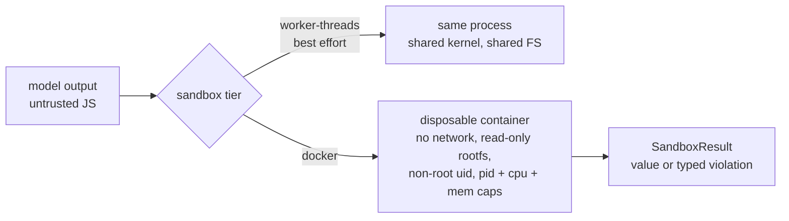

# Golden path: safe code execution

The supported route to executing code you do not trust - model-written
scripts in [code-mode](/guide/tools#code-mode), user-supplied snippets,
third-party skill hooks - behind a real isolation boundary.

Read this page as a contract: what the boundary enforces, what it
explicitly does not, and how to verify both on your own machine.

## Threat model in one paragraph

Treat generated code as attacker-controlled. The worker-threads tier
(the built-in default) is **best-effort hygiene, not a security
boundary**: it blocks the obvious escape hatches (`fs`, network
imports, `child_process`, `vm`) and scrubs the environment, but it
shares your process. The `docker` tier moves execution into a
disposable container with kernel-level isolation - that is the tier
this page wires. The full tier table and threat-model prose live in
[Security](/guide/security#sandbox-tiers).



## Prerequisites

- A Docker daemon the server user can reach.
- The `dockerode` peer (v5+): `npm install dockerode@^5` - the base
  install ships zero native sandbox code; the peer loads lazily.
- A sandbox image. The framework deliberately ships none; a minimal
  one is:

```bash
cat > Dockerfile.sandbox <<'EOF'
FROM node:22-slim
USER 10001:10001
EOF
docker build -f Dockerfile.sandbox -t graphorin-sandbox:latest .
```

## The worked example

```ts
import { createDockerSandbox } from '@graphorin/security/sandbox';

const sandbox = createDockerSandbox({
  image: 'graphorin-sandbox:latest',
  memoryLimitMb: 256,
  cpus: 0.5,
  pidsLimit: 64,
  defaultTimeoutMs: 10_000,
});

// The code is a plain source string - imagine the model wrote it. It
// runs inside an async wrapper; the input payload is visible as the
// __INPUT__ global (JSON-embedded, the only data door into the box).
const result = await sandbox.run<{ readonly n: number }, number>(
  {
    kind: 'source',
    source: 'const { n } = __INPUT__; return n * n;',
  },
  { input: { n: 12 } },
);

if (result.ok) {
  console.log('output:', result.output, `(${result.durationMs}ms)`);
} else {
  console.log('blocked:', result.error.kind, result.error.message);
}
```

Expected output (duration varies):

```
output: 144 (412ms)
```

Results are **errors-as-data**: every failure comes back as
`{ ok: false, error: { kind, message }, durationMs }` with `kind` one
of `timeout | memory-exceeded | sandbox-violation | aborted |
execution-failed` - never a throw you have to catch around every call.
The runtime maps this shape onto the tool-outcome union when the
sandbox backs a tool.

## What the boundary enforces

Container defaults (every one is a `createDockerSandbox` option; the
values below are the shipped defaults):

| Control | Default | What it stops |
| --- | --- | --- |
| Network | disabled | Exfiltration, C2 callbacks, dependency fetching |
| Root filesystem | read-only; `/work` tmpfs (64 MB, mode 0700) is the only writable mount | Persistence, host tampering |
| User | `10001:10001` (non-root; `user: ''` opts back to the image default) | Container-root privilege escalation surface |
| Capabilities | all dropped + `no-new-privileges` | setuid tricks, raw sockets |
| Memory | 512 MB (`memoryLimitMb`) | Memory bombs |
| PIDs | 128, clamped 16-4096 (`pidsLimit`) | Fork bombs |
| CPU | 1 CPU, clamped 0.1-8 (`cpus`) | CPU starvation of the host |
| Wall clock | 30 s (`defaultTimeoutMs`), force-removed after | Infinite loops, zombie containers |

Verify the negatives yourself - each should come back `ok: false` (or
an empty result), not hang and not succeed:

```ts
import { createDockerSandbox } from '@graphorin/security/sandbox';

const sandbox = createDockerSandbox({ image: 'graphorin-sandbox:latest' });

// Network is unreachable (fetch rejects; surfaces as execution-failed):
const net = await sandbox.run(
  { kind: 'source', source: "await fetch('https://example.com'); return 'reached';" },
  { input: undefined },
);
console.log('network attempt ok?', net.ok); // false

// Writes outside /work are denied by the read-only rootfs (EROFS):
const write = await sandbox.run(
  {
    kind: 'source',
    source: "require('node:fs').writeFileSync('/etc/owned', 'x'); return 'wrote';",
  },
  { input: undefined },
);
console.log('rootfs write ok?', write.ok); // false
```

The same assertions run as live negative tests against a real daemon in
the repo's security suite (uid, rootfs, network, pid ceiling), so the
defaults cannot silently regress.

## Wiring it into an agent

Code-mode is where this matters in practice: the agent writes a script
against projected tool APIs and `code_execute` runs it in a sandbox.
Point the executor's `sandboxResolver` at the docker tier for untrusted
trust classes and keep worker-threads for your own first-party hooks -
[Tools: sandbox tiers](/guide/tools#sandbox-tiers) shows the resolver
wiring and the per-tier policy table.

## What stays out of scope

Be explicit with yourself about what this page did NOT give you:

- **Worker-threads is not a boundary.** If the code is hostile and the
  docker tier is unavailable, the honest options are "do not run it"
  or an infrastructure sandbox (gVisor, Firecracker, a throwaway VM).
- **The container shares the host kernel.** A kernel 0-day is outside
  this boundary; regulated multi-tenant isolation wants a VM boundary
  on top.
- **Secrets hygiene is yours.** Nothing you mount or bake into the
  sandbox image is protected from the code running there - keep the
  image empty of credentials; the sandbox passes `input` explicitly
  and that is the only data door.
- **Resource limits are per-run.** A queue of hostile runs is a
  denial-of-service surface at the scheduler level - cap concurrency
  upstream.

## Troubleshooting

| Symptom | Cause and fix |
| --- | --- |
| `sandbox-violation ... dockerode` | The peer is not installed (or not v5). `npm install dockerode@^5`. |
| `connect ENOENT /var/run/docker.sock` | The daemon socket is elsewhere or unreadable - pass `socketPath`, and never add the server user to `docker` group on a shared host without understanding that is root-equivalent. |
| `No such image: graphorin-sandbox:latest` | Build or pull the sandbox image first; the framework ships none by design. |
| Every run times out at 30 s | Cold image pulls or a busy daemon; raise `defaultTimeoutMs` per call via `timeoutMs`, and pre-pull the image in deployment. |
| `EACCES` on `/work` | You overrode `user:` to a uid the tmpfs is not owned by - the tmpfs is owned by the numeric `user` option; keep them consistent. |
