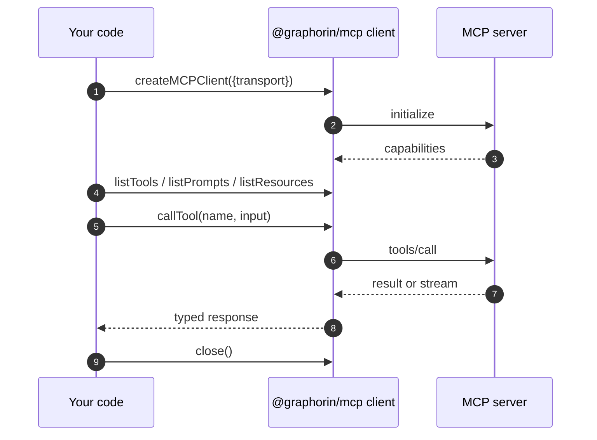

# MCP client

`@graphorin/mcp` is an in-core Model Context Protocol client wrapping [`@modelcontextprotocol/sdk`](https://github.com/modelcontextprotocol/typescript-sdk). It exposes connections, tool discovery, prompt discovery, resource discovery, OAuth-protected transports, and the bridge that turns an MCP-discovered tool into a Graphorin `Tool` your agent can call.

## Transports

Two transports are supported, matching the current MCP specification (a deprecated SSE transport is also accepted with a one-time warning):

| Transport | When to use |
|---|---|
| **stdio** | Local MCP servers spawned as a subprocess. |
| **Streamable HTTP** | Remote MCP servers reachable over HTTP/HTTPS, including OAuth-protected endpoints. |

```ts
import { createMCPClient } from '@graphorin/mcp';

const stdioClient = await createMCPClient({
  transport: {
    kind: 'stdio',
    command: 'mcp-server-filesystem',
    args: ['--root', './workspace'],
  },
});

const httpClient = await createMCPClient({
  transport: {
    kind: 'streamable-http',
    url: 'https://mcp.example.com/v1',
    headers: { authorization: 'Bearer …' },
  },
});
```

## Discovering tools, prompts, and resources

```ts
const tools = await stdioClient.listTools();
const prompts = await stdioClient.listPrompts();
const resources = await stdioClient.listResources();
```

Every discovered surface is fully typed.

## Bridging MCP tools into the agent

The client exposes a `toTools(...)` adapter that turns the discovered MCP tool descriptors into Graphorin `Tool` objects ready to register with `@graphorin/tools`:

```ts
import { createToolRegistry } from '@graphorin/tools';

const mcpTools = await stdioClient.toTools({
  // Optional namespace prefix to disambiguate tool names.
  namespace: 'fs',
  // Optional `defer_loading` override; defaults to auto when there
  // are more than 10 tools.
  deferLoading: false,
  // Per-tool side-effect classification override (DEC-153).
  sideEffectClassByTool: {
    'fs/write': 'side-effecting',
  },
});

const registry = createToolRegistry({
  tools: [...mcpTools, ...firstPartyTools],
  collisionStrategy: 'auto-prefix',
});
```

The adapter:

- filters / namespaces the surfaced tools;
- maps the MCP tool's input/output schemas into the `Tool` contract;
- defaults each generated tool to `sideEffectClass: 'external-stateful'` (operators downgrade per-tool through `sideEffectClassByTool`);
- routes execution back through the client's `callTool(name, input)`;
- emits one `mcp.call.invoked.total` counter per call and a `mcp.tool.invoke` span via `@graphorin/observability`.

## Large resources: `resource_link` → result handles

When a tool result includes a `resource_link` content part, the adapter does **not** inline the resource body. It surfaces a compact preview plus the resource `uri` as a *result handle* (ties to the P1-4 result handles), so a large dataset enters context only if the model asks for it. The model fetches it on demand through the built-in `read_result` tool, backed by an MCP resource reader:

```ts
import { createAgent } from '@graphorin/agent';
import { createMcpResourceReader } from '@graphorin/mcp/client';

const agent = createAgent({
  name: 'researcher',
  instructions: '…',
  provider,
  tools: mcpTools,
  // Lets `read_result` resolve MCP `resource_link` handles on demand by
  // calling `readResource(uri)`. Tried after the built-in spill-file
  // reader; supplying it force-registers `read_result`.
  resultReaders: [createMcpResourceReader({ clients: [httpClient] })],
});
```

`createMcpResourceReader` reads the resource via `readResource` and applies the caller's byte/line range, so the model can page a large resource exactly like a spilled artifact. With more than one client it tries each until one server resolves the URI.

## Server-initiated requests: elicitation & sampling

MCP servers can call *back* to the client mid-request. Graphorin surfaces the two most useful patterns through opt-in callbacks on `createMCPClient`. Both are **gated**: the client advertises the capability — and a conforming server only issues the request — when you supply the matching handler. The default client advertises neither (no implicit prompting, no implicit model calls — Principle #1).

### Elicitation (`elicitation/create`)

A server can ask the human for structured input in the middle of a tool call. Back it with your HITL surface (a CLI prompt, the agent's approval channel, …):

```ts
const client = await createMCPClient({
  transport: { kind: 'stdio', command: 'my-mcp-server' },
  elicitation: async (request) => {
    // request.message + request.requestedSchema (a JSON-Schema object)
    const confirmed = await promptOperator(request.message);
    return confirmed
      ? { action: 'accept', content: { confirm: true } }
      : { action: 'decline' };
  },
});
```

Because an elicitation arrives while a `callTool(...)` request is in flight, the handler resolves **in-process** — it does not durably suspend a Graphorin run. (Durable-suspend elicitation across the request lifetime is a planned follow-up.)

### Sampling (`sampling/createMessage`)

A server can ask the client's model to generate a completion. Back it with a `Provider`. The request messages are **MCP-derived (untrusted)** — run them through the same redaction / sensitivity middleware you use elsewhere:

```ts
const client = await createMCPClient({
  transport: { kind: 'stdio', command: 'my-mcp-server' },
  sampling: async (request) => {
    const out = await provider.generate({
      messages: request.messages.map(toProviderMessage),
      maxTokens: request.maxTokens,
    });
    return { role: 'assistant', content: { type: 'text', text: out.text }, model: out.model };
  },
});
```

Observability: `mcp.elicitation.requested|accepted|declined.total`, `mcp.sampling.requested|completed.total`, and `mcp.resource-link.emitted|resolved.total` counters track each gated path.

## OAuth 2.1 with PKCE

Remote MCP servers that require authorisation flow through `@graphorin/security/oauth`, which implements the **Authorization Code grant with PKCE-S256** (RFC 7636 + OAuth 2.1) plus refresh-token rotation (RFC 6749 § 6) using the optional [`openid-client`](https://github.com/panva/openid-client) peer dependency. The Device Authorization Grant is also supported for headless clients.

The CLI command `graphorin auth login` walks the operator through the flow once; the resulting tokens are stored as `SecretValue`s in the configured secrets store and refreshed lazily on the next call. To use the resulting tokens with an MCP client, resolve the bearer through a `SecretRef` and pass it into the transport's `headers`:

```ts
import { resolveSecret } from '@graphorin/security';

const token = await resolveSecret('keyring:mcp_example_token');
const httpClient = await createMCPClient({
  transport: {
    kind: 'streamable-http',
    url: 'https://mcp.example.com/v1',
    headers: { authorization: `Bearer ${token.reveal()}` },
  },
});
```

## Lifecycle



`createMCPClient(...)` opens the connection and performs the MCP `initialize` handshake before resolving. `client.close()` is idempotent and required for clean shutdown.

## Error mapping

| MCP error code | Graphorin `ToolError.kind` |
|---|---|
| `MethodNotFound` | `'not-found'` |
| `InvalidParams` | `'invalid-input'` |
| `InternalError` | `'internal-error'` |
| `RequestCanceled` | `'aborted'` |
| `Timeout` | `'timed-out'` |

## Audit + observability

Every `client.callTool(...)` lands one row in the audit log with the server URL, the tool name, the call id, the duration, and the redacted (sensitivity-aware) result. The `mcp.tool.invoke` span carries the same metadata for live tracing.

## Next steps

- [Tools](/guide/tools) — how the bridged tools coexist with first-party tools.
- [Security](/guide/security) — OAuth + sandbox model for untrusted servers.
- [CLI](/guide/cli) — `graphorin auth login` flow.

---

**Graphorin** · v0.4.0 · MIT License · © 2026 Oleksiy Stepurenko
