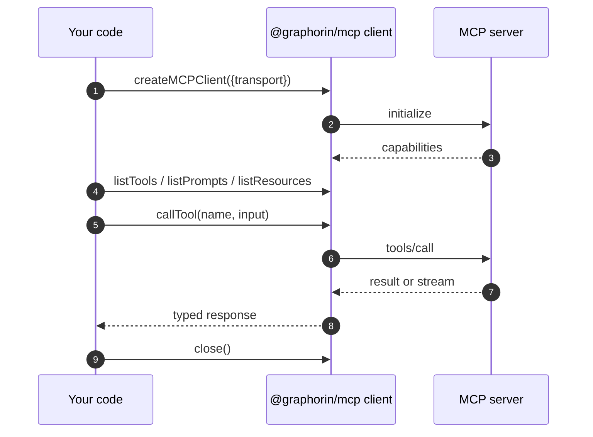

# MCP client

`@graphorin/mcp` is an in-core Model Context Protocol client wrapping [`@modelcontextprotocol/sdk`](https://github.com/modelcontextprotocol/typescript-sdk). It exposes connections, tool discovery, prompt discovery, resource discovery, OAuth-protected transports, and the bridge that turns an MCP-discovered tool into a Graphorin `Tool` your agent can call.

The scoping is deliberate and consume-only: Graphorin is an MCP **client** (stdio / Streamable HTTP / SSE) and nothing more. It does not expose its own tools or agents over MCP; there is no MCP server in the framework. To invoke Graphorin tools or agents remotely, use the REST / WebSocket [standalone server](/guide/standalone-server) (`@graphorin/server`). That server's `/v1/mcp/servers` routes (list / register / remove, scope `mcp:admin`) manage which *external* MCP servers the runtime connects to as a client; they are a management surface, not an MCP endpoint.

## Transports

Two transports are supported, matching the current MCP specification (a deprecated SSE transport is also accepted with a one-time warning):

| Transport | When to use |
|---|---|
| **stdio** | Local MCP servers spawned as a subprocess. |
| **Streamable HTTP** | Remote MCP servers reachable over HTTP/HTTPS, including OAuth-protected endpoints. |

```ts
import { createMCPClient } from '@graphorin/mcp';

const stdioClient = await createMCPClient({
  transport: {
    kind: 'stdio',
    command: 'mcp-server-filesystem',
    args: ['--root', './workspace'],
  },
});

const httpClient = await createMCPClient({
  transport: {
    kind: 'streamable-http',
    url: 'https://mcp.example.com/v1',
    headers: { authorization: 'Bearer …' },
  },
});
```

## Discovering tools, prompts, and resources

```ts
import { createMCPClient } from '@graphorin/mcp';

const stdioClient = await createMCPClient({
  transport: { kind: 'stdio', command: 'mcp-server-filesystem' },
});

const tools = await stdioClient.listTools();
const prompts = await stdioClient.listPrompts();
const resources = await stdioClient.listResources();
```

Every discovered surface is fully typed.

## Bridging MCP tools into the agent

The client exposes a `toTools(...)` adapter that turns the discovered MCP tool descriptors into Graphorin `Tool` objects ready to register with `@graphorin/tools`:

```ts
import type { Tool } from '@graphorin/core';
import { createToolRegistry } from '@graphorin/tools';
import { createMCPClient } from '@graphorin/mcp';

const stdioClient = await createMCPClient({
  transport: { kind: 'stdio', command: 'mcp-server-filesystem' },
});
const firstPartyTools: ReadonlyArray<Tool> = []; // your own Tool objects

const mcpTools = await stdioClient.toTools({
  // Optional namespace prefix to disambiguate tool names.
  namespace: 'fs',
  // Optional `defer_loading` override; defaults to auto when there
  // are more than 10 tools.
  defer_loading: false,
  // Per-tool side-effect classification override (DEC-153).
  sideEffectClassByTool: {
    // Namespaced with '.', matching the adapted tool names.
    'fs.write': 'side-effecting',
  },
});

// `createToolRegistry()` takes no tool list. Register each tool with its
// source - the strategy-aware registry uses the `serverIdentity` to
// auto-prefix names that collide across servers.
const registry = createToolRegistry();
for (const tool of mcpTools) {
  registry.register(tool, { kind: 'mcp', serverIdentity: 'filesystem' });
}
for (const tool of firstPartyTools) {
  registry.register(tool, { kind: 'first-party' });
}
```

The adapter:

- filters / namespaces the surfaced tools;
- maps the MCP tool's input/output schemas into the `Tool` contract;
- defaults each generated tool to `sideEffectClass: 'external-stateful'` (operators downgrade per-tool through `sideEffectClassByTool`). A downgrade to `'read-only'` / `'pure'` is a wide trust decision: sink classification is fully metadata-driven, so the tool leaves **every** sink check at once - the data-flow gate, the Rule-of-Two writer forbid, and the read-only capability gate. The server's own `readOnlyHint` is deliberately **not** trusted for this (a hostile server could self-declare read-only). Downgrade only tools whose read-only nature you have verified yourself; each downgrade logs one WARN at adaptation time and is listed in `AdaptedToolsResult.downgradedTools` for audits;
- routes execution back through the client's `callTool(name, input)`;
- emits `mcp.call.invoked.total` / `mcp.call.failed.total` / `mcp.call.cancelled.total` counters per call (there is no MCP-specific span today; adapted tools still get the executor's regular `tool.execute` span).

## Large resources and result handles

When a tool result includes a `resource_link` content part, the adapter does **not** inline the resource body. It surfaces a compact preview plus the resource `uri` as a *result handle* (ties to the P1-4 result handles), so a large dataset enters context only if the model asks for it. The model fetches it on demand through the built-in `read_result` tool, backed by an MCP resource reader:

```ts
import { createAgent } from '@graphorin/agent';
import { createMCPClient } from '@graphorin/mcp';
import { createMcpResourceReader } from '@graphorin/mcp/client';
import { createProvider, ollamaAdapter } from '@graphorin/provider';

const httpClient = await createMCPClient({
  transport: { kind: 'streamable-http', url: 'https://mcp.example.com/v1' },
});
const mcpTools = await httpClient.toTools();

const agent = createAgent({
  name: 'researcher',
  instructions: 'Answer with the MCP resources at hand.',
  provider: createProvider(
    ollamaAdapter({ baseUrl: 'http://127.0.0.1:11434', model: 'qwen2.5:7b-instruct' }),
  ),
  tools: mcpTools,
  // Lets `read_result` resolve MCP `resource_link` handles on demand by
  // calling `readResource(uri)`. Tried after the built-in spill-file
  // reader; supplying it force-registers `read_result`.
  resultReaders: [createMcpResourceReader({ clients: [httpClient] })],
});
```

`createMcpResourceReader` reads the resource via `readResource` and applies the caller's byte/line range, so the model can page a large resource exactly like a spilled artifact. With more than one client it tries each until one server resolves the URI.

## Server-initiated requests: elicitation & sampling

MCP servers can call *back* to the client mid-request. Graphorin surfaces the two most useful patterns through opt-in callbacks on `createMCPClient`. Both are **gated**: the client advertises the capability - and a conforming server only issues the request - when you supply the matching handler. The default client advertises neither (no implicit prompting, no implicit model calls - Principle #1).

::: warning Deprecation notice (MCP 2026-07-28 RC)
The 2026-07-28 protocol revision **deprecates Sampling, Roots, and protocol-level Logging** with a 12-month removal window; long-running work moves to the **Tasks extension** (a separate extension, not the 2025-11 experimental core feature). Graphorin keeps its gated sampling/elicitation callbacks for compatibility with 2025-11 servers, but treat sampling as frozen: no new capabilities will be layered on it, and new integrations should not depend on it. Any future Tasks support will target the extension shape.
:::

### Elicitation (`elicitation/create`)

A server can ask the human for structured input in the middle of a tool call. Back it with your HITL surface (a CLI prompt, the agent's approval channel, …):

```ts
import { createMCPClient } from '@graphorin/mcp';

// Back this with your real HITL surface (a CLI prompt, an approval queue, ...).
const promptOperator = async (message: string): Promise<boolean> => {
  console.log(message);
  return true;
};

const client = await createMCPClient({
  transport: { kind: 'stdio', command: 'my-mcp-server' },
  elicitation: async (request) => {
    // request.message + request.requestedSchema (a JSON-Schema object)
    const confirmed = await promptOperator(request.message);
    return confirmed
      ? { action: 'accept', content: { confirm: true } }
      : { action: 'decline' };
  },
});
```

Because an elicitation arrives while a `callTool(...)` request is in flight, the handler resolves **in-process** - it does not durably suspend a Graphorin run. (Durable-suspend elicitation across the request lifetime is a planned follow-up.)

### Sampling (`sampling/createMessage`)

A server can ask the client's model to generate a completion. Back it with a `Provider`. The request messages are **MCP-derived (untrusted)** - run them through the same redaction / sensitivity middleware you use elsewhere:

```ts
import type { Message } from '@graphorin/core';
import { createMCPClient, type MCPSamplingMessage } from '@graphorin/mcp';
import { createProvider, ollamaAdapter } from '@graphorin/provider';

const provider = createProvider(
  ollamaAdapter({ baseUrl: 'http://127.0.0.1:11434', model: 'qwen2.5:7b-instruct' }),
);

// Project each MCP-derived message onto the provider `Message` shape
// (text parts only here) - and run your redaction middleware over it.
const toProviderMessage = (m: MCPSamplingMessage): Message => {
  const text = m.content.map((part) => (part.type === 'text' ? part.text : '')).join('');
  return m.role === 'user' ? { role: 'user', content: text } : { role: 'assistant', content: text };
};

const client = await createMCPClient({
  transport: { kind: 'stdio', command: 'my-mcp-server' },
  sampling: async (request) => {
    const out = await provider.generate({
      messages: request.messages.map(toProviderMessage),
      maxTokens: request.maxTokens,
    });
    return { role: 'assistant', content: { type: 'text', text: out.text ?? '' }, model: provider.modelId };
  },
});
```

Observability: `mcp.elicitation.requested|accepted|declined.total`, `mcp.sampling.requested|completed.total`, and `mcp.resource-link.emitted|resolved.total` counters track each gated path.

## OAuth 2.1 with PKCE

Remote MCP servers that require authorisation flow through `@graphorin/security/oauth`, which implements the **Authorization Code grant with PKCE-S256** (RFC 7636 + OAuth 2.1) plus refresh-token rotation (RFC 6749 § 6) using the optional [`openid-client`](https://github.com/panva/openid-client) peer dependency. The Device Authorization Grant is also supported for headless clients.

The CLI command `graphorin auth login` walks the operator through the flow once; the resulting tokens are stored as `SecretValue`s in the configured secrets store and refreshed lazily on the next call. To use the resulting tokens with an MCP client, pass an `authProvider` built by `createOAuthAuthorizationProvider`. The client installs a per-request fetch-wrapper that calls `authProvider.resolveHeader()` on **every** outgoing request, so the refresh-ahead window fires automatically and a long-lived agent session survives token expiry without re-creating the client:

```ts
import { createOAuthAuthorizationProvider, createMCPClient } from '@graphorin/mcp';
import { createInMemoryOAuthServerStore, createSecretsStore } from '@graphorin/security';

// In production: the persistent OAuthServerStore the login flow wrote to.
const storage = createInMemoryOAuthServerStore();
// The SecretsStore holding the persisted token material (SPL-1).
const secretsStore = await createSecretsStore();

const authProvider = createOAuthAuthorizationProvider({
  serverId: 'example-mcp',
  storage, // the OAuthServerStore the login flow persisted to
  secretsStore, // resolves the persisted tokens across process restarts
});

const httpClient = await createMCPClient({
  transport: {
    kind: 'streamable-http',
    url: 'https://mcp.example.com/v1',
  },
  authProvider,
});
```

With `secretsStore` supplied, a fresh process serves the persisted access token directly for as long as the stored session is provably fresh (outside the `refreshAheadMs` window, default 5 minutes) - the first `resolveHeader()` does not burn a refresh-token rotation. Without it the provider has no token source across restarts: the `OAuthServerStore` record carries only refs, so the first request has to refresh (and fails when no refresh token is resolvable). The programmatic wrappers `mcpAuthRefresh` / `mcpAuthRevoke` / `mcpAuthStatus` / `mcpAuthListSessions` accept and forward the same `secretsStore` option, so refresh and revoke also work across processes.

Do **not** resolve the token once into static `headers` - that pins a single token and defeats the refresh-ahead window. For a rare pre-shared token, pass `bearerToken` instead; `authProvider` and `bearerToken` are mutually exclusive and supplying both throws `MCPInvalidConfigError`.

## Lifecycle



`createMCPClient(...)` opens the connection and performs the MCP `initialize` handshake before resolving. `client.close()` is idempotent and required for clean shutdown.

## OAuth discovery hardening

Discovery is a trust boundary (SPL-7): metadata names the endpoints that will receive authorization codes, refresh tokens and Basic client secrets. The client therefore **rejects non-https endpoints** (plain `http` is allowed only for loopback hosts - `localhost`, `127.0.0.1`, `[::1]` - for local development), **enforces RFC 8414 §3.3 issuer consistency** (the metadata `issuer` must equal the discovery URL it was fetched for), and builds well-known URLs via **RFC 8414 path-insertion** for path-bearing issuers (the suffix-append form is kept as a fallback for pre-RFC servers). The authorization callback also **requires the `state` parameter** (SPL-6) - a callback omitting it is rejected outright as a CSRF/code-injection attempt.

## Error mapping

The client throws typed `@graphorin/mcp` errors; the tool **executor** then maps whatever an adapted tool throws onto `ToolError.kind`:

| Client-side error | Executor `ToolError.kind` |
|---|---|
| `MCPProtocolError` (transport / RPC failures) | `'execution_failed'` |
| `MCPCallTimeoutError` (`timeoutMs` expiry, `kind: 'call-timeout'`) | `'execution_failed'` |
| Abort via the run signal | `'aborted'` |
| `CallToolResult.isError: true` | tool **failure** - `MCPToolExecutionError` (`kind: 'tool-execution'`) with the server's content text in the message, so the executor records a real failure (audit, retry and error policies engage) while the model keeps the self-correction signal |

Two call-level knobs complete the picture: `callTool(name, args, { signal, timeoutMs })` honours the abort signal (an aborted agent run sends `notifications/cancelled` to the server - adapted tools forward their `ToolExecutionContext.signal` automatically) and maps `timeoutMs` onto the SDK request timeout, surfacing expiry as `MCPCallTimeoutError` (`kind: 'call-timeout'`). `toTools({ callTimeoutMs })` applies the same timeout to every adapted tool's calls.

## Definition pinning and `list_changed`

**Durable trust-on-first-use (`pinStore`).** Pass `toTools({ pinStore })` - any `{ get(serverId), set(serverId, fingerprints) }` store (a JSON file, a SQLite table) - and the client records each server's definition fingerprints on first sight (`mcp.tools.pins-recorded.total`) and compares on every later call. With a store present, a mismatch **rejects by default** (`MCPToolPinningError` - a persisted first approval is an explicit trust decision; pass `onPinMismatch: 'warn'` to downgrade). Explicit `pinnedFingerprints` win over the store. Tool descriptions additionally run through the injection heuristics at registration; hits are stripped AND counted (`mcp.tool-description.injection-flagged.total`) so a poisoning server is visible, not silently laundered.


Tool definitions are a poisoning surface: a server can change a tool's description or schema behind an already-approved name (the **approve-then-swap rug-pull**). The client makes this visible (MC-6):

- Every adapted tool carries a stable sha256 **`__definitionHash`** (over name + description + input/output schema + title, key-sorted). Persist it alongside your approval record.
- Within one client's lifetime, a definition drifting between `toTools()` snapshots is audited (`mcp.tools.changed.total` + a warn log with both hashes).
- Across restarts, pass your stored pins back: `toTools({ pinnedFingerprints: { toolName: hash }, onPinMismatch: 'reject' })` throws `MCPToolPinningError` (`kind: 'pin-mismatch'`) on divergence; the default `'warn'` audits `mcp.tools.pin-mismatch.total` and continues.
- `notifications/tools/list_changed` is subscribed: each one bumps `mcp.tools.list-changed.total` and logs a warning - re-run `toTools()` to refresh and re-sanitize the catalogue (which also re-runs the drift diff).

## Audit + observability

The client itself emits **counters**, not audit rows or spans: `mcp.call.invoked|failed|cancelled.total`, `mcp.structured-content.*`, `mcp.resource-link.*`, `mcp.tools.changed|list-changed|pin-mismatch.total`, `mcp.elicitation.*`, `mcp.sampling.*`, and `mcp.transport.closed|error.total`. Tool calls that run through the agent's executor additionally land the executor's generic `tool:execute:*` audit rows (which do not carry the server URL). Server-initiated **sampling and tasks with tool-use, and icons, are known-unsupported** (a sampling request carrying `tools` is rejected with an `McpError`, per the 2025-11-25 MUST).

## Next steps

- [Tools](/guide/tools) - how the bridged tools coexist with first-party tools.
- [Security](/guide/security) - OAuth + sandbox model for untrusted servers.
- [CLI](/guide/cli) - `graphorin auth login` flow.

