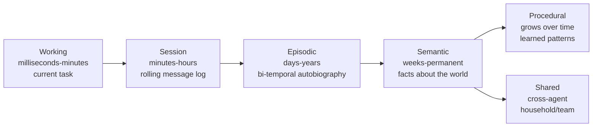
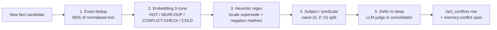

# Memory system

Most frameworks treat memory as one undifferentiated bag. Graphorin treats it as **six layers**, each with its own lifecycle, conflict-resolution strategy, and privacy posture. Together they give your assistant a memory it can actually live with — for years.

## The six tiers



| Tier | What it stores | Read surface | Write surface |
|---|---|---|---|
| **working** | Short structured blocks holding what the assistant is doing right now — persona, current task, immediate context. | `list`, `read`, `compile` | `define`, `write`, `patch`, `attach`, `detach` |
| **session** | The rolling message log of the current conversation. | `list`, `search`, `attributedFor` | `push`, `flushImportant`, `compact` |
| **episodic** | Things that happened — decisions, events, milestones — captured with proper bi-temporal validity. | `recent`, `search` | `record` |
| **semantic** | Facts about you, the world, the task. Conflicts resolved through a multi-stage pipeline. | `search` | `remember`, `supersede`, `forget` |
| **procedural** | How to do things — workflows, recipes, learned patterns. | `list`, `activate` | `define`, `remove` |
| **shared** | Common knowledge across multiple agents in the same household, team, or organisation. | `listFor` | `attach`, `detach` |

## The facade

Every tier is wired through one entry point — `createMemory({ ... })`:

```ts
import { createSqliteStore } from '@graphorin/store-sqlite';
import { createTransformersJsEmbedder } from '@graphorin/embedder-transformersjs';
import { createMemory } from '@graphorin/memory';

const sqlite = await createSqliteStore({ path: './assistant.db' });
await sqlite.init();

const memory = createMemory({
  store: sqlite.memory,
  embeddings: sqlite.embeddings,
  embedder: createTransformersJsEmbedder(),
});

await memory.semantic.remember(
  { userId: 'alex' },
  { text: 'Loves mountain hiking and fresh espresso.' },
);

const hits = await memory.semantic.search(
  { userId: 'alex' },
  'mountain trip ideas',
);
```

## The nine memory tools

`memory.tools` is a typed `Tool[]` ready to register with `@graphorin/tools`. Every entry exposes typed input / output schemas, the right memory-modification guard tier, and the right `sideEffectClass` so that the agent runtime can sandbox and audit it.

| Tool | Tier | Purpose |
|---|---|---|
| `block_append` | working | Append text to a working memory block. |
| `block_replace` | working | Replace a unique substring inside a block. |
| `block_rethink` | working | Replace a block's value entirely. |
| `fact_remember` | semantic | Persist a new fact through the multi-stage conflict pipeline. |
| `fact_search` | semantic | Hybrid (vector + FTS5 + RRF) search over facts. |
| `fact_supersede` | semantic | Mark an old fact superseded by a new one. |
| `fact_forget` | semantic | Soft-delete a fact (kept for replay). |
| `recall_episodes` | episodic | Triple-signal episode retrieval. |
| `conversation_search` | session | FTS5 search over the active session messages. |

## Hybrid search

Semantic memory composes dense-vector results with full-text (FTS5) results and fuses them through the built-in **Reciprocal Rank Fusion** reranker (k=60 by default). The fusion is deterministic, requires no extra model, and rarely needs tuning.

```ts
import { RRFReranker } from '@graphorin/memory/search';

memory.semantic.setReranker(new RRFReranker({ k: 60 }));
```

Plug in any `ReRanker` implementation — a cross-encoder model, an LLM judge, a custom scoring function — when the default is not sharp enough. The optional `@graphorin/reranker-transformersjs` and `@graphorin/reranker-llm` packages ship reference implementations.

## Multi-stage conflict resolution



Every `semantic.remember(...)` call flows through five stages in order:

1. **Exact dedup.** MD5 hash on the canonical (lowercase, collapsed-whitespace, trimmed) candidate body short-circuits on a hit.
2. **Embedding three-zone.** Top-K neighbours from `searchVector` classify the candidate into HOT (`>= 0.95`), NEAR-DUP (`>= 0.85`), CONFLICT-CHECK (`> 0.4`), or COLD. HOT zone always dedups (semantic identity outranks every other signal).
3. **Heuristic regex.** The active locale pack's supersede + negation markers fire when the candidate has an explicit change signal (`moved to`, `no longer`, `got promoted`, …).
4. **Subject / predicate.** Naive `(subject, predicate, object)` split using the locale pack's predicate normalisers; matching subject + predicate with a different object is a strong supersede signal.
5. **Defer to deep LLM judge.** Stages 1–4 yielded no decision but the candidate sits in CONFLICT-CHECK zone — the row is admitted `pending` and queued for the consolidator's deep phase.

Every decision lands one row in the `fact_conflicts` table with the producing stage, the detection zone, the cosine similarity (where applicable), and a reason string. A `memory.conflict` span is emitted per call. The English locale pack ships by default; additional locales plug in via `defineLocalePack({...})`.

## Bi-temporal storage

Fact writes set `validFrom = now` and leave `validTo = null`; supersede chains are kept intact for replay. Old facts are **superseded, never silently overwritten** — every change is auditable.

```ts
const decision = await memory.semantic.rememberWithDecision(scope, {
  text: 'I just moved to Tbilisi for the new gig.',
});
console.log(decision.kind);
// 'supersede' | 'dedup' | 'pending' | 'admit'
```

## Background consolidator

A separate background process (`Consolidator`) distils long conversations into long-term knowledge. It runs in three phases with a built-in cost budget so it can never run away with your bill:

| Phase | What it does |
|---|---|
| **Light** | Summarisation + conflict-resolution flush of pending rows. |
| **Standard** | Episode formation, semantic promotion, cross-conflict resolution. |
| **Deep** | Cross-session pattern detection, procedural extraction, shared-tier promotion. |

Per-tier defaults from `CONSOLIDATOR_TIER_DEFAULTS`:

| Tier | Phases enabled | `maxTokensPerDay` | `maxCostPerDay` (USD) | `onExceed` |
|---|---|---|---|---|
| `'free'` (default) | `light` only | `0` (effectively no-op) | `0` | `'pause'` |
| `'cheap'` | `light + standard` | `50 000` | `0.20` | `'pause'` |
| `'standard'` | `light + standard + deep` | `200 000` | `1.00` | `'log'` |
| `'full'` | `light + standard + deep` | `1 000 000` | `5.00` | `'log'` |
| `'custom'` | operator-defined | operator must set | operator must set | operator must set |

The default `'free'` tier registers the `light` phase but pins both ceilings to zero, so consolidation effectively does nothing until you opt in. Override when you want memory to feel alive after the first conversation:

```ts
createMemory({
  store: sqlite.memory,
  embeddings: sqlite.embeddings,
  embedder: createTransformersJsEmbedder(),
  consolidator: { tier: 'cheap', enabled: true, provider },
});
```

`'custom'` requires explicit `ceilings.maxTokensPerDay` + `ceilings.maxCostPerDay` (and `cheapModel` / `deepModel` if those phases are enabled) — `CustomTierMisconfiguredError` is thrown otherwise. The full `CONSOLIDATOR_TIER_DEFAULTS` table is exported from `@graphorin/memory`.

## Embedder migration

Switching embedders silently is a footgun — old vectors are not comparable to new ones. The runner in `@graphorin/memory/migration` makes the change explicit:

```ts
import { migrateEmbedder } from '@graphorin/memory/migration';
import { createTransformersJsEmbedder } from '@graphorin/embedder-transformersjs';

const target = createTransformersJsEmbedder({ model: 'Xenova/multilingual-e5-large' });

for await (const progress of migrateEmbedder({
  store: sqlite,
  embeddings: sqlite.embeddings,
  source: memory.embedder,
  target,
  strategy: 'auto-migrate',
})) {
  console.log(`${progress.processed}/${progress.total} (${progress.kind})`);
}
```

| Strategy | Behaviour |
|---|---|
| `lock-on-first` (default) | Refuses any silent embedder swap with an actionable error pointing at the planned migration. |
| `multi-active` | Keeps both `vec0` tables alive — reads union, writes go to the active embedder. |
| `auto-migrate` | Re-embeds existing rows in resumable batches (checkpointed via `migration_state`; cancellable with `AbortSignal`). |

## Privacy levels

Every memory row carries a `Sensitivity` tag — `public`, `internal`, or `secret`. The tag flows through traces, exports, and the provider middleware. Sensitive content is redacted by default; you cannot accidentally turn redaction off.

## Next steps

- [Agent runtime](/guide/agent-runtime) — how the runtime registers `memory.tools`.
- [Sessions](/guide/sessions) — multi-agent attribution + JSONL export + replay.
- [Persistence](/guide/persistence) — SQLite + `sqlite-vec` + FTS5.
- [Observability](/guide/observability) — what the memory spans look like.

---

**Graphorin** · v0.3.0 · MIT License · © 2026 Oleksiy Stepurenko
