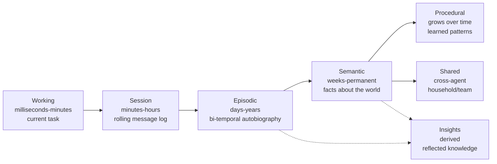
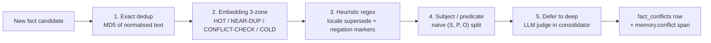

# Memory system

Most frameworks treat memory as one undifferentiated bag. Graphorin treats it as **six layers**, each with its own lifecycle, conflict-resolution strategy, and privacy posture. Together they give your assistant a memory it can actually live with - for years.

## The six tiers



| Tier | What it stores | Read surface | Write surface |
|---|---|---|---|
| **working** | Short structured blocks holding what the assistant is doing right now - persona, current task, immediate context. | `list`, `read`, `compile` | `define`, `write`, `append`, `replace`, `rethink`, `attach`, `detach` |
| **session** | The rolling message log of the current conversation. | `list`, `search`, `attributedFor` | `push`, `flushImportant`, `compact` |
| **episodic** | Things that happened - decisions, events, milestones - captured with proper bi-temporal validity. | `recent`, `search` | `record` |
| **semantic** | Facts about you, the world, the task. Conflicts resolved through a multi-stage pipeline. | `search`, `searchIterative`, `history` | `remember`, `supersede`, `forget`, `validate` |
| **procedural** | How to do things - workflows, recipes, learned patterns. | `list`, `activate` | `define`, `remove`, `induce` |
| **shared** | Common knowledge across multiple agents in the same household, team, or organisation. | `listFor` | `attach`, `detach` |

### Derived: insights (`memory.insights`)

A seventh, **read-only** surface sits above the six. It is never written to directly - the consolidator's deep phase *synthesises* it from your episodes and facts (see [Reflection](#reflection-insight-synthesis)). `memory.insights` exposes `search` / `list`; on a store without insight support it is an empty no-op.

## The facade

Every tier is wired through one entry point - `createMemory({ ... })`:

```ts
import { createSqliteStore } from '@graphorin/store-sqlite';
import { createTransformersJsEmbedder } from '@graphorin/embedder-transformersjs';
import { createMemory } from '@graphorin/memory';

const sqlite = await createSqliteStore({ path: './assistant.db' });
await sqlite.init();

const memory = createMemory({
  store: sqlite.memory,
  embeddings: sqlite.embeddings,
  embedder: createTransformersJsEmbedder(),
});

await memory.semantic.remember(
  { userId: 'alex' },
  { text: 'Loves mountain hiking and fresh espresso.' },
);

const hits = await memory.semantic.search(
  { userId: 'alex' },
  'mountain trip ideas',
);
```

Everything above runs **fully offline** with no provider. The richer capabilities below are **opt-in** - they only ever call a model when you wire one in:

| `createMemory` option | Turns on | Default without it |
|---|---|---|
| `consolidator: { tier, provider }` | Background distillation - episodes, insights, forgetting (see [Consolidator](#background-consolidator)). | `'free'` tier - `light` phase pinned to a zero budget (effectively off). |
| `graph: { entityResolution: true }` | Entity resolution on write + `expandHops` graph search (see [Relation graph](#relation-graph-one-hop-expansion)). | No linking; `expandHops` defaults to `0`. |
| `queryTransform: { provider }` | Multi-query / RAG-Fusion + HyDE on `search` (see [Query transformation](#query-transformation)). | Single-shot, offline search. |
| `iterativeRetrieval: { provider }` | Grade-then-reformulate `searchIterative` + the `deep_recall` tool (see [Iterative retrieval](#agentic-iterative-retrieval)). | One difficulty-gated pass, no provider call. |
| `procedureInduction: { provider }` | `procedural.induce(...)` workflow learning (see [Procedural induction](#procedural-memory-induction)). | `induce(...)` throws; procedural stays pure CRUD. |
| `reranker` | Swap the default fusion reranker (see [Hybrid search](#hybrid-search)). | Reciprocal Rank Fusion (`k=60`). |

## The eleven memory tools

`memory.tools` is a typed `Tool[]` ready to register with `@graphorin/tools`. Every entry exposes typed input / output schemas, the right memory-modification guard tier, and the right `sideEffectClass` so that the agent runtime can sandbox and audit it.

| Tool | Tier | Purpose |
|---|---|---|
| `block_append` | working | Append text to a working memory block. |
| `block_replace` | working | Replace a unique substring inside a block. |
| `block_rethink` | working | Replace a block's value entirely. |
| `fact_remember` | semantic | Persist a new fact through the multi-stage conflict pipeline. Its output reports `quarantined` (and a `quarantineReason` of `injection` / `synthesized`) so a poisoned write cannot pass for a normally-stored one. |
| `fact_search` | semantic | Hybrid (vector + FTS5 + RRF) search over facts. Accepts an `asOf` instant for point-in-time reads. |
| `fact_supersede` | semantic | Mark an old fact superseded by a new one. |
| `fact_forget` | semantic | Soft-delete a fact (kept for replay). |
| `fact_history` | semantic | Trace a fact's bi-temporal supersede chain. |
| `fact_validate` | semantic | Promote a quarantined fact to active (audited). **Approval-gated**, and it cannot promote an injection-flagged fact - see [quarantine](#memory-safety-provenance-quarantine). |
| `recall_episodes` | episodic | Triple-signal episode retrieval. |
| `conversation_search` | session | FTS5 search over the active session messages. |

These eleven are always registered. A **twelfth**, `deep_recall` (iterative grade-then-reformulate recall), is appended **only when** you configure `iterativeRetrieval` - so the default offline surface stays at exactly eleven and the original tool indices never shift.

## Hybrid search

Semantic memory composes dense-vector results with full-text (FTS5) results and fuses them through the built-in **Reciprocal Rank Fusion** reranker (`k=60` by default). The fusion is deterministic, requires no extra model, and rarely needs tuning.

The FTS5 leg tokenises the query on whitespace and OR-combines the tokens - each quoted independently - so a multi-word natural-language question recalls facts that share **any** term, regardless of word order or adjacency: `where does Anna work` still finds *"Anna works at Acme"*. This matters most in the offline default, where (with no embedder configured) the FTS leg is the only retrieval signal. Per-token quoting also neutralises FTS5 operator characters, so punctuation in a query can never alter its structure or raise an error. Exact-phrase matching is not exposed as a separate mode; lean on the vector leg or [weighted fusion](/guide/rerankers) when you need phrase-level precision.

```ts
import { RRFReranker } from '@graphorin/memory';

const reranker = new RRFReranker(60); // k = 60, the framework default
// Wire it onto the semantic tier of your memory facade:
// memory.semantic.setReranker(reranker);
```

Once you have labelled data (the `@graphorin/evals` harness), a **calibrated weighted fusion** can beat plain RRF - and **query transformation** can recover memories whose stored wording differs from the question. Both are covered in [Rerankers & fusion](/guide/rerankers). In brief:

```ts
// Weight the retrievers per-call - RRF stays the default; equal weights reproduce it exactly.
await memory.semantic.search(scope, 'where does anna live now', {
  fusion: { strategy: 'weighted', weights: { vector: 3, fts: 1 } },
});
```

### Contextual retrieval

A terse fact like `"moved to Tbilisi"` is hard to find later because the embedding and the FTS index lose the surrounding context. Before a fact is indexed Graphorin prepends a short **situating context** (entities / timeframe / topics - Anthropic's *Contextual Retrieval*), while preserving the canonical `text` you read back.

The default mode, `'late-chunk'`, derives that context **deterministically from the fact's own structured signals with no extra LLM call** (and is a no-op for plain free-text writes), so it stays fully offline. An opt-in, **consolidator-only** `'llm'` mode spends one budgeted cheap-model call per write to author the prefix, degrading to late-chunk on any failure.

```ts
createMemory({ /* … */ contextualRetrieval: 'late-chunk' }); // default
// consolidator: { contextualRetrieval: 'llm' }  // opt-in, consolidator writes only
```

### Query transformation

When the question and the stored fact use different words, one query may miss. `multiQuery` fans the query into reworded variants (RAG-Fusion) and `hyde` embeds a hypothetical answer - both fused through the same reranker:

```ts
await memory.semantic.search(scope, 'what does alex like to drink', {
  multiQuery: 3,   // original + up to 2 reworded variants, then fuse
  hyde: true,      // also embed a hypothetical answer and fuse its neighbours
});
```

Both are **opt-in**: wire `createMemory({ queryTransform: { provider } })`. With no transformer configured (the default) these options are silent no-ops and search stays offline + single-shot. Reserve them for retrieval-heavy recall - they add provider latency.

## Relation graph & one-hop expansion

Every fact can carry a `(subject, predicate, object)` triple. When you enable the **entity resolver**, Graphorin folds the subject/object strings into canonical entities - `"Anna"`, `"Anna S."`, `"my sister"` collapse to one entity - via lexical + embedding dedup, with **auditable, reversible merges** (an append-only ledger; `merged_into` is single-level).

At read time, one-hop expansion answers associative questions without leaving SQLite:

```ts
createMemory({ /* … */ graph: { entityResolution: true } }); // opt-in; offline

await memory.semantic.search(scope, 'what did the person I met in Tbilisi recommend?', {
  expandHops: 1, // seed on the candidates, fuse in facts sharing an entity (recursive CTE)
});
```

The ambiguous-similarity band **mints a new entity by default** - it never auto-merges on weak evidence. Opt into LLM adjudication (`graph: { llmAdjudication: true, provider }`) to resolve that band. Omit `graph` entirely and the path is unchanged and fully offline (`expandHops` defaults to `0`).

The resolver also refuses to compare embeddings **across different embedders**: if a candidate entity was embedded by a different model than the current one, the cosine step is skipped (different models occupy different vector spaces), so a half-migrated graph cannot produce garbage merges from incomparable vectors.

### PPR-lite, graph fusion weight, and exact entity-match (D5)

Three opt-in refinements to the graph leg:

- **PPR-lite spreading activation** - `search(scope, q, { expandHops: 2, graphScoring: 'ppr' })` widens to two-hop expansion and scores neighbours by damped spreading activation (`damping^hopDepth`, HippoRAG-style) instead of a flat `1`, so a fact two hops from a strong seed ranks below a direct neighbour. Seeding from query-matched entities (rather than the retrieved candidates) is the eval-gated extension.
- **Graph as a tunable fusion weight** - the graph leg was hardcoded neutral; `fusion: { strategy: 'weighted', weights: { graph, entity } }` now weights it like the FTS / vector legs once its reliability is calibrated against labels.
- **Exact entity-match retriever** - `search(scope, q, { entityMatch: true })` adds a precise "facts about `<entity>`" candidate leg: the query terms are normalized to entity names and facts linked to a matching canonical entity are fused in (with the `entity` weight), distinct from the fuzzy FTS / vector legs.

The `longmemeval` harness exposes `--retrieval ppr` and `--retrieval entity` alongside `graph` for A/B measurement. Bitemporal event-time, Matryoshka embedding truncation, and cascade LLM reranking remain **eval-gated** (built only once the numbers justify), per the roadmap.

## Agentic / iterative retrieval

For hard multi-hop or temporal questions one pass can't answer, `searchIterative` runs a **grade-then-reformulate loop** (CRAG / Self-RAG). A cheap **local difficulty gate** keeps simple lookups single-shot; only a query judged *hard* - and only when a grader is configured - is graded for sufficiency and, when weak, reformulated and retrieved again (widening to one-hop graph expansion each round), up to a hard-capped `maxIterations` (≤ 5). If it still can't satisfy the question it **abstains** rather than confabulating:

```ts
createMemory({ /* … */ iterativeRetrieval: { provider } }); // opt-in

const result = await memory.semantic.searchIterative(scope, 'who introduced me to my current employer?');
if (result.abstained) {
  // no confident answer - surface "I don't know" instead of guessing
}
```

Exposed programmatically as `searchIterative(...)` and as the gated **`deep_recall`** tool (the twelfth tool). Omit `iterativeRetrieval` and `searchIterative` degrades to one difficulty-gated pass with **no provider call**, and the tool surface stays at eleven.

## Multi-stage conflict resolution



Every `semantic.remember(...)` call flows through five stages in order:

1. **Exact dedup.** MD5 hash on the canonical (lowercase, collapsed-whitespace, trimmed) candidate body short-circuits on a hit.
2. **Embedding three-zone.** Top-K neighbours from `searchVector` classify the candidate into HOT (`>= 0.95`), NEAR-DUP (`>= 0.85`), CONFLICT-CHECK (`> 0.4`), or COLD. HOT zone always dedups (semantic identity outranks every other signal).
3. **Heuristic regex.** The active locale pack's supersede + negation markers fire when the candidate has an explicit change signal (`moved to`, `no longer`, `got promoted`, …).
4. **Subject / predicate.** Naive `(subject, predicate, object)` split using the locale pack's predicate normalisers; matching subject + predicate with a different object is a strong supersede signal.
5. **Defer to deep LLM judge.** Stages 1-4 yielded no decision but the candidate sits in CONFLICT-CHECK zone - the row is admitted `pending` and queued for the consolidator's deep phase.

Every decision lands one row in the `fact_conflicts` table with the producing stage, the detection zone, the cosine similarity (where applicable), and a reason string. A `memory.conflict` span is emitted per call. The English locale pack ships by default; additional locales plug in via `defineLocalePack({...})`.

The consolidator's standard phase reuses this same machinery for **neighbour-aware write reconciliation**: extracted facts are checked against their nearest neighbours by a cheap pre-filter (exact-dedup + embedding zones), and only the genuinely ambiguous mid-zone spends one reconcile pass choosing *add / update / noop / conflict*. Updates and conflicts route through bi-temporal supersede - never a delete.

## Bi-temporal storage & time-travel

Fact writes set `validFrom = now` and leave `validTo = null`. A supersede **closes** the old fact's `validTo` (it is never silently overwritten) and keeps the chain intact for replay - every change is auditable.

```ts
const decision = await memory.semantic.rememberWithDecision(scope, {
  text: 'I just moved to Tbilisi for the new gig.',
});
console.log(decision.kind);
// 'supersede' | 'dedup' | 'pending' | 'admit'
```

Because `validTo` is closed on supersede, you can read memory **as it was at any past instant** - and trace how a single fact evolved:

```ts
// Point-in-time read: what did we believe last spring?
const past = await memory.semantic.search(scope, 'where does alex live', {
  asOf: '2025-04-01T00:00:00Z', // ISO-8601 instant
});

// The full supersede chain for one fact, oldest → newest.
const chain = await memory.semantic.history(scope, factId);
```

`asOf` is also exposed on the `fact_search` tool, and `history` as the `fact_history` tool.

## Memory safety: provenance & quarantine

Long-living memory is a poisoning target: a malicious tool result or a confabulated extraction can plant a "fact" that later steers the assistant. Graphorin gates every write with **provenance** and **quarantine** - distinct from the agent-runtime [data-flow / taint policy](/guide/security#provenance-data-flow-policy), which governs *tool* I/O.

Every fact (and episode, insight, induced procedure) carries:

- a **`provenance`** tag - `user`, `tool`, `extraction`, `reflection`, `induction`, or `imported`; and
- a retrieval-trust **`status`** - `active` or `quarantined`.

*Derived* writes (consolidator extraction, reflection, workflow induction) and any candidate that trips the offline **injection heuristics** (`ignore previous instructions`, role-markup smuggling, secrecy / exfiltration directives) land `status: 'quarantined'` and are **excluded from default recall** until promoted. `fact_remember` reports the quarantine in its output (`quarantined: true` with a `quarantineReason` of `injection` or `synthesized`), so a poisoned write cannot masquerade as a normal one.

Promotion is two-gated so the model cannot poison its own memory in one turn (`fact_remember(poison)` → `fact_validate(id)`):

- The model-callable **`fact_validate` tool is approval-gated** (`needsApproval: true`): the run suspends for a human decision before any promotion runs.
- `validate(...)` **re-checks the text against the injection heuristics and refuses** an injection-flagged fact with `QuarantinePromotionRefusedError`. Synthesized-but-clean writes promote normally; an injection-flagged fact is an **operator-only** decision and needs the explicit `force` flag from a trusted (non-agent) caller:

```ts
await memory.semantic.validate(scope, factId); // synthesized → active, audited
// Injection-flagged facts are refused unless an operator forces, after review:
await memory.semantic.validate(scope, factId, 'reviewed by operator', { force: true });

// Review queue: surface quarantined rows explicitly.
const pending = await memory.semantic.search(scope, '', { includeQuarantined: true });
```

The same `validate(...)` exists on **every derived tier** - `memory.episodic.validate`, `memory.insights.validate`, and `memory.procedural.validate` (so an induced procedure can finally reach `activate()`) - each with the identical injection-refusal gate. Operators review and promote the whole queue from the CLI: **`graphorin memory review`** lists what is quarantined across all four tiers, and `--promote <id>` promotes a reviewed item (refused for injection-flagged rows unless `--force`).

Quarantine is **fail-safe by default** - paid distillation stays invisible until validated. Where that trade-off is wrong for a deployment, the consolidator's opt-in `autoPromoteExtraction` flag (`createMemory({ consolidator: { autoPromoteExtraction: true } })`, **off by default**) admits **injection-clean extraction facts** as `active` directly. Injection-flagged facts always stay quarantined, and episodes / insights / induced procedures are unaffected - they remain quarantined-until-validated.

Quarantine is a **retrieval gate, never a delete** - quarantined rows stay fully auditable. This is the precondition for safely shipping synthesised memory (reflection / reconciliation / induction) against memory-poisoning attacks. See [Security](/guide/security#memory-safety-provenance-quarantine) for the threat model.

### Principal / owner dimension

Orthogonal to provenance (*where a memory came from*), every fact / episode / rule / insight can carry an `owner` (*who it belongs to*): `'user'` for user-stated content, `'agent'` for the agent's own inferences (the consolidator stamps extraction facts, auto-formed episodes, reflection insights, and induced procedures), `'shared'` for records deliberately published to a multi-agent tier. Default reads apply **no owner filter** - recall is byte-identical - and rows written before the feature count as `'user'`. Opt in at retrieval time: `semantic.search(scope, query, { owner: 'agent' })` (or an array) filters in-store on the FTS + vector legs and record-level on the fused result, separating "the user said X" from "I inferred X".

## Procedural memory & induction

The procedural tier stores *how to do things*. You can author procedures directly with `define(...)`, or - opt-in - let the assistant **learn** them from its own successful runs (Agent Workflow Memory):

```ts
createMemory({ /* … */ procedureInduction: { provider } }); // opt-in

// After a run completes successfully, distil a reusable workflow.
const rule = await memory.procedural.induceFromRun(scope, runState);
// goal + value-abstracted steps ("search for {product}") + success criteria
```

Induction fires on **success only** - a failed run never calls the inducer - and the result lands **quarantined** with `provenance: 'induction'`. Because procedures drive *actions*, this is the highest-risk synthesised write, so induced procedures are **excluded from `activate()`** until validated (`list()` still surfaces them for review). `trajectoryFromRunState(runState)` distils the agent's already-emitted run state, so capturing a trajectory needs **no agent change**. Without `procedureInduction`, `induce(...)` throws `ProcedureInductionNotConfiguredError` and the tier stays pure offline CRUD.

### Runbook search (opt-in)

Procedures used to be reachable only through their activation predicate (`'always'` / `'topic='` / `'tag='`). `memory.procedural.search(scope, 'deploy the docs site')` adds **content recall**: a lexical search over rule text (the default SQLite adapter serves it from a rules FTS index; adapters without one degrade to an offline token-overlap scan) that returns **whole validated procedures** - title, numbered steps, variables, success criteria - so the model can follow a known-good workflow file-style instead of re-deriving it. Quarantined (unvalidated induced) procedures never surface. `createMemory({ runbookSearch: true })` additionally registers the gated `runbook_search` tool; the default tool surface stays at the canonical eleven.

## Background consolidator

A background pipeline (`Consolidator`) distils long conversations into long-term knowledge. It runs in three phases with a built-in cost budget so it can never run away with your bill:

| Phase | What it does |
|---|---|
| **Light** | Zero-LLM housekeeping: **multi-signal forgetting** - low-salience facts are soft-archived (recoverable) - plus the opt-in capacity-bounded eviction pass. |
| **Standard** | One LLM extraction pass over new session slices (**temporally anchored** - per-message timestamps + "today is" so relative dates resolve), **neighbour-aware** reconciliation (add / supersede / defer-to-deep), an embedder-independent exact-duplicate guard, **episode formation with auto-importance scoring**, and (opt-in) `'llm'` contextual-retrieval enrichment. Extracted facts land **quarantined** until validated. |
| **Deep** | An LLM judge drains the pending CONFLICT-CHECK queue (supersede / soft dedup / admit) and, at the `full` tier, runs **reflection / insight synthesis**. |

Procedural induction is **not** phase-scheduled - call `memory.procedural.induce(...)` / `induceFromRun(...)` yourself; there is no cross-agent shared-tier promotion.

### Making it run

In library mode the consolidator is **dormant until you start and trigger it** - constructing `createMemory({ consolidator: {...} })` alone never spends a token:

1. `await memory.consolidator.start()` - arms the runtime (idempotent).
2. Something must fire it: pass `triggers` (a `ConsolidatorTriggerSpec[]` consumed by the `@graphorin/triggers` scheduler inside `graphorin start`), or call `memory.consolidator.fireNow('standard', scope)` / `.trigger({ kind: 'turn' }, scope)` from your own loop.

Every `trigger(...)` dispatch first replays ready dead-letter batches (backoff-gated) and, at tiers without a deep phase, expires CONFLICT-CHECK rows older than 7 days as `admit` so the pending queue cannot grow unbounded.

Per-tier defaults from `CONSOLIDATOR_TIER_DEFAULTS`:

| Tier | Phases enabled | `maxTokensPerDay` | `maxCostPerDay` (USD) | `onExceed` |
|---|---|---|---|---|
| `'free'` (default) | `light` only | `0` (effectively no-op) | `0` | `'pause'` |
| `'cheap'` | `light + standard` | `50 000` | `0.20` | `'pause'` |
| `'standard'` | `light + standard + deep` | `200 000` | `1.00` | `'log'` |
| `'full'` | `light + standard + deep` | `1 000 000` | `5.00` | `'log'` |
| `'custom'` | operator-defined | operator must set | operator must set | operator must set |

Phase-level features are gated by per-tier flags: **episode formation** and **importance scoring** are on at `standard` / `full`; **contextual retrieval** defaults to `late-chunk` on every tier (the `'llm'` upgrade is consolidator-only); **reflection** is on **only at `full`**. The default `'free'` tier registers the `light` phase but pins both ceilings to zero, so consolidation effectively does nothing until you opt in:

```ts
createMemory({
  store: sqlite.memory,
  embeddings: sqlite.embeddings,
  embedder: createTransformersJsEmbedder(),
  consolidator: { tier: 'cheap', enabled: true, provider },
});
```

`'custom'` requires explicit `ceilings.maxTokensPerDay` + `ceilings.maxCostPerDay` (and `cheapModel` / `deepModel` if those phases are enabled) - `CustomTierMisconfiguredError` is thrown otherwise. The full `CONSOLIDATOR_TIER_DEFAULTS` table is exported from `@graphorin/memory`.

### Reflection & insight synthesis

At the `full` tier, once the accumulated importance of recent episodes crosses a threshold, the deep phase asks the model for the few most salient questions, retrieves evidence for each, and synthesises a higher-order **insight** (Generative Agents). Insights land `provenance: 'reflection'` + `status: 'quarantined'`, carry **mandatory citations set from the retrieved evidence** (never hallucinated), and are **rank-capped below the facts they cite**. Read them through `memory.insights.search` / `memory.insights.list`.

### Learned-context digest (opt-in)

`consolidator: { learnedContext: true }` adds a Letta-style sleep-time pass after the deep phase: one budgeted LLM call rewrites the reserved `learned_context` working block from the previous digest + recent episodes + active insights + active procedures. Because it is an ordinary working block, the digest is spliced into layer 3 of the assembled system prompt automatically (inside the stable KV-cache prefix), survives compaction via the persona-block re-anchor pattern (`reanchorPersonaBlock({ blockLabel: 'learned_context' })`), and stays editable by the agent through the `block_*` tools - the pass folds any agent edits into its next rewrite. Size-bounded by `learnedContextMaxChars` (default 1200). Off by default at **every** tier; a silent no-op when the facade has no working tier or the pass finds no evidence (no paid call).

### Multi-signal forgetting

Forgetting is **cost / staleness control, not an accuracy lever**. The light phase scores each fact with `salience(...)` - the Ebbinghaus `retention` curve (recency + access frequency) combined with the fact's `importance` hint and a security-risk negative term (a quarantined or foreign-provenance fact is evicted sooner). With neutral importance on an active, first-party fact, `salience === retention`, so behaviour is unchanged until you opt in. Setting `decayCapacity` bounds storage: the lowest-salience facts are **soft-archived** (recoverable - `archived = 1`, never deleted) until the window fits.

Recall reinforces: every `semantic.search(...)` stamps the recalled facts' `lastAccessedAt`, bumps their `strength` (capped at 2.0), and increments a monotonic `access_count` (D3), so recently-recalled facts genuinely decay slower (MRET-7) - the bookkeeping write is best-effort and never breaks the read path. The counter feeds an opt-in **retrieval-frequency reinforcement** term: set `salienceWeights: { ...DEFAULT_SALIENCE_WEIGHTS, accessReinforcement: 0.3 }` and a heavily-used fact keeps up to 1.3x its retention (log1p-saturating at 32 accesses); at the default weight `0` the factor is exactly `1` and salience is byte-identical. The decay window itself excludes archived rows (MCON-6): they receive no access bumps, so without the filter they would pin the LRU head and silently stop live facts from decaying once enough of them accumulated; inspection paths pass `listForDecay(scope, limit, { includeArchived: true })`.

```ts
createMemory({ /* … */ consolidator: { tier: 'standard', enabled: true, provider, decayCapacity: 50_000 } });
```

## Recall explainability

Ask *why* a memory surfaced. `explainRecall(hits, { query, rerankerId })` decomposes a `search(...)` result into the per-memory signals that drove its score - `bm25` / `vector` / fused `rrf` / `decay` - in final-rank order; `formatRecallExplanation(...)` renders it. `search` also attaches that breakdown (ids + scores + signals, never the query text) to the `memory.search.semantic` span.

Operators inspect the rest from the CLI - `graphorin memory inspect <factId>` (supersede chain / quarantine / conflicts / citing insights) and `graphorin memory activity` (recent consolidator / reflection activity). See the [CLI guide](/guide/cli#graphorin-memory).

## Embedder migration

Switching embedders silently is a footgun - old vectors are not comparable to new ones. The runner in `@graphorin/memory/migration` makes the change explicit:

```ts
import { createSqliteStore } from '@graphorin/store-sqlite';
import { createOllamaEmbedder } from '@graphorin/embedder-ollama';
import { createTransformersJsEmbedder } from '@graphorin/embedder-transformersjs';
import { migrateEmbedder } from '@graphorin/memory/migration';

const sqlite = await createSqliteStore({ path: './assistant.db' });
const source = createOllamaEmbedder(); // the embedder that produced the existing vectors
const target = createTransformersJsEmbedder({ model: 'Xenova/multilingual-e5-large' });

// `nextBatch` is always caller-supplied: a paging function over the
// source rows to re-embed. `auto-migrate` throws without it.
for await (const progress of migrateEmbedder({
  source,
  target,
  embeddings: sqlite.embeddings,
  strategy: 'auto-migrate',
})) {
  console.log(`${progress.processed}/${progress.total} (${progress.kind})`);
}
```

| Strategy | Behaviour |
|---|---|
| `lock-on-first` (default) | Refuses any silent embedder swap with an actionable error pointing at the planned migration. |
| `multi-active` | Keeps both `vec0` tables alive - reads union, writes go to the active embedder. |
| `auto-migrate` | Re-embeds existing rows in streamed batches within a single run (cancellable with `AbortSignal`; an aborted migration starts again from the beginning - there is no cross-process checkpoint yet). |

## Context assembly (the six layers)

The facade's **context engine** (`memory.contextEngine`) compiles memory into the agent's per-run system prompt. The agent runtime calls `memory.contextEngine.assemble(...)` once at run start when you opt in with `createAgent({ memory, autoAssembleContext: true })` (see [memory-aware system prompt](/guide/agent-runtime#memory-aware-system-prompt-opt-in)); the assembled prompt stacks six layers:

| Layer | Content | Source |
|---|---|---|
| 1 | `graphorin_memory_base`: the locale-pack base template that teaches the model how this memory works. `memoryBaseMode: 'full'` (default, ~250-350 tokens) or `'minimal'` (~80-120, for top-tier models). | Locale pack |
| 2 | `agent_instructions`: your `createAgent({ instructions })`. | Agent config |
| 3 | Working-memory blocks (persona, current task, the `learned_context` digest), each passed through the D2 privacy filter below. | `memory.working` |
| 4 | Activated procedural rules (D2-filtered) plus skill metadata cards. | `memory.procedural` + skills |
| 5 | Memory-metadata counters: what the store holds, per tier. | `memory.metadata` |
| 6 | Opt-in auto-recall: when `factsAutoRecall` triggers on the last user message, a bounded `semantic.search` runs and the facts that pass the privacy filter are injected. | `memory.semantic` |

Layers 1 and 2 are concatenated into a single `identity` candidate sharing one slot in the token-budget allocator, and the final prompt is emitted in **stability order**: the layer 1-4 prefix first, the volatile metadata and auto-recall content after it, so the provider's prompt-cache breakpoint survives across steps.

Configure the engine on the facade, `createMemory({ contextEngine: { ... } })`:

| `ContextEngineConfig` field | Default | Meaning |
|---|---|---|
| `memoryBaseMode` | `'full'` | Layer 1 template verbosity (`'minimal'` opts top-tier models into the compact form). |
| `locale` | `'en'` | Locale pack: a string id or a pack built with `defineContextLocalePack`. |
| `layers.{identity, memoryMetadata, activeRules, activeSkills, workingBlocks, autoRecall}` | all enabled | Per-layer `{ enabled?, cap? }` token caps; `layers.autoRecall` additionally takes `topK` / `threshold`. |
| `factsAutoRecall` | `false` | Layer 6 trigger: `{ topK?, threshold?, strategy? }`. `topK` (default 5) bounds volume; `threshold` defaults to `0` because the fused-score scale is reranker-dependent. |
| `privacy` | see below | The D2 privacy-filter configuration. |
| `maxContextTokens` | unbounded | Hard token budget for the assembled prompt. |
| `reservedForResponse` | `4096` | Tokens reserved for the model's response. |
| `reservedForCompaction` | `8192` | Tokens reserved for the compaction summarizer call. |
| `providerContextWindow` | unset | The active provider's context window; **required when `compaction` is enabled**. |
| `compaction` / `summarizer` / `tokenCounter` | off / unset / heuristic | The in-flight message-history compaction axis; see [context management in the loop](/guide/agent-runtime#context-management-in-the-loop). |

`assemble(...)` returns an `AssembledPrompt`: the single `systemMessage` plus diagnostics, including the per-layer `layerAllocation` snapshot (what each layer was granted under the budget) and the `privacyCounters` record of per-reason filter decisions.

## Privacy levels

Every memory row carries a `Sensitivity` tag - `public`, `internal`, or `secret`. The tag flows through traces, exports, and the provider middleware. Sensitive content is redacted by default; you cannot accidentally turn redaction off. This is orthogonal to the [provenance / quarantine](#memory-safety-provenance-quarantine) trust gate above: sensitivity controls *who may see* a memory, provenance controls *whether it is trusted enough to recall*.

### The D2 assembly filter

At [context-assembly](#context-assembly-the-six-layers) time the tag becomes an active gate: every working block (layer 3), activated rule (layer 4), and auto-recalled fact (layer 6) passes the D2 filter before it may enter the prompt. The filter is configured through `contextEngine.privacy`:

| `PrivacyConfig` field | Default | Meaning |
|---|---|---|
| `providerTrust` | `'public-tls'` | Trust class of the active provider: `'loopback'` / `'private'` / `'public-tls'` / `'public-cleartext'`. |
| `providerAcceptsSensitivity` | derived from `providerTrust` | Explicit override of the sensitivity tiers the provider may receive. |
| `cloudUploadConsent` | `false` | Per-user opt-in for sending `'internal'`-tier content to a cloud provider. |
| `defaultSensitivity` | `'internal'` | Tier applied to records missing a tag. |

Each record yields a `pass` or `drop` decision with a reason (`allowed`, `provider-rejects-secret`, `provider-rejects-internal`, `no-cloud-upload-consent`); the reasons are counted into `AssembledPrompt.privacyCounters` so per-tier drops are auditable.

| Record tier | Passes when |
|---|---|
| `public` | Always. |
| `internal` | The provider accepts `'internal'` **and** the trust class is `'loopback'` / `'private'`, or `cloudUploadConsent: true`. |
| `secret` | The provider accepts `'secret'` **and** the trust class is `'loopback'`. It never leaves the machine otherwise. |

Without an explicit `providerAcceptsSensitivity`, the accepted set derives from the trust class: `'loopback'` accepts all three tiers, `'private'` accepts `public` + `internal`, and both public classes accept `public` only. The filter trusts the record-level tag it was given; content it cannot see (raw user input, tool results, agent instructions) is covered by the outbound prompt-redaction middleware (D3), the universal backstop.

## Next steps

- [Rerankers & fusion](/guide/rerankers) - RRF, weighted fusion, and query transformation.
- [Security](/guide/security#memory-safety-provenance-quarantine) - the memory-poisoning threat model and the quarantine gate.
- [Agent runtime](/guide/agent-runtime) - how the runtime registers `memory.tools`.
- [Sessions](/guide/sessions) - multi-agent attribution + JSONL export + replay.
- [Persistence](/guide/persistence) - SQLite + `sqlite-vec` + FTS5, migrations, and the bi-temporal schema.
- [Observability](/guide/observability) - what the memory spans look like.

---

**Graphorin** · v0.5.0 · MIT License · © 2026 Oleksiy Stepurenko
