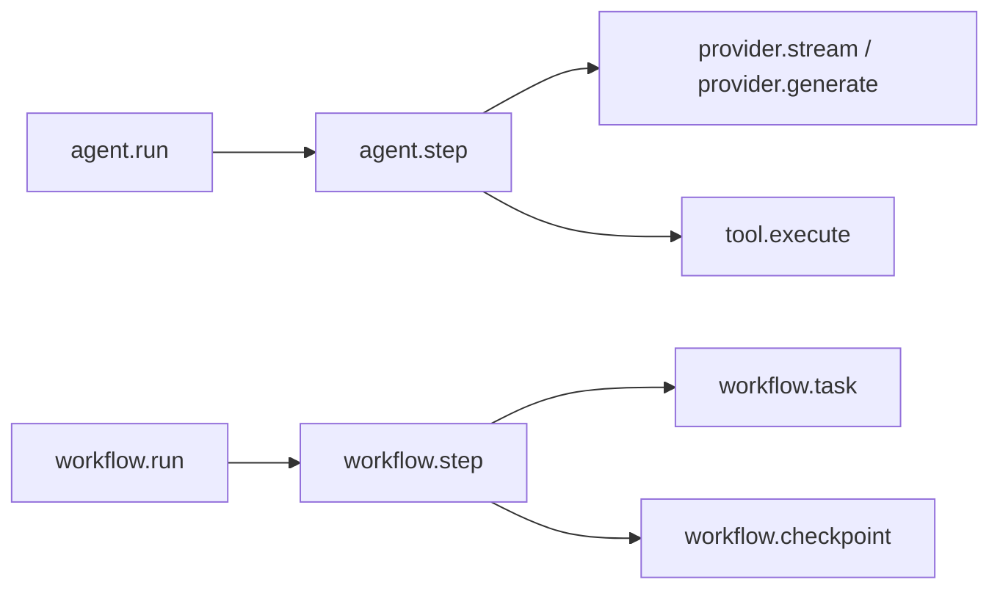
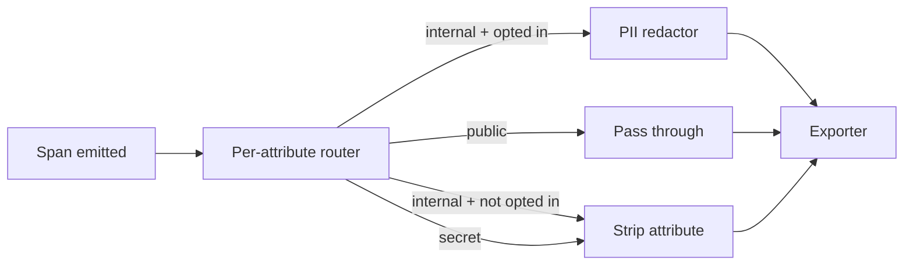

# Observability

`@graphorin/observability` ships an OpenTelemetry-native tracing surface implementing the **OpenTelemetry GenAI Semantic Conventions** and a sensitivity-aware redaction layer that is **mandatory** on every exporter - there is no way to accidentally ship un-redacted spans to a remote collector.

## What gets traced



The agent loop opens one `agent.run` span per run and one `agent.step` span per step; `tool.execute` parents under the current step via `RunContext.span`, and a `withTracing`-wrapped provider parents its `provider.stream`/`provider.generate` span under the step via `ProviderRequest.parentSpan` - so a run is ONE trace tree and parent-based sampling has a real parent to follow. Memory-tier spans (`memory.search.semantic`, consolidator phases) still start their own traces today: the tiers hold their own tracer handle and are called outside the step context - a known limitation, not a wiring bug.

Per-type sampling rules act INSIDE a sampled trace too: under the default parent-based decision maker, `sampling.rules: [{ type: 'tool.execute', rate: 0.01 }]` thins the per-call spans of every sampled `agent.run` - which is where the volume actually lives - instead of only ever applying to root spans. A rule can only downsample: children of an unsampled parent are never resurrected (they would be orphans), and a child dropped by its rule breaks the tree below it - its own descendants inherit `parentSampled=false`. Configurations without rules are byte-identical to before.

Run/step/tool spans carry OTel GenAI attributes (`gen_ai.operation.name` = `invoke_agent` / `execute_tool` / `chat`, `gen_ai.agent.id`, `gen_ai.tool.name`, `gen_ai.request.model`, `gen_ai.usage.input_tokens` / `output_tokens` on close) plus Graphorin-specific ones (`graphorin.run.id`, `graphorin.step.number`, `graphorin.tool.name`, `graphorin.tool.sensitivity`, `graphorin.tool.sandbox.kind`, …).

## Wiring a tracer

```ts
import { createOTLPHttpExporter, createTracer } from '@graphorin/observability';

const tracer = createTracer({
  serviceName: 'my-assistant',
  exporters: [createOTLPHttpExporter({ url: 'https://otel.example.com/v1/traces' })],
  // Default validation config is conservative; pass an object to tune.
});
```

The tracer **auto-wraps every exporter** with `withValidation(...)` by default - you do not have to opt in. To bypass auto-wrapping, set `validation: 'off'` on the tracer config; in that mode every exporter you pass MUST already be wrapped via `withValidation(...)` or the tracer throws `UnvalidatedExporterError` at startup.

The validation layer enforces:

- **Sensitivity-aware filtering.** The export floor defaults to `public`: an attribute tagged above the floor (untagged attributes default to `'internal'`) is stripped, attribute by attribute, unless the operator explicitly raises `validation.minTier`. String values matching the secret-pattern catalogue are masked regardless of tier.
- **PII redaction.** 14 built-in default-on patterns cover credit-card numbers, US SSNs, emails, E.164 phone numbers, JWTs, bearer and basic-auth headers, private-key PEM blocks, AWS access keys, GitHub tokens, OpenAI / Anthropic / Graphorin tokens, and IBANs. IPv4 / IPv6 address patterns and a `gcp-service-account` label variant ship opt-in (enable them via `validation.enabledPatterns`).
- **Per-attribute allowlists.** Configurable per exporter for advanced setups.

## Sensitivity-aware redaction



Redaction is **attribute-granular**: an attribute that exceeds the configured floor (or matches a secret / PII pattern) is stripped and counted, and the rest of the span still reaches the exporter. A single untagged or over-tier attribute never makes the whole span vanish - previously framework spans, which carry untagged attributes by default, disappeared from every exporter and operators saw empty traces.

You **cannot** disable the validation wrapper. You can:

- extend the pattern catalogue with your own regexes via `createTracer({ validation: { patterns: [...] } })`;
- raise or lower the export floor with `validation.minTier`, and toggle individual built-ins via `validation.enabledPatterns` / `validation.disabledPatterns`;
- add allowlists for specific high-cardinality attributes that are safe.

## Local console export

The repository's example apps read:

```bash
GRAPHORIN_TRACE=console
```

…via their shared trace helper (`examples/example-trace-helper`) and pretty-print every finished span to the terminal. The framework itself never reads this variable - it is the example harness's convention, not a `@graphorin/observability` feature; wire an exporter explicitly through `createTracer(...)` to get the same behavior in your app. See the [Examples](/guide/examples) page.

## OTLP export

`@graphorin/observability` ships its **own minimal OTLP-HTTP exporter** - `createOTLPHttpExporter` - which implements the package's `TraceExporter` contract (an OTel SDK exporter class does NOT: different `export` signature, no `id`/`flush()`). It only fires when the operator wires a collector URL - Graphorin never opens an OTLP connection on its own. To integrate an upstream OTel SDK pipeline instead, convert finished spans with the exported `toOtlpEnvelope` helper inside your own exporter.

```ts
import { createOTLPHttpExporter, createTracer } from '@graphorin/observability';

const tracer = createTracer({
  exporters: [
    createOTLPHttpExporter({
      url: process.env.OTLP_URL ?? 'https://otel.example.com/v1/traces',
      headers: { authorization: `Bearer ${process.env.OTLP_TOKEN}` },
    }),
  ],
});
```

## Replay

Spans persist so a run can be reconstructed later. `@graphorin/store-sqlite` ships a durable span sink (migration 024 + the `spans` table):

```ts
import { createMemory } from '@graphorin/memory';
import { createTracer, withValidation } from '@graphorin/observability';
import { createSessionManager } from '@graphorin/sessions';
import { createSqliteSpanExporter, createSqliteStore, traceSourceForSession } from '@graphorin/store-sqlite';

const store = await createSqliteStore({ path: './assistant.db' });
await store.init();
const memory = createMemory({ store: store.memory, embeddings: store.embeddings });

// Persist every span, keyed by the `graphorin.session.id` attribute. Raise the
// export floor to `internal` so the run's framework telemetry (tagged
// `internal` by default) is persisted rather than stripped by the default
// `public` floor - the routing ids (`graphorin.session.id` / `graphorin.run.id`)
// are always `public` so a span stays keyed regardless. Secret-tier attributes
// are still stripped at export, and replay masks secret/PII patterns.
const tracer = createTracer({
  exporters: [withValidation(createSqliteSpanExporter(store.connection), { minTier: 'internal' })],
});

// Read a session's spans back as the `traceSource` Session.replay() consumes.
const manager = createSessionManager({
  store: store.sessions,
  memory: memory.session,
  replayTraceSource: (id) => traceSourceForSession(store.connection, id),
});
```

With that wiring, `session.replay()` (no arguments) reproduces the real run instead of emitting only `replay.start` / `replay.end`. Without it, replay falls back to the empty source. Replays are sanitised by default: the replay floor defaults to `internal` (framework spans are `internal`), so secret-tier attributes are excluded and secret/PII pattern hits are masked; pass `minSensitivity: 'public'` for a stricter replay or `raw: true` (gated on `traces:read:raw`) to bypass sanitisation. The `spans` table grows until you prune it: `graphorin traces prune --before <date>` (or the `pruneSpans` primitive from `@graphorin/store-sqlite`) deletes spans that finished before the cutoff, and a session hard-delete removes that session's spans as part of the erasure cascade; the same `spans` table backs the `graphorin memory why` introspection. See [Standalone server](/guide/standalone-server) for the REST surface.

## GenAI Semantic Convention attributes

The framework targets the published OpenTelemetry GenAI conventions. Attributes `withTracing(provider)` actually emits:

| Attribute | Where |
|---|---|
| `gen_ai.operation.name` | Every provider span (`'chat'`); agent/tool spans carry `invoke_agent` / `execute_tool`. |
| `gen_ai.provider.name` | Every provider span. Derived from the adapter name (`'openai'`, `'anthropic'`, `'ollama'`, …). |
| `gen_ai.request.model` | Every provider span. |
| `gen_ai.usage.input_tokens` / `gen_ai.usage.output_tokens` | On completion (generate) / stream finish. |

A wider attribute family (`gen_ai.system`, `gen_ai.response.model`/`.id`/`.finish_reasons`, `gen_ai.tool.*`, `gen_ai.agent.*`, and the internal-tier message content attributes) is available through the explicit helpers `emitGenAIAttributes` / `emitGenAIMessageEvents` - those fire only where you call them, not automatically.

## Counters

The framework exposes in-process counters for high-frequency events in two families: `tool.*` (emitted by `@graphorin/tools` - executor invocations/errors/retries, truncation and spill, collision handling, sanitization hits, dataflow decisions, code-mode and streaming activity) and `mcp.*` (emitted by `@graphorin/mcp` - call outcomes, resource-link and structured-content handling, pin mismatches, injection flags, transport lifecycle). A few representative series:

| Counter | Where |
|---|---|
| `tool.executor.memory_guard.mismatch.total{toolName,tier}` | A tool's memory-guard verify step disagreed with the snapshot. |
| `tool.executor.retry.total` | Transparent bounded retry of a rate-limited tool fired. |
| `tool.inbound.sanitization.hit.total` | An inbound sanitization filter matched tool output. |
| `mcp.call.tool-error.total` | An MCP tool call returned `isError`. |
| `mcp.tools.pin-mismatch.total` | A pinned MCP tool's fingerprint drifted (rug-pull defense). |

Counter names are unprefixed in-process (`snapshotCounters()`); add your own namespace prefix at the export boundary if your metrics backend needs one.

### Server exposition and the audit chain

On the standalone server both families are wired for you:

- **`/v1/metrics`** - every scrape folds the live `tool.*` / `mcp.*` counters into the Prometheus registry as `graphorin_tool_*` / `graphorin_mcp_*` series (dots and dashes map to `_`; series appear lazily, only once they have moved). Counters delta-sync (re-scrapes never double-count) and gauges set absolutely - the snapshot's `kinds` field tells the bridge which is which. Histograms are not bridged yet; their raw observation lists stay available through `snapshotCounters().histograms`.
- **`/v1/audit`** - when the audit chain is enabled, the tools audit bus feeds it through a bridge governed by `audit.toolEvents`: `'security'` (default) writes only the security-significant subset (dataflow flagged/blocked/declassified, sanitization hits/blocks, approval lifecycle, collisions, cap-disabled), `'all'` adds per-call `tool:execute:*` chatter, `'off'` disables the bridge. Shadow-mode dataflow findings are therefore operator-visible out of the box.

Library-mode (non-server) users wire the same two seams by hand:

```ts no-check
import { onToolAudit, snapshotCounters } from '@graphorin/tools/audit';

// Pull-based: export the counter snapshot to your metrics backend.
setInterval(() => {
  const { counters, kinds } = snapshotCounters();
  for (const [key, value] of Object.entries(counters)) {
    myBackend.record(key, value, kinds[key] ?? 'counter');
  }
}, 15_000);

// Push-based: forward audit-bus events to your own sink.
const stop = onToolAudit((event) => {
  if (event.action.startsWith('tool:dataflow:')) mySecurityLog.write(event);
});
```

## Next steps

- [Security](/guide/security) - sensitivity flow + sandbox + audit log.
- [Privacy](/guide/privacy) - the no-phone-home contract.
- [Standalone server](/guide/standalone-server) - replay + Prometheus metrics endpoints.

