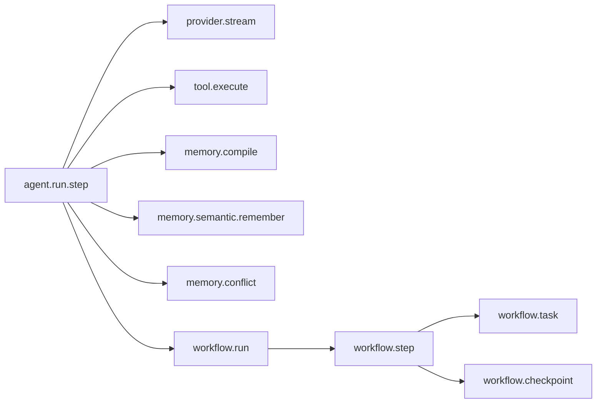
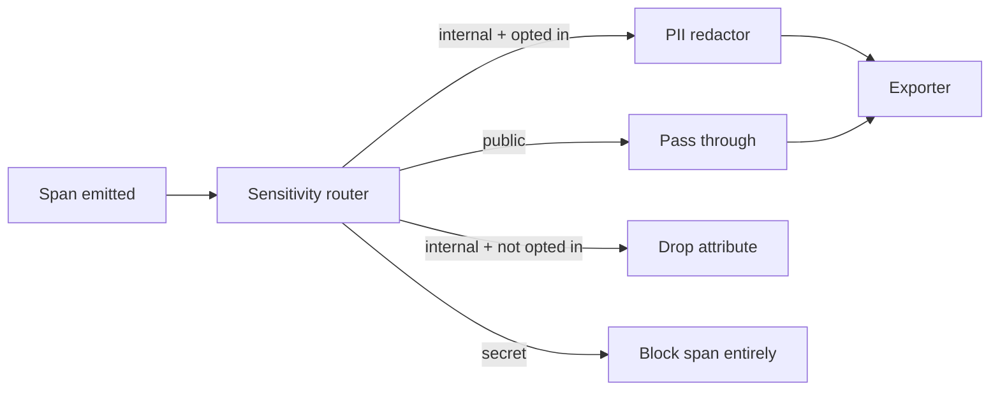

# Observability

`@graphorin/observability` ships an OpenTelemetry-native tracing surface implementing the **OpenTelemetry GenAI Semantic Conventions** and a sensitivity-aware redaction layer that is **mandatory** on every exporter — there is no way to accidentally ship un-redacted spans to a remote collector.

## What gets traced



Every span carries the right `gen_ai.*` attributes (`gen_ai.system`, `gen_ai.request.model`, `gen_ai.usage.input_tokens`, `gen_ai.usage.output_tokens`, etc.) plus Graphorin-specific ones (`graphorin.tool.name`, `graphorin.tool.sensitivity`, `graphorin.tool.sandbox.kind`, `graphorin.memory.tier`, `graphorin.workflow.thread_id`, …).

## Wiring a tracer

```ts
import { createTracer, withValidation } from '@graphorin/observability';
import { OTLPTraceExporter } from '@opentelemetry/exporter-trace-otlp-http';

const tracer = createTracer({
  serviceName: 'my-assistant',
  exporters: [new OTLPTraceExporter({ url: 'https://otel.example.com/v1/traces' })],
  // Default validation config is conservative; pass an object to tune.
});
```

The tracer **auto-wraps every exporter** with `withValidation(...)` by default — you do not have to opt in. To bypass auto-wrapping, set `validation: 'off'` on the tracer config; in that mode every exporter you pass MUST already be wrapped via `withValidation(...)` or the tracer throws `UnvalidatedExporterError` at startup.

The validation layer enforces:

- **Sensitivity-aware filtering.** Spans with sensitivity `'secret'` never leave the process. `'internal'` spans are passed through only if the operator opted in.
- **PII redaction.** 14 built-in patterns cover credit-card numbers, SSNs, emails, phone numbers, IPv4 / IPv6 addresses, JWT tokens, AWS access keys, GitHub tokens, OpenAI keys, private keys, IBANs, MAC addresses, and bare bearer tokens.
- **Per-attribute allowlists.** Configurable per exporter for advanced setups.

## Sensitivity-aware redaction



You **cannot** disable the validation wrapper. You can:

- extend the pattern catalogue with your own regexes via `withRedaction({ patterns: [...] })`;
- pin attribute keys to specific sensitivity tags via the `sensitivityMap`;
- add allowlists for specific high-cardinality attributes that are safe.

## Local console export

For local development, set:

```bash
GRAPHORIN_TRACE=console
```

…and every finished span is pretty-printed to your terminal. The example apps in the repository use this to make iteration fast — see the [Examples](/guide/examples) page.

## OTLP export

`@graphorin/observability` exposes the OTLP-HTTP exporter from `@opentelemetry/exporter-trace-otlp-http`. The exporter only fires when the operator wires a collector URL — Graphorin never opens an OTLP connection on its own.

```ts
import { createTracer, withValidation } from '@graphorin/observability';
import { OTLPTraceExporter } from '@opentelemetry/exporter-trace-otlp-http';

const tracer = createTracer({
  exporters: [
    withValidation(
      new OTLPTraceExporter({
        url: process.env.OTLP_URL,
        headers: { authorization: `Bearer ${process.env.OTLP_TOKEN}` },
      }),
    ),
  ],
});
```

## Replay

Every persisted span has enough metadata to reconstruct the agent run that produced it. The standalone server's `/v1/replays/:runId` endpoint returns:

- the canonical `RunState` snapshot at every step;
- the input / output payloads (sanitised by default);
- the tool call lifecycle;
- the memory writes and conflict-pipeline decisions.

Replays are sanitised by default and bound by the configured retention window. See [Standalone server](/guide/standalone-server) for the REST surface.

## GenAI Semantic Convention attributes

The framework targets the published OpenTelemetry GenAI conventions. Common attributes you'll see:

| Attribute | Where |
|---|---|
| `gen_ai.system` | Every provider span. Derived from the adapter (`'openai'`, `'anthropic'`, `'ollama'`, …). |
| `gen_ai.request.model` | Every provider span. |
| `gen_ai.request.temperature` | Set when the call configures it. |
| `gen_ai.usage.input_tokens` | On stream completion. |
| `gen_ai.usage.output_tokens` | On stream completion. |
| `gen_ai.completion.0.role` / `gen_ai.completion.0.content` | The assistant message; redaction-respecting. |

## Counters

The framework exposes a small set of counters for high-frequency events:

| Counter | Where |
|---|---|
| `graphorin.tool.executor.memory_guard.mismatch.total{toolName,tier}` | A tool's memory-guard verify step disagreed with the snapshot. |
| `graphorin.memory.conflict.total{stage,zone}` | Conflict-pipeline decisions per stage / zone. |
| `graphorin.provider.stream.error.total{adapter,kind}` | Errors normalised through the provider adapter. |
| `graphorin.workflow.checkpoint.total{outcome}` | Checkpoint write outcomes. |

## Next steps

- [Security](/guide/security) — sensitivity flow + sandbox + audit log.
- [Privacy](/guide/privacy) — the no-phone-home contract.
- [Standalone server](/guide/standalone-server) — replay + Prometheus metrics endpoints.

---

**Graphorin** · v0.4.0 · MIT License · © 2026 Oleksiy Stepurenko
