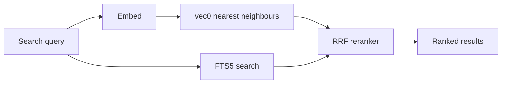

# Persistence

Graphorin is **local-first**: by default, every byte the framework persists lives in a single SQLite database on the user's machine. The default storage adapter (`@graphorin/store-sqlite`) is built on:

- [`better-sqlite3`](https://github.com/WiseLibs/better-sqlite3) (MIT) — the synchronous SQLite driver.
- [`sqlite-vec`](https://github.com/asg017/sqlite-vec) (Apache-2.0 OR MIT) — the vector-search extension that backs semantic memory.
- **FTS5** — the SQLite-bundled full-text index that powers hybrid search.

## Architecture

```mermaid
flowchart LR
    Code[Your code] --> Adapter[@graphorin/store-sqlite adapter]
    Adapter --> Memory[Memory tables]
    Adapter --> Sessions[Sessions tables]
    Adapter --> Embeddings[vec0 virtual tables]
    Adapter --> FTS[FTS5 virtual tables]
    Adapter --> Workflow[Checkpoints]
    Adapter --> Audit[Audit log]
    Adapter --> Triggers[Triggers state]
```

A single SQLite database file holds every Graphorin table. The adapter exposes typed sub-stores for `memory`, `sessions`, `embeddings`, `workflow`, `audit`, and `triggers`. Each sub-store is the implementation of a contract declared in `@graphorin/core/contracts` — your application can swap in a different adapter without touching the rest of the framework.

## Wiring the default

```ts
import { createSqliteStore } from '@graphorin/store-sqlite';

const sqlite = await createSqliteStore({
  path: './assistant.db',
  pragmas: { /* defaults are sane; override only when you need to */ },
});

await sqlite.init(); // run pending migrations
```

`createSqliteStore({...})` returns a typed object with `memory`, `sessions`, `embeddings`, `workflow`, `audit`, and `triggers` sub-stores plus a top-level `close()` method.

## Migrations

Every Graphorin package owns its own SQL migrations and registers them through the **migration registry** convention. On `sqlite.init()` the registry runs pending migrations in dependency order; each migration is wrapped in a transaction and recorded in the `migration_state` table.

Migrations are **forward-only**. Down-migrations are not supported until the framework reaches `1.0`.

## Hybrid search



The default is **Reciprocal Rank Fusion** with `k=60`. A different reranker (e.g. cross-encoder, LLM judge) is one call away — see [Memory system](/guide/memory-system) for the swap.

::: warning Never `VACUUM` the database
FTS5 hits map back to base rows by implicit `rowid`, and `VACUUM` can renumber rowids — silently corrupting search. Use the `graphorin storage encrypt` / `rekey` maintenance path (it copies the file byte-for-byte, preserving rowids); each open also runs a cheap FTS↔rowid integrity check and warns on drift. See [Storage](/guide/storage).
:::

## Bi-temporal storage

Fact rows in semantic memory are bi-temporal:

| Column | Meaning |
|---|---|
| `validFrom` | When the fact became true (defaults to write time). |
| `validTo` | When the fact ceased to be true (`NULL` = still valid; closed on supersede). |
| `recordedAt` | When the row was written (immutable). |
| `supersededBy` | Pointer to the row that replaced it (when applicable). |
| `importance` | Soft salience hint in `[0, 1]` used by forgetting (`NULL` = neutral). |
| `provenance` | Origin tag — `user` / `tool` / `extraction` / `reflection` / `induction` / `imported`. |
| `status` | Recall-trust gate — `active` or `quarantined`. |

Old facts are **superseded, never silently overwritten** — every change is auditable. Because `validTo` is closed on supersede, you can read memory **as of any past instant** (`search(scope, query, { asOf })`, exposed as the `fact_search` tool's `asOf` argument) and trace a single fact's full supersede chain (`semantic.history(...)`, the `fact_history` tool).

## Memory graph & derived stores

Beyond the bi-temporal fact rows, the memory sub-store persists two further structures (added in migrations 013–017):

- An **entity graph** — `entities`, `fact_entities`, and an append-only `entity_merges` ledger — backs one-hop associative search. Entity merges are reversible and fully audited; one-hop expansion runs as a recursive CTE entirely in SQLite.
- **Reflection insights** — synthesised higher-order knowledge with mandatory citations, kept in their own FTS-indexed table and quarantined until validated.

See [Memory system](/guide/memory-system) for how these are produced and queried.

## Optional encryption-at-rest

`@graphorin/store-sqlite-encrypted` is an opt-in companion that pulls in [`better-sqlite3-multiple-ciphers`](https://github.com/m4heshd/better-sqlite3-multiple-ciphers) (MIT) — a drop-in fork of `better-sqlite3` that bundles the SQLite3MultipleCiphers extension (SQLCipher v4 compatible). The audit log is **always** encrypted (mandatory); the main database is encrypted on demand by passing an `encryption` block to `createSqliteStore`:

```ts
import { resolveSecret } from '@graphorin/security';
import { createSqliteStore } from '@graphorin/store-sqlite';

const sqlite = await createSqliteStore({
  path: './assistant.db',
  encryption: {
    enabled: true,
    cipher: 'sqlcipher',
    passphraseResolver: async () => {
      const value = await resolveSecret('keyring:graphorin_db_key?service=graphorin');
      return value.reveal();
    },
  },
});

await sqlite.init();
```

Installing `@graphorin/store-sqlite-encrypted` registers the cipher peer driver. The package also exposes `encryptDatabase(...)`, `rekeyDatabase(...)`, and `cipherIntegrityCheck(...)` — the runners that back `graphorin storage encrypt` / `rekey` / `integrity-check`. The passphrase is resolved through the same `SecretRef` pipeline as every other secret. See [Secrets](/guide/secrets).

## Embedder model storage

Embeddings produced by `@graphorin/embedder-transformersjs` are tagged with the canonical embedder id (`'<provider>:<model>@<dim>'`) at write time. The storage layer's `EmbeddingMetaRepository` enforces a `lock-on-first` policy by default — silent embedder swaps fail-fast with an actionable error pointing at the planned migration. See [Memory system § Embedder migration](/guide/memory-system#embedder-migration).

## File layout

```text
./assistant.db           — main database (memory, sessions, workflow, triggers, embeddings)
./assistant.db-wal       — write-ahead log
./assistant.db-shm       — shared-memory file
./.graphorin/audit.db    — encrypted audit log
./.graphorin/secrets.db  — encrypted-file secrets store (when used)
./.graphorin/triggers/   — trigger artifacts
./.graphorin/replays/    — replay artifacts
```

`.graphorin/` lives next to the database by default; the path is configurable per sub-store.

## Process hardening

The CLI command `graphorin doctor` audits POSIX file modes on the database, the audit log, the secrets store, and the systemd unit template (where applicable):

```bash
graphorin doctor
```

Recommended defaults are `0600` for the secrets store and the audit log, and `0640` for the main database when running as a daemon under a dedicated service account.

## Pluggable adapters

The contracts in `@graphorin/core/contracts` are deliberately small. Build a non-SQLite adapter (Postgres, libSQL, DuckDB, in-memory) by implementing the `MemoryStore`, `EmbeddingStore`, `SessionStore`, `CheckpointStore`, `AuditStore`, and `TriggerStore` interfaces. Existing packages depend only on the contracts.

## Next steps

- [Memory system](/guide/memory-system) — what each sub-store actually stores.
- [Workflow engine](/guide/workflow-engine) — durable checkpoints.
- [Secrets](/guide/secrets) — encrypted-file store + audit log.
- [Standalone server](/guide/standalone-server) — REST endpoints over the same storage.

---

**Graphorin** · v0.4.0 · MIT License · © 2026 Oleksiy Stepurenko
