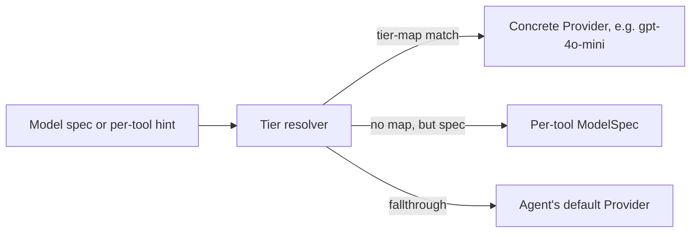

# Providers

Graphorin is **vendor-neutral by principle**. A single `Provider` interface adapts any LLM, and a middleware composer wires sensitivity-aware redaction, token counting, model-tier classification, and reasoning-policy enforcement into every call.

## Adapters

| Adapter | Backed by | Use when |
|---|---|---|
| `vercelAdapter(...)` | [Vercel AI SDK](https://github.com/vercel/ai) (`ai@^7.0.0-beta.76`, Apache-2.0) | A frontier cloud provider - OpenAI, Anthropic, Google, etc. |
| `ollamaAdapter(...)` | A local [Ollama](https://ollama.com/) daemon over HTTP. | Local-first deployments that already run an Ollama daemon. |
| `openAICompatibleAdapter(...)` | Any HTTP server speaking the OpenAI Chat Completions wire format. | LM Studio, LocalAI, vLLM, Together.ai, llama-server's OpenAI-compat mode, …  |
| `llamaCppServerAdapter(...)` | The standalone `llama-server` binary from [`llama.cpp`](https://github.com/ggml-org/llama.cpp). | When you want the canonical `llama.cpp` server but not in-process. |
| `llamaCppNodeAdapter(...)` (in `@graphorin/provider-llamacpp-node`) | [`node-llama-cpp@^3.5`](https://node-llama-cpp.withcat.ai/) (MIT). | In-process GGUF execution. Companion package (opt-in install). |

## Why a `Provider` and not the raw SDK?

`createProvider(adapter, options?)` wraps the raw adapter in the canonical `Provider` shape and centralises:

- per-instance `acceptsSensitivity` declarations,
- capability overrides (e.g. forcing `multimodal: false` for a tool that does not need it),
- default `reasoningRetention` resolution from the adapter's declared `reasoningContract`,
- a single attachment surface for every middleware below.

The optional middleware composer (`composeProviderMiddleware([...])`) wraps the result in a chain whose order is validated against the **canonical order** - outermost to innermost:

```text
withTracing → withRetry → withRateLimit → withCostLimit → withCostTracking → withFallback → withRedaction → adapter
```

A `MiddlewareOrderingError` is thrown the moment the array argument violates the canonical order, and a separate production-startup hook - `assertProductionMiddleware(provider)`, called from your own boot path - throws `MissingProductionMiddlewareError` when `NODE_ENV=production` (or `force: true`) and the chain does not include `withRedaction`. `listMiddlewareKinds(provider)` walks a composed chain and returns the declared kinds outermost-first, so your own startup checks can assert the chain's shape. Each middleware has a focused responsibility:

| Middleware | What it does |
|---|---|
| `withTracing` | Attaches `provider.stream` / `provider.generate` spans through `@graphorin/observability`. |
| `withRetry` | Exponential backoff + jitter on transient failures. |
| `withRateLimit` | Per-bucket rate limiting before the request leaves the process: requests per minute, plus an optional `tokensPerMinute` budget (with a pluggable `estimateTokens`) so long-context steps are throttled at the real binding limit instead of surfacing as provider 429s. |
| `withCostLimit` | Refuses requests that would breach the configured budget. |
| `withCostTracking` | Records per-call cost for auditing. |
| `withFallback` | Composes a chain of fallback providers. |
| `withRedaction` | Innermost: strips secrets / PII from the **request** immediately before the adapter call. User-supplied patterns match **every** occurrence (the `/g` flag is forced), and per-pattern `verify` predicates are honoured (the built-in `creditcard` check requires a Luhn-valid number with a major-network leading digit, so serialized floats and epoch timestamps are never corrupted). A masked bare numeric JSON leaf is quoted, so the document stays parseable. |

::: warning Request redaction vs response detection
`withRedaction` **rewrites only the outbound request**. On the response side it *detects*: the streaming scan keeps a bounded tail buffer, matches the same catalogue across `text-delta` chunk boundaries, and emits one violation row per finding - but it never mutates the streamed text (mid-stream rewriting would corrupt structured-output and tool-call parsing), and `generate()` responses are not rewritten either. If model output reaches end users, compose the response half with an output guardrail:

```ts
import { guardrails } from '@graphorin/security';

// Request side: withRedaction in the provider middleware chain.
// Response side: a rewrite-mode PII guardrail on the output stage.
const outputPii = guardrails.piiDetection<string>({ stage: 'output', action: 'rewrite' });
```
:::

Token counting, model-tier classification, and reasoning-retention policy are **separate APIs** (`createDefaultCounter(...)`, `classifyModelTier(...)`, `resolveReasoningRetention(...)`) - not middleware. Reasoning retention is consulted by the runtime per step; `classifyModelTier(...)` is an operator-side helper for building and sanity-checking a `modelTierMap` - the agent's tier resolution walks its own precedence ladder and does NOT invoke the classifier at runtime, so an inconsistent tier-map is not auto-validated.

## Quick start

```ts
import { createProvider, ollamaAdapter } from '@graphorin/provider';

const provider = createProvider(
  ollamaAdapter({
    baseUrl: 'http://127.0.0.1:11434',
    model: 'qwen2.5:7b-instruct-q4_K_M',
  }),
  {
    acceptsSensitivity: ['public', 'internal'],
    reasoningRetention: 'pass-through-all',
  },
);
```

`acceptsSensitivity` is the **first-run sensitivity prompt**. Memory rows tagged `secret` are filtered out before any payload reaches the adapter. The default for an unfamiliar provider is **deny everything except `public`** until you opt in.

## Provider events

Every adapter normalises its native stream into the same `ProviderEvent` discriminated union:

| Event type | Meaning |
|---|---|
| `stream-start` | The stream opened - carries response metadata. |
| `text-delta` | A token of the assistant message. |
| `reasoning-delta` | A token of an extended-reasoning channel (e.g. `<thinking>`). |
| `tool-call-start` / `tool-call-input-delta` / `tool-call-end` | Streaming tool calls. |
| `file` / `source` | A generated file part, or a source citation. |
| `finish` | Terminal event - carries the `finishReason` **and** the `usage` (input / output / total tokens). An aborted stream reports `finishReason: 'aborted'` (not `'stop'`), and abort is excluded from `withRetry` / `withFallback`. |
| `error` | A normalised, typed error. |

The agent runtime consumes this stream and emits its own `AgentEvent`s on top.

## Model tiers



Declare a tier on a tool:

```ts
import { tool } from '@graphorin/tools';
import { z } from 'zod';

export const heavyPlanner = tool({
  name: 'plan',
  description: 'Draft a step-by-step plan for the given goal.',
  inputSchema: z.object({ goal: z.string() }),
  preferredModel: 'smart',
  async execute({ goal }) {
    return { plan: `Break "${goal}" into steps.` };
  },
});
```

Map tiers to concrete Providers on the agent:

```ts no-check
import { openai } from '@ai-sdk/openai';
import { createAgent } from '@graphorin/agent';
import { createProvider, ollamaAdapter, vercelAdapter } from '@graphorin/provider';

const agent = createAgent({
  // …
  modelTierMap: {
    fast: createProvider(ollamaAdapter({ model: 'qwen2.5:1.5b' })),
    balanced: createProvider(ollamaAdapter({ model: 'qwen2.5:7b-instruct' })),
    smart: createProvider(vercelAdapter(openai('gpt-4o'))),
  },
});
```

The runtime walks the precedence ladder once per step:

```text
'prepare-step' > 'tier-map' | 'spec' > 'agent-preferred' > 'fallthrough-default'
```

## Reasoning retention

Some providers expose internal reasoning content (extended thinking, scratch pads). Graphorin's policy model lets you keep the trade-offs explicit:

| Mode | Behaviour |
|---|---|
| `'strip'` | Drop reasoning from the next request body. Default for hidden chain-of-thought providers (OpenAI o1 / o3, Gemini reasoning) and the conservative default for unknown providers. |
| `'pass-through-claude'` | Round-trip Anthropic-shaped thinking blocks byte-equal to the previous assistant message. Default for round-trip-required providers (Claude tool-use with thinking). |
| `'pass-through-all'` | Round-trip every reasoning content part the provider returns, regardless of vendor shape. Useful for custom providers with `reasoningContract: 'optional'` that still benefit from preserving the chain. |

Handoffs strip reasoning by default - the default handoff filter and every `filters.compose(...)` chain append `filters.stripReasoning()` unconditionally at the boundary.

## Request timeouts & structured output

The HTTP adapters (Ollama, OpenAI-compatible, `llama.cpp` server) apply a **default time-to-response timeout of 120 s** per request: a hung server that never answers surfaces as a retryable `ProviderHttpError` ("request timed out…") instead of stalling `generate()` forever. The timer is scoped to the response headers - once the server starts answering, a long streaming body is never killed. Override per adapter with `timeoutMs` (`0` disables); the caller's `signal` always composes.

The same adapters now consume `ProviderRequest.outputType` (set by the agent's `outputType` config and the memory pipelines): a structured request with `outputType.jsonSchema` maps to the OpenAI-shaped strict `response_format: json_schema` and to Ollama's native `format` field. A SCHEMA-LESS structured request deliberately sends no `response_format` (live-verified: the Anthropic OpenAI-compat endpoint rejects every permissive spelling - `json_object`, `strict: false`, and open schemas under `strict: true`); the agent's trailing JSON instruction carries the contract and the local `schema.parse` validates. Note for the compat endpoint: an explicit `jsonSchema` must be CLOSED (`additionalProperties: false`, all properties required) or the server answers 400. The mapping is gated on the adapter's `capabilities.structuredOutput` - override it to `false` for servers that reject `response_format`.

## Adapters at a glance

### Capability matrix

What each bundled adapter supports out of the box. Every cell in the
first block reflects the adapter's **default** `ProviderCapabilities` -
they are declarations, not hard limits, and an explicit `capabilities`
override on the adapter options always wins (e.g. flip
`structuredOutput: false` for a server that rejects `response_format`).

| Capability | Vercel AI SDK | Ollama | OpenAI-compatible | llama.cpp server | In-process GGUF |
|---|---|---|---|---|---|
| Streaming | yes | yes (ndjson) | yes (SSE) | yes (SSE) | yes |
| Tool calling | yes | yes (`tool_choice: 'required'` unsupported, throws) | yes | yes | no |
| Parallel tool calls | yes | no | no | no | no |
| Multimodal input | yes | no | no | no | no |
| Structured output | yes (via AI SDK) | yes (native `format` field) | yes (strict `response_format: json_schema`) | yes (same) | no |
| Reasoning deltas | yes (incl. Anthropic signatures) | yes (`message.thinking`) | yes (`reasoning_content`) | yes (`reasoning_content`) | no |
| Think control | `providerOptions` | native `think` option | `providerOptions.reasoning_effort` | `providerOptions.reasoning_effort` | n/a |
| Prompt caching | `cachePolicy` -> Anthropic `cache_control` anchors; read + write usage legs | none | read-only (`cached_tokens` -> `cachedReadTokens`) | read-only | KV-cache reuse via `persistentSession` (no wire cache) |
| Usage accounting | input/output/total + reasoning + cache read/write | prompt/completion/total + server timings metadata | prompt/completion/total + reasoning + cached read | same | prompt/completion/total |
| `timeoutMs` option | no (compose `signal`; SDK owns transport) | yes (default 120 s) | yes (default 120 s) | yes (default 120 s) | n/a (in-process) |
| Abort via `signal` | yes | yes | yes | yes | yes |
| Default context / max output | 200k / 16384 | 8192 / 4096 | 8192 / 4096 | 8192 / 4096 | 8192 / 4096 |

Three cross-cutting notes:

- **Aborts are results, not throws.** Every adapter maps a caller abort
  to `finishReason: 'aborted'` on the response instead of throwing, and
  the retry/fallback middleware deliberately excludes aborts.
- **Retry, fallback, rate limiting, cost control, redaction and
  tracing are middleware**, not adapter features - see the
  [middleware table](#why-a-provider-and-not-the-raw-sdk) above. Any
  adapter composes with all of them.
- **One-shot parameter recovery** (OpenAI-compatible + llama.cpp
  server only): on a matching HTTP 400 the adapter retries once with
  `max_tokens` remapped to `max_completion_tokens`, an unsupported
  `temperature` stripped, or `reasoning_effort: 'none'` forced for
  tool calls - governed by `unsupportedParamRecovery: 'auto' | 'off'`.

### Vercel AI SDK

```ts no-check
import { openai } from '@ai-sdk/openai';
import { createProvider, vercelAdapter } from '@graphorin/provider';

const provider = createProvider(
  vercelAdapter(openai('gpt-4o')),
  { acceptsSensitivity: ['public'] },
);
```

`vercelAdapter(model, options?)` takes an AI SDK language-model object as its first argument (e.g. `openai('gpt-4o')` from `@ai-sdk/openai`, `anthropic('claude-...')` from `@ai-sdk/anthropic`). The Vercel AI SDK provides the underlying connection to OpenAI, Anthropic, Google, Mistral, Groq, Cohere, etc. Configure provider-specific options (API key resolution, base URL, headers) on the AI SDK model; the adapter's own `options` cover naming and capability overrides.

### Ollama

```ts
import { ollamaAdapter, createProvider } from '@graphorin/provider';

const provider = createProvider(
  ollamaAdapter({
    baseUrl: 'http://127.0.0.1:11434',
    model: 'qwen3:8b-q4_K_M',
    think: false, // thinking control: false | true | 'low' | 'medium' | 'high'
    numCtx: 40_960, // one number for the server request AND capabilities.contextWindow
    keepAlive: '10m', // keep the model loaded between turns
  }),
  { acceptsSensitivity: ['public', 'internal'] },
);
```

Three operational knobs matter on this adapter:

- **Thinking.** Thinking-capable models (qwen3, deepseek-r1, gpt-oss) think **by default** on recent Ollama releases, and on an 8B model the hidden chain can dominate latency - a two-step tool task that answers in seconds with `think: false` can take minutes without it. `think` maps to Ollama's top-level `think` field (`'low' | 'medium' | 'high'` grade effort on models that support levels), a truthy value flips `capabilities.reasoning` to `true`, and streamed `message.thinking` chunks surface as `reasoning.delta` agent events instead of being dropped.
- **Context sync.** Ollama sizes the actual context itself (4096 by default) no matter what the model card advertises, while this adapter used to declare 8192 - three numbers silently disagreeing, so the memory compaction budget and the real server limit could drift apart on long dialogues. `numCtx` sends `options.num_ctx` on every request **and** becomes the default `capabilities.contextWindow`, so the server, the declared capability, and the [context engine budget](/guide/memory-system) all use one number (an explicit `capabilities.contextWindow` override still wins).
- **Keep-alive.** `keepAlive` maps to Ollama's `keep_alive` (default 5m server-side). Raise it for interactive assistants so the model does not unload between turns.

**Forced `toolChoice` is refused, not faked.** The native `/api/chat` API has no `tool_choice` field. This adapter honours `toolChoice: 'none'` by withholding the tool catalogue and `'auto'` as the default, but a forced choice (`'required'` or `{ tool: name }`) throws a typed `ProviderToolChoiceUnsupportedError` instead of silently degrading the contract to a suggestion. If you need forced tool calls against Ollama, point the [OpenAI-compatible adapter](#openai-compatible-http) at `http://127.0.0.1:11434/v1` - that wire format carries `tool_choice`.

Per-request escape hatch: any `ProviderRequest.providerOptions` keys are passed through to the request body verbatim (top-level keys override the built body; a nested `options` object merges into the built `options` block).

**Server timings in events and traces.** Ollama reports per-call timings on its terminal chunk; the adapter normalizes them to milliseconds and surfaces them as `providerMetadata.ollama` (`OllamaTimings`: `totalMs` / `loadMs` / `promptEvalMs` / `evalMs`) on the streamed `finish` event and the `generate()` response. `withTracing` stamps them onto the provider span as `graphorin.provider.ollama.*` attributes, so a slow answer is attributable at a glance: a cold first call is dominated by `loadMs` (many seconds), a long-context call by `promptEvalMs`, a verbose one by `evalMs`. `graphorin doctor --smoke-local --ollama-model <name>` prints the same split.

#### Measured profile: qwen3:8b-q4_K_M on Apple Silicon

Measured on an M1 Max (32 GB), Ollama 0.32.0, model file 5.2 GB (Q4_K_M). Point-in-time reference numbers, not guarantees - rerun `graphorin doctor --smoke-local --ollama-model qwen3:8b-q4_K_M` on your machine for your own:

| What | Measured |
|---|---|
| Resident size, `num_ctx` 32768 (the Ollama 0.32 server default) | ~9.8 GB, 100% GPU |
| Resident size, `num_ctx` 40960 (the model maximum) | ~11 GB, 100% GPU |
| Cold load (first request after daemon start) | ~9 s |
| Warm load overhead per request | ~0.1 s |
| Re-load when a request CHANGES `num_ctx` | ~6 s (KV cache realloc) |
| Generation speed (warm) | ~32-38 tok/s |
| `think: true` on a short factual ask | roughly doubles wall time - the hidden chain consumed more tokens than the visible answer |

Practical settings for an interactive assistant on this class of hardware:

```ts no-check
ollamaAdapter({
  model: 'qwen3:8b-q4_K_M',
  think: false,     // enable selectively for hard reasoning turns
  numCtx: 40_960,   // pick ONE value and keep it - changing it mid-session costs a ~6s re-load
  keepAlive: '30m', // avoid the ~9s cold load between conversations
});
```

Two version-drift notes this table encodes: Ollama's server-side default context has moved over releases (4096 historically, 32768 as of 0.32), which is exactly why `numCtx` pins one number for the server, the declared `capabilities.contextWindow`, and the memory compaction budget; and qwen3-family models think by default, so an assistant that does not need chains should set `think: false` explicitly rather than relying on server defaults.

### OpenAI-compatible HTTP

```ts
import { openAICompatibleAdapter, createProvider } from '@graphorin/provider';

const provider = createProvider(
  openAICompatibleAdapter({
    baseUrl: 'http://127.0.0.1:1234/v1',
    apiKey: 'lm-studio',
    model: 'qwen2.5-7b-instruct',
  }),
  { acceptsSensitivity: ['public', 'internal'] },
);
```

Both base-URL conventions work: a bare origin (`http://127.0.0.1:1234`) gets the classic `/v1/chat/completions` default path, while a base that already ends in `/v1` (the `api.openai.com/v1` / LM Studio / vLLM convention, as above) gets `/chat/completions` appended - either way the request reaches the server's single real endpoint instead of a `/v1/v1/...` 404. An explicit `chatPath` always wins verbatim for exotic layouts.

Three knobs matter when pointing this adapter at current cloud models:

- `tokenLimitParam: 'max_completion_tokens'` pins the wire name for `maxTokens` - current OpenAI models reject the classic `max_tokens` with HTTP 400. Left unset, the adapter reacts to that exact 400 by re-sending the request once with the remapped name and remembers the switch for the provider instance, so eval CLIs work against the GPT-5.6 family without extra flags.
- `unsupportedParamRecovery` (default `'auto'`) covers the other two GPT-5.6-class 400s the same way. Current OpenAI reasoning models accept only the default sampling: a 400 rejecting `temperature` re-sends the request without the field (the caller's determinism intent cannot be honored, so nothing is substituted) and omits it for the instance's lifetime - this is what keeps the memory pipeline, the LLM judge, and the LLM reranker (all of which pin `temperature: 0`) working against such models. A 400 requiring `reasoning_effort: 'none'` for function tools on chat completions re-sends with it, scoped to tool-carrying requests. Each recovery WARNs once; set `'off'` to surface the original errors, and note the Responses route via `vercelAdapter(openai.responses(...))` needs none of this.
- Extra body fields (for example `reasoning_effort: 'low'` on reasoning models) pass through per request via `providerOptions`, which is merged onto the wire body last. An explicit `providerOptions` value for `temperature` or `reasoning_effort` disables that field's auto-recovery, so explicit overrides keep failing loudly.

### `llama.cpp` HTTP server

```ts
import { llamaCppServerAdapter, createProvider } from '@graphorin/provider';

const provider = createProvider(
  llamaCppServerAdapter({
    model: 'qwen2.5:7b-instruct-q4_k_m',
    baseUrl: 'http://127.0.0.1:8080',
  }),
  { acceptsSensitivity: ['public', 'internal'] },
);
```

### In-process GGUF (companion package)

```ts
// pnpm add @graphorin/provider-llamacpp-node
import { llamaCppNodeAdapter } from '@graphorin/provider-llamacpp-node';
import { createProvider } from '@graphorin/provider';

const provider = createProvider(
  llamaCppNodeAdapter({ modelPath: '/abs/path/qwen2.5-7b.Q4_K_M.gguf' }),
  { acceptsSensitivity: ['public', 'internal'] },
);
```

Trade-off: in-process loses durable mid-stream resume because the model context lives in the Node.js process - durable resume across a restart needs the [Standalone server](/guide/standalone-server).

## Token counting

`@graphorin/provider` ships a dispatcher with built-in counters for Anthropic and OpenAI / `tiktoken`-style models. Install one tuned to your model - or your own implementation of the `TokenCounter` contract (`{ id, version, count, countText }`) - as the process-global counter:

```ts
import { createDefaultCounter, setGlobalTokenCounter } from '@graphorin/provider';

// Built-in counter tuned to a specific model:
setGlobalTokenCounter(createDefaultCounter({ model: 'gpt-4o' }));
```

## Prompt caching

Prompt-cache reads are billed at roughly a tenth of the input price, and for a multi-step agent that resends its transcript every step the cache hit rate is the single biggest cost lever. Graphorin's support has three legs:

1. **Usage accounting.** `Usage` carries `cachedReadTokens` / `cacheWriteTokens` (both subsets of `promptTokens`). The vercel adapter maps the AI SDK's `inputTokenDetails`; the OpenAI-compatible adapter maps `prompt_tokens_details.cached_tokens`. The fields flow through `step.end` events, `RunState.usage`, `usageByModel`, and `withCostTracking`'s `onUsage` hook.
2. **Cost.** `ModelPrice` has `cachedReadUsdPerToken` and `cacheWriteUsdPerToken`; `calculateCost(...)` and `withCostTracking`'s `priceLookup` bill each leg at its own rate (a missing cache rate falls back to the full input rate, never cheaper than reality).
3. **Breakpoints.** Caching on Anthropic is opt-in per request. Set the policy once on the agent and every request carries it:

```ts
import { createAgent } from '@graphorin/agent';
import { createProvider, ollamaAdapter } from '@graphorin/provider';

const provider = createProvider(ollamaAdapter({ model: 'qwen2.5:7b-instruct' }));

const agent = createAgent({
  name: 'assistant',
  instructions: '...',
  provider,
  cachePolicy: { breakpoints: 'auto' }, // optional ttl: '1h'
});
```

With `breakpoints: 'auto'` the vercel adapter anchors `cache_control` markers on the first and last conversation messages, so tools + system + the stable prefix are written once and read at the discounted rate on every later step; each step's write becomes the next step's read. OpenAI caches automatically (no markers needed); providers without a cache concept ignore the policy.

Two loop-side properties protect the cache hit rate: the transcript is append-only with a pinned system prefix, and the tool catalogue grows append-only - eager tools and handoffs serialize before promoted tools, so a `tool_search` promotion appends at the end instead of shifting the prefix. If even that invalidation is too expensive, `toolPromotion: 'run-boundary'` freezes the advertised catalogue for the whole run (discoveries persist on `RunState.promotedTools` and join the catalogue on the next run).

## Pricing

`@graphorin/pricing` ships a bundled snapshot of LLM pricing data sourced from the public [`@pydantic/genai-prices`](https://github.com/pydantic/genai-prices) dataset (MIT). The snapshot is **never refreshed automatically** - call `graphorin pricing refresh` to update it on demand. See [Pricing](/reference/pricing) for the full lifecycle.

Models released after the bundled snapshot date (for example the Claude 5 family) intentionally have **no entry**: cost tracking reports `null` plus one WARN per model instead of an invented number, and a release-gate test (`snapshot-coverage.test.ts`) keeps the classifier and the snapshot from drifting apart silently. Refresh the snapshot or contribute the entry once vendor pricing is public.

## Next steps

- [Memory system](/guide/memory-system) - how memory is filtered before it reaches the provider.
- [Observability](/guide/observability) - what spans the provider middleware emits.
- [Security](/guide/security) - sensitivity gating and the redaction layer.
- [Pricing](/reference/pricing) - bundled snapshot + refresh.

