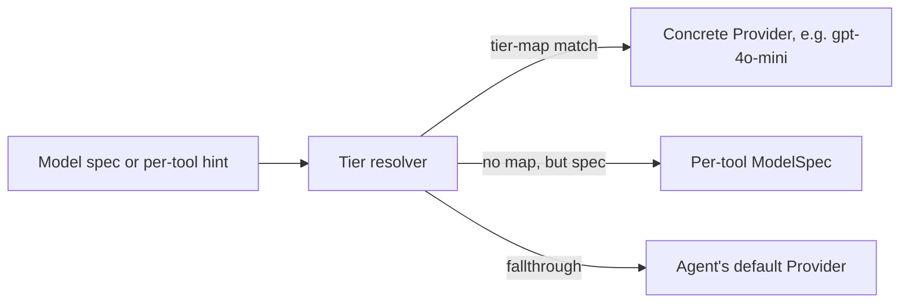

# Providers

Graphorin is **vendor-neutral by principle**. A single `Provider` interface adapts any LLM, and a middleware composer wires sensitivity-aware redaction, token counting, model-tier classification, and reasoning-policy enforcement into every call.

## Adapters

| Adapter | Backed by | Use when |
|---|---|---|
| `vercelAdapter(...)` | [Vercel AI SDK](https://github.com/vercel/ai) (`ai@^7.0.0-beta.76`, Apache-2.0) | A frontier cloud provider - OpenAI, Anthropic, Google, etc. |
| `ollamaAdapter(...)` | A local [Ollama](https://ollama.com/) daemon over HTTP. | Local-first deployments that already run an Ollama daemon. |
| `openAICompatibleAdapter(...)` | Any HTTP server speaking the OpenAI Chat Completions wire format. | LM Studio, LocalAI, vLLM, Together.ai, llama-server's OpenAI-compat mode, …  |
| `llamaCppServerAdapter(...)` | The standalone `llama-server` binary from [`llama.cpp`](https://github.com/ggml-org/llama.cpp). | When you want the canonical `llama.cpp` server but not in-process. |
| `llamaCppNodeAdapter(...)` (in `@graphorin/provider-llamacpp-node`) | [`node-llama-cpp@^3.5`](https://node-llama-cpp.withcat.ai/) (MIT). | In-process GGUF execution. Companion package (opt-in install). |

## Why a `Provider` and not the raw SDK?

`createProvider(adapter, options?)` wraps the raw adapter in the canonical `Provider` shape and centralises:

- per-instance `acceptsSensitivity` declarations,
- capability overrides (e.g. forcing `multimodal: false` for a tool that does not need it),
- default `reasoningRetention` resolution from the adapter's declared `reasoningContract`,
- a single attachment surface for every middleware below.

The optional middleware composer (`composeProviderMiddleware([...])`) wraps the result in a chain whose order is validated against the **canonical order** - outermost to innermost:

```text
withTracing → withRetry → withRateLimit → withCostLimit → withCostTracking → withFallback → withRedaction → adapter
```

A `MiddlewareOrderingError` is thrown the moment the array argument violates the canonical order, and a separate production-startup hook refuses to boot a server that does not include `withRedaction` in the chain. Each middleware has a focused responsibility:

| Middleware | What it does |
|---|---|
| `withTracing` | Attaches `provider.stream` spans through `@graphorin/observability`. |
| `withRetry` | Exponential backoff + jitter on transient failures. |
| `withRateLimit` | Per-bucket rate limiting before the request leaves the process. |
| `withCostLimit` | Refuses requests that would breach the configured budget. |
| `withCostTracking` | Records per-call cost for auditing. |
| `withFallback` | Composes a chain of fallback providers. |
| `withRedaction` | Innermost: strips secrets / PII immediately before the adapter call. User-supplied patterns match **every** occurrence (the `/g` flag is forced), and the streaming scan keeps a bounded tail buffer so a secret split across two `text-delta` chunks is still caught. |

Token counting, model-tier classification, and reasoning-retention policy are **separate APIs** (`createDefaultCounter(...)`, `classifyModelTier(...)`, `resolveReasoningRetention(...)`) - not middleware. They run as part of the agent runtime's per-step planning, not inside the middleware chain.

## Quick start

```ts
import { createProvider, ollamaAdapter } from '@graphorin/provider';

const provider = createProvider(
  ollamaAdapter({
    baseUrl: 'http://127.0.0.1:11434',
    model: 'qwen2.5:7b-instruct-q4_K_M',
  }),
  {
    acceptsSensitivity: ['public', 'internal'],
    reasoningRetention: 'pass-through-all',
  },
);
```

`acceptsSensitivity` is the **first-run sensitivity prompt**. Memory rows tagged `secret` are filtered out before any payload reaches the adapter. The default for an unfamiliar provider is **deny everything except `public`** until you opt in.

## Provider events

Every adapter normalises its native stream into the same `ProviderEvent` discriminated union:

| Event type | Meaning |
|---|---|
| `stream-start` | The stream opened - carries response metadata. |
| `text-delta` | A token of the assistant message. |
| `reasoning-delta` | A token of an extended-reasoning channel (e.g. `<thinking>`). |
| `tool-call-start` / `tool-call-input-delta` / `tool-call-end` | Streaming tool calls. |
| `file` / `source` | A generated file part, or a source citation. |
| `finish` | Terminal event - carries the `finishReason` **and** the `usage` (input / output / total tokens). An aborted stream reports `finishReason: 'aborted'` (not `'stop'`), and abort is excluded from `withRetry` / `withFallback`. |
| `error` | A normalised, typed error. |

The agent runtime consumes this stream and emits its own `AgentEvent`s on top.

## Model tiers



Declare a tier on a tool:

```ts
import { tool } from '@graphorin/tools';

export const heavyPlanner = tool({
  name: 'plan',
  preferredModel: 'smart',
  // …
});
```

Map tiers to concrete Providers on the agent:

```ts
import { openai } from '@ai-sdk/openai';

const agent = createAgent({
  // …
  modelTierMap: {
    fast: createProvider(ollamaAdapter({ model: 'qwen2.5:1.5b' })),
    balanced: createProvider(ollamaAdapter({ model: 'qwen2.5:7b-instruct' })),
    smart: createProvider(vercelAdapter(openai('gpt-4o'))),
  },
});
```

The runtime walks the precedence ladder once per step:

```text
'prepare-step' > 'tier-map' | 'spec' > 'agent-preferred' > 'fallthrough-default'
```

## Reasoning retention

Some providers expose internal reasoning content (extended thinking, scratch pads). Graphorin's policy model lets you keep the trade-offs explicit:

| Mode | Behaviour |
|---|---|
| `'strip'` | Drop reasoning from the next request body. Default for hidden chain-of-thought providers (OpenAI o1 / o3, Gemini reasoning) and the conservative default for unknown providers. |
| `'pass-through-claude'` | Round-trip Anthropic-shaped thinking blocks byte-equal to the previous assistant message. Default for round-trip-required providers (Claude tool-use with thinking). |
| `'pass-through-all'` | Round-trip every reasoning content part the provider returns, regardless of vendor shape. Useful for custom providers with `reasoningContract: 'optional'` that still benefit from preserving the chain. |

Handoffs always strip reasoning - `filters.stripReasoning()` is unconditional at the boundary.

## Request timeouts & structured output

The HTTP adapters (Ollama, OpenAI-compatible, `llama.cpp` server) apply a **default time-to-response timeout of 120 s** per request (PS-24): a hung server that never answers surfaces as a retryable `ProviderHttpError` ("request timed out…") instead of stalling `generate()` forever. The timer is scoped to the response headers - once the server starts answering, a long streaming body is never killed. Override per adapter with `timeoutMs` (`0` disables); the caller's `signal` always composes.

The same adapters now consume `ProviderRequest.outputType` (set by the agent's `outputType` config and the memory pipelines): a structured request maps to OpenAI-shaped `response_format` (`json_schema` when `outputType.jsonSchema` is supplied, `json_object` otherwise) and to Ollama's native `format` field. The mapping is gated on the adapter's `capabilities.structuredOutput` - override it to `false` for servers that reject `response_format`.

## Adapters at a glance

### Vercel AI SDK

```ts
import { openai } from '@ai-sdk/openai';
import { createProvider, vercelAdapter } from '@graphorin/provider';

const provider = createProvider(
  vercelAdapter(openai('gpt-4o')),
  { acceptsSensitivity: ['public'] },
);
```

`vercelAdapter(model, options?)` takes an AI SDK language-model object as its first argument (e.g. `openai('gpt-4o')` from `@ai-sdk/openai`, `anthropic('claude-...')` from `@ai-sdk/anthropic`). The Vercel AI SDK provides the underlying connection to OpenAI, Anthropic, Google, Mistral, Groq, Cohere, etc. Configure provider-specific options (API key resolution, base URL, headers) on the AI SDK model; the adapter's own `options` cover naming and capability overrides.

### Ollama

```ts
import { ollamaAdapter, createProvider } from '@graphorin/provider';

const provider = createProvider(
  ollamaAdapter({
    baseUrl: 'http://127.0.0.1:11434',
    model: 'qwen2.5:7b-instruct-q4_K_M',
  }),
  { acceptsSensitivity: ['public', 'internal'] },
);
```

### OpenAI-compatible HTTP

```ts
import { openAICompatibleAdapter, createProvider } from '@graphorin/provider';

const provider = createProvider(
  openAICompatibleAdapter({
    baseUrl: 'http://127.0.0.1:1234/v1',
    apiKey: 'lm-studio',
    model: 'qwen2.5-7b-instruct',
  }),
  { acceptsSensitivity: ['public', 'internal'] },
);
```

### `llama.cpp` HTTP server

```ts
import { llamaCppServerAdapter, createProvider } from '@graphorin/provider';

const provider = createProvider(
  llamaCppServerAdapter({
    model: 'qwen2.5:7b-instruct-q4_k_m',
    baseUrl: 'http://127.0.0.1:8080',
  }),
  { acceptsSensitivity: ['public', 'internal'] },
);
```

### In-process GGUF (companion package)

```ts
// pnpm add @graphorin/provider-llamacpp-node
import { llamaCppNodeAdapter } from '@graphorin/provider-llamacpp-node';
import { createProvider } from '@graphorin/provider';

const provider = createProvider(
  llamaCppNodeAdapter({ modelPath: '/abs/path/qwen2.5-7b.Q4_K_M.gguf' }),
  { acceptsSensitivity: ['public', 'internal'] },
);
```

Trade-off: in-process loses durable mid-stream resume because the model context lives in the Node.js process - durable resume across a restart needs the [Standalone server](/guide/standalone-server).

## Token counting

`@graphorin/provider` ships a dispatcher with built-in counters for Anthropic and OpenAI / `tiktoken`-style models. Install one tuned to your model - or your own implementation of the `TokenCounter` contract (`{ id, version, count, countText }`) - as the process-global counter:

```ts
import { createDefaultCounter, setGlobalTokenCounter } from '@graphorin/provider';

// Built-in counter tuned to a specific model:
setGlobalTokenCounter(createDefaultCounter({ model: 'gpt-4o' }));
```

## Prompt caching

Prompt-cache reads are billed at roughly a tenth of the input price, and for a multi-step agent that resends its transcript every step the cache hit rate is the single biggest cost lever. Graphorin's support has three legs:

1. **Usage accounting.** `Usage` carries `cachedReadTokens` / `cacheWriteTokens` (both subsets of `promptTokens`). The vercel adapter maps the AI SDK's `inputTokenDetails`; the OpenAI-compatible adapter maps `prompt_tokens_details.cached_tokens`. The fields flow through `step.end` events, `RunState.usage`, `usageByModel`, and `withCostTracking`'s `onUsage` hook.
2. **Cost.** `ModelPrice` has `cachedReadUsdPerToken` and `cacheWriteUsdPerToken`; `calculateCost(...)` and `withCostTracking`'s `priceLookup` bill each leg at its own rate (a missing cache rate falls back to the full input rate, never cheaper than reality).
3. **Breakpoints.** Caching on Anthropic is opt-in per request. Set the policy once on the agent and every request carries it:

```ts
const agent = createAgent({
  name: 'assistant',
  instructions: '...',
  provider,
  cachePolicy: { breakpoints: 'auto' }, // optional ttl: '1h'
});
```

With `breakpoints: 'auto'` the vercel adapter anchors `cache_control` markers on the first and last conversation messages, so tools + system + the stable prefix are written once and read at the discounted rate on every later step; each step's write becomes the next step's read. OpenAI caches automatically (no markers needed); providers without a cache concept ignore the policy.

Two loop-side properties protect the cache hit rate: the transcript is append-only with a pinned system prefix, and the tool catalogue grows append-only - eager tools and handoffs serialize before promoted tools, so a `tool_search` promotion appends at the end instead of shifting the prefix. If even that invalidation is too expensive, `toolPromotion: 'run-boundary'` freezes the advertised catalogue for the whole run (discoveries persist on `RunState.promotedTools` and join the catalogue on the next run).

## Pricing

`@graphorin/pricing` ships a bundled snapshot of LLM pricing data sourced from the public [`@pydantic/genai-prices`](https://github.com/pydantic/genai-prices) dataset (MIT). The snapshot is **never refreshed automatically** - call `graphorin pricing refresh` to update it on demand. See [Pricing](/reference/pricing) for the full lifecycle.

Models released after the bundled snapshot date (for example the Claude 5 family) intentionally have **no entry**: cost tracking reports `null` plus one WARN per model instead of an invented number, and a release-gate test (`snapshot-coverage.test.ts`) keeps the classifier and the snapshot from drifting apart silently. Refresh the snapshot or contribute the entry once vendor pricing is public.

## Next steps

- [Memory system](/guide/memory-system) - how memory is filtered before it reaches the provider.
- [Observability](/guide/observability) - what spans the provider middleware emits.
- [Security](/guide/security) - sensitivity gating and the redaction layer.
- [Pricing](/reference/pricing) - bundled snapshot + refresh.

---

**Graphorin** · v0.6.0 · MIT License · © 2026 Oleksiy Stepurenko
