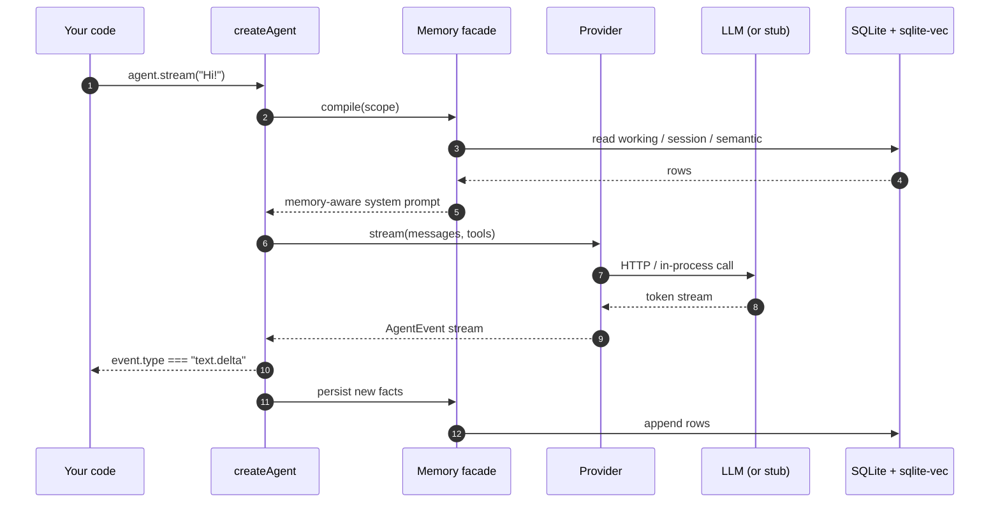

# Quickstart

This walkthrough is the smallest end-to-end Graphorin assistant. Everything runs on your laptop — SQLite for storage, multilingual embeddings via `@huggingface/transformers`, and a deterministic stub provider for the LLM. No API keys, no telemetry, no phone-home.

## What you'll build

A memory-backed agent that:

1. Stores facts in a six-tier memory system on a local SQLite database.
2. Streams tokens to your terminal as it answers.
3. Survives a process restart with all state intact.

## 20-line hello world

```ts
import { createAgent } from '@graphorin/agent';
import { createMemory } from '@graphorin/memory';
import { createProvider } from '@graphorin/provider';
import { createSqliteStore } from '@graphorin/store-sqlite';
import { createTransformersJsEmbedder } from '@graphorin/embedder-transformersjs';
import { createStubProvider } from './stub-provider.js'; // defined below

const sqlite = await createSqliteStore({ path: './assistant.db' });
await sqlite.init();

const memory = createMemory({
  store: sqlite.memory,
  embeddings: sqlite.embeddings,
  embedder: createTransformersJsEmbedder(),
});

const provider = createProvider(createStubProvider(), {
  acceptsSensitivity: ['public', 'internal'],
});

const agent = createAgent({
  name: 'hello',
  instructions: 'Be brief and helpful.',
  provider,
  memory,
});

for await (const event of agent.stream('Hi!', { sessionId: 's1', userId: 'u1' })) {
  if (event.type === 'text.delta') process.stdout.write(event.delta);
}

await sqlite.close();
```

## The stub provider

`createStubProvider()` is a tiny, deterministic `Provider` that echoes the last
user message — no API keys, no network. Save it next to the snippet above as
`stub-provider.ts`:

```ts
import type { Provider, ProviderEvent, ProviderRequest } from '@graphorin/core';
import { zeroUsage } from '@graphorin/core';

export function createStubProvider(): Provider {
  const reply = (req: ProviderRequest): string => {
    const last = [...req.messages].reverse().find((m) => m.role === 'user');
    const text =
      typeof last?.content === 'string'
        ? last.content
        : (last?.content ?? [])
            .filter((p): p is { type: 'text'; text: string } => p.type === 'text')
            .map((p) => p.text)
            .join(' ');
    return `stub-echo: ${text}`;
  };
  return {
    name: 'stub',
    modelId: 'stub-echo',
    capabilities: {
      streaming: true,
      toolCalling: false,
      parallelToolCalls: false,
      multimodal: false,
      structuredOutput: false,
      reasoning: false,
      contextWindow: 8_192,
      maxOutput: 1_024,
      reasoningContract: 'optional',
    },
    acceptsSensitivity: ['public', 'internal', 'secret'],
    async *stream(req): AsyncIterable<ProviderEvent> {
      yield { type: 'stream-start', metadata: { providerName: 'stub', modelId: 'stub-echo' } };
      yield { type: 'text-delta', delta: reply(req) };
      yield { type: 'finish', finishReason: 'stop', usage: zeroUsage() };
    },
    async generate(req) {
      return { text: reply(req), usage: zeroUsage(), finishReason: 'stop' };
    },
  };
}
```

The runnable [example apps](/guide/examples) ship a fuller version of this same
stub.

## What's happening



## Try it with a real local LLM

Swap the stub provider for one of the local-LLM recipes:

```ts
import { ollamaAdapter, createProvider } from '@graphorin/provider';

const provider = createProvider(
  ollamaAdapter({
    baseURL: 'http://127.0.0.1:11434',
    model: 'qwen2.5:7b-instruct-q4_K_M',
  }),
  { acceptsSensitivity: ['public', 'internal'] },
);
```

Or the OpenAI-compatible HTTP adapter for `llama.cpp`'s `llama-server`, LM Studio, LocalAI, or any vendor that speaks the OpenAI Chat Completions wire format. See [Providers](/guide/providers) for the full matrix.

## Sensitivity-aware payloads

`acceptsSensitivity: ['public', 'internal']` is the **first-run sensitivity prompt**. Memory rows tagged `secret` are filtered out before any payload reaches the provider. The default for an unfamiliar provider is **deny everything except `public`** until you opt in. See [Security](/guide/security) for the threat model.

## Streaming events

`agent.stream(...)` returns a typed `AsyncIterable<AgentEvent<TOutput>>`. Every operation the runtime performs surfaces as an event:

A few of the most common event types:

| Event type | When it fires |
|---|---|
| `agent.start` / `agent.end` | The run starts and finishes. |
| `step.start` / `step.end` | Per-step boundaries inside the run. |
| `text.delta` / `text.complete` | Token / final text from the model. |
| `reasoning.delta` | A token of the model's extended-reasoning channel (when present). |
| `tool.call.start` / `tool.call.delta` / `tool.call.end` | Streaming model emission of a tool call. |
| `tool.execute.start` / `tool.execute.end` / `tool.execute.error` | Execution lifecycle of the tool. |
| `tool.approval.requested` / `tool.approval.granted` / `tool.approval.denied` | A privileged tool needs human approval and the eventual decision. |
| `memory.read` / `memory.write` | A memory operation crossed the boundary. |
| `context.compacted` | The context engine auto-compacted the buffer. |
| `handoff` | The agent handed off to another agent. |
| `agent.model.fellback` | The agent retried against a fallback model. |
| `agent.fanout.spawned` / `agent.fanout.merged` | Fan-out lifecycle. |
| `agent.evaluator.iteration` / `agent.evaluator.converged` | Evaluator-optimizer lifecycle. |
| `agent.progress.written` / `agent.progress.read` | A progress artifact was persisted or loaded. |
| `agent.lateral-leak.detected` | The lateral-leak defense layer flagged outbound content. |
| `guardrail.tripped` | An input or output guardrail tripped. |

The discriminated `AgentEvent<TOutput>` union is exhaustive and verified at compile time — `assertNever(event)` in the default branch keeps your handlers honest.

## Persisting facts

The agent registers nine memory tools by default. Calling them is just a normal tool call:

```ts
await memory.semantic.remember(
  { userId: 'alex' },
  { text: 'Loves mountain hiking and fresh espresso.' },
);

const hits = await memory.semantic.search(
  { userId: 'alex' },
  'mountain trip ideas',
);
```

See [Memory system](/guide/memory-system) for the full tier model and the conflict-resolution pipeline.

## Next steps

- [Architecture](/guide/architecture) — how the layers fit together.
- [Memory system](/guide/memory-system) — the six tiers, hybrid search, and the consolidator.
- [Agent runtime](/guide/agent-runtime) — streaming, HITL, multi-agent handoffs.
- [Providers](/guide/providers) — switch from the stub to Ollama, llama.cpp, or any cloud provider.
- [Examples](/guide/examples) — full end-to-end example apps in the repository.

---

**Graphorin** · v0.1.0 · MIT License · © 2026 Oleksiy Stepurenko
