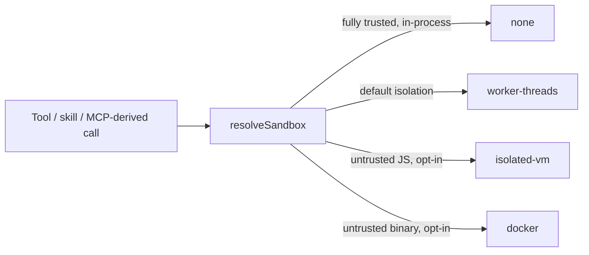
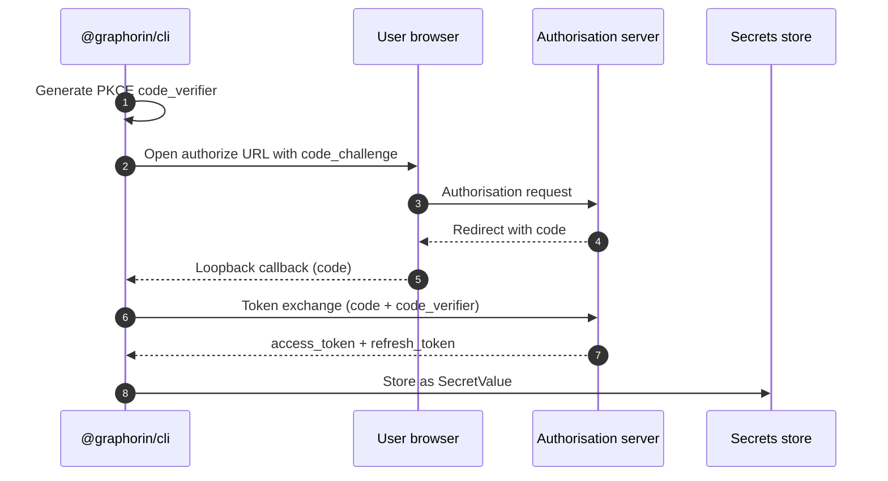
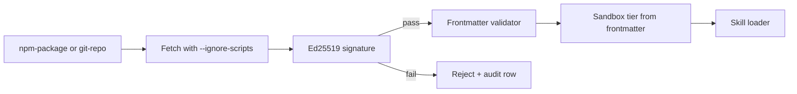
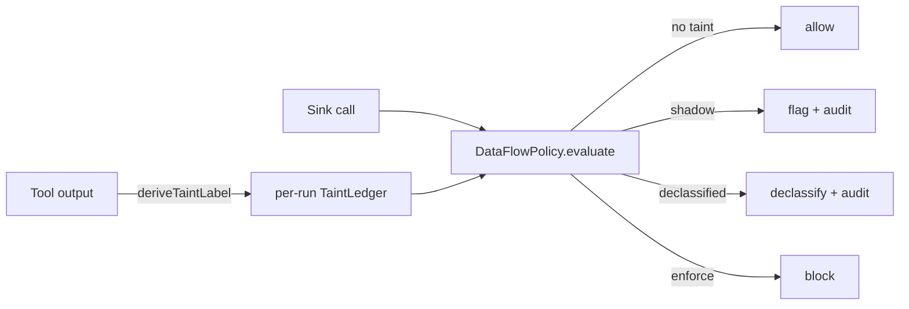

# Security

Security is a first-class subsystem in Graphorin, not an afterthought. `@graphorin/security` ships:

- **Secrets** - `SecretValue` wrapper, `SecretRef` URI scheme, OS keychain integration, optional encrypted-file store. See [Secrets](/guide/secrets) for the full sub-page.
- **Sandbox tiers** - `'none'`, `'worker-threads'`, `'isolated-vm'`, `'docker'`.
- **Server-token authentication** - HMAC-SHA256 with a deployment-wide pepper.
- **Audit log** - SQLite database with mandatory encryption-at-rest and a SHA-256 hash chain.
- **OAuth 2.1 with PKCE** - outbound flows for MCP servers and skill registries.
- **Supply-chain helpers** - Ed25519 signature verification for distributed skills.
- **Lateral-leak defense layer** - composes orthogonally with the agent runtime's safety primitives.
- **Provenance / data-flow policy** - opt-in, taint-based enforcement at the tool boundary that defuses the lethal trifecta (`@graphorin/security/dataflow`).

## Sandbox tiers



| Tier (resolved kind) | `sandboxPolicy` | Backed by | Used for |
|---|---|---|---|
| `'none'` | `'none'` | The Node.js process. | Fully-trusted first-party tools. |
| `'worker-threads'` | `'sandboxed'` | Node.js worker threads (built-in - no peer dependency). Workers run with an empty environment (`env: {}` + a pre-run scrub) - the host `process.env` is never inherited; only the explicit `SandboxRunOptions.env` allowlist is visible. | **The default isolation tier.** Today it backs **code-mode** script execution (and any tool an operator routes through a custom `sandboxResolver`). Inline `config.tools` and MCP-derived tools resolve to this policy but run **in-process** - see below. |
| `'isolated-vm'` | `'isolated'` | [`isolated-vm`](https://github.com/laverdet/isolated-vm) (peer dependency, ISC). | Untrusted JavaScript skills. |
| `'docker'` | `'docker'` | [`dockerode`](https://github.com/apocas/dockerode) (peer dependency, Apache-2.0). | Untrusted binaries / full subprocess isolation. |

A tool declares its tier through `sandboxPolicy`; the executor maps that to a resolved kind (`'sandboxed' → 'worker-threads'`, `'isolated' → 'isolated-vm'`). Today this policy is **advisory for inline (`config.tools`) and MCP-derived tools**: it is resolved and surfaced on the `tool.execute` span / audit row, but those tools execute **in-process** - the agent runtime intentionally ships with no `sandboxResolver` wired. Real out-of-process isolation applies only to **code-mode** scripts and to tools an operator routes through a custom `sandboxResolver`; module-loadable skill / MCP isolation is wired when those land. See the per-field runtime behaviour in [Agent runtime](/guide/agent-runtime).

The `'worker-threads'` tier is **best-effort** isolation, not a security boundary: the worker shares the host process and filesystem. It blocks `fs` / network module imports (ESM resolve hook + a CJS `require` interception) and always denies the process-escape modules `child_process` / `vm` / `cluster` / `inspector` / `worker_threads`, but a determined attacker with native addons or other escapes is not contained - load genuinely untrusted code under `'isolated-vm'` (V8 isolate) or `'docker'` (kernel) instead.

`isolated-vm` and `dockerode` are **opt-in peer dependencies** - they are not installed by default, so a base install pulls in zero native sandbox code. Add them only if you load untrusted code; `'none'` and `'worker-threads'` need nothing extra.

When you do install `dockerode`, prefer **v5** (the peer range accepts `^4.0.0 || ^5.0.0`, and the workspace tests against 5.x): dockerode 4.x pulls in `uuid@10`, which carries a moderate advisory ([GHSA-w5hq-g745-h8pq](https://github.com/advisories/GHSA-w5hq-g745-h8pq)); dockerode 5 dropped the `uuid` dependency entirely. If you must stay on 4.x, add the override the workspace itself uses: `"dockerode>uuid": ">=11.1.1 <12"` (pnpm `overrides`).

## Sensitivity model

Every message, memory row, tool result, and trace attribute carries a `Sensitivity` tag:

| Tag | Meaning | Where it can flow |
|---|---|---|
| `public` | No restrictions. | Anywhere. |
| `internal` | Operator-private but not user-secret. | Local trace + opt-in collectors; never to providers without `acceptsSensitivity: ['internal']`. |
| `secret` | User secret. | Never leaves the machine. Memory rows tagged `secret` are filtered before any payload reaches a provider; the single exception is a provider that explicitly accepts `'secret'` **and** whose trust class is `'loopback'` (in-process / localhost). |

The default for an unfamiliar provider is **deny everything except `public`** until you opt in. The default export floor for an exporter is `public` - anything above it is stripped attribute-by-attribute until the operator explicitly raises `validation.minTier`, and values matching the secret-pattern catalogue are masked regardless of tier.

## Server-token authentication

The standalone server (`@graphorin/server`) requires every authenticated REST / WebSocket / SSE connection to present a bearer token signed with HMAC-SHA256 against a deployment-wide pepper. The unauthenticated `/v1/health` probe is exempt so liveness checks work before token verification is wired. Tokens are generated and rotated through `graphorin token`:

```bash
graphorin token create --scopes agents:invoke --expires-in 30d
graphorin token list
graphorin token revoke <token-id>
```

The pepper itself is resolved at server boot through a `SecretRef` (typically stored under `keyring:graphorin_server_pepper` or the encrypted-file store). See [Secrets](/guide/secrets) for the resolution pipeline.

**Attenuation-only minting.** `POST /v1/tokens` never escalates: a token principal can only mint scopes its OWN grant already covers (checked with the same `scopeMatches` rules the middleware uses - `admin:*` covers everything, a two-segment grant covers three-segment requests, but `agents:invoke:foo` does NOT cover the wider `agents:invoke`). A request outside the caller's grant answers `403 { error: 'scope-escalation-denied', denied: [...] }` listing the uncovered scopes. Because the child's `tokens:create` must itself be covered, delegation chains narrow monotonically - a service token holding only `tokens:create` can no longer mint itself `admin:*`. Give minters the full target set (or `admin:*`) if they legitimately need to issue wide tokens. Syntactically invalid scopes are rejected with `400` instead of silently minting a token that grants nothing. The CLI path (`graphorin token create`) operates on the store directly as the operator and is not subject to this rule.

**Pepper strength.** Consuming a pepper (`createToken`, `rekeyTokens`, the `TokenVerifier`'s first use) runs a weak-secret check: peppers below 32 bytes, with low Shannon entropy, or containing a long run of identical bytes (placeholder/test values) are rejected with a `WeakPepperError` whose `reason` explains the failure. Generate peppers with `crypto.randomBytes(32)` or the auth library's `generatePepper()`. The underlying heuristic is exported as `assessSecretStrength(bytes)` from `@graphorin/security` (and `@graphorin/security/hardening`) - a pure function returning `{ ok, reason, shannonBitsPerByte, maxIdenticalRun, … }` - so you can apply the same bar to your own passphrases.

## Audit log

Every privileged operation writes one row to the audit log:

- secret access (read / write / list);
- tool execution (start / end / approval);
- memory mutations (write / supersede / forget);
- skill installs (with signature verification result);
- token issuance / revocation;
- OAuth flows (initiation / token issuance / refresh).

The audit log lives in a dedicated SQLite database with **mandatory encryption-at-rest** (via [`better-sqlite3-multiple-ciphers`](https://github.com/m4heshd/better-sqlite3-multiple-ciphers)) and a **SHA-256 hash chain** that links every row to its predecessor. Tampering breaks the chain. `config.audit.cipher` selects the cipher and is pinned before `PRAGMA key` on both open paths; the audit default is `chacha20` - deliberately DIFFERENT from the main store's `sqlcipher` (ADR-030) because every pre-fix audit.db was created in the sqlite3mc default format and pinning `chacha20` keeps them byte-compatible. If you set `audit.cipher: 'sqlcipher'` in a config where it was previously ignored, an existing chacha20 file will now fail to open (correct fail-fast, not data loss) - re-encrypt it or drop the setting.

The CLI command `graphorin audit verify` walks the chain and reports any breaks (`graphorin audit export` / `prune` round out the group).

### Merkle transparency + signed checkpoints

The linear hash chain is tamper-*evident* but not tamper-*resistant*: a writer who can rewrite the whole database can re-root the chain (exactly what `pruneAudit` does by design). `@graphorin/security/audit` adds an RFC-6962 Merkle layer over the same rows so the log can be **anchored** and made tamper-resistant against that adversary:

```ts
import { SecretValue } from '@graphorin/security';
import {
  openAuditDb,
  signAuditCheckpoint,
  verifyAuditAgainstCheckpoint,
  generateAuditSigningKeyPair,
} from '@graphorin/security/audit';

const auditDb = await openAuditDb({
  path: './audit.db',
  passphrase: SecretValue.fromString('replace-with-a-real-passphrase'),
});

const { publicKeyPem, privateKeyPem } = generateAuditSigningKeyPair(); // Ed25519
// Periodically sign the current tree head and store it OUT OF BAND
// (a different host, an object store, a ticket):
const checkpoint = await signAuditCheckpoint(auditDb, { privateKeyPem, writerId: 'ci' });

// Later - the signature is valid AND the live log is an append-only
// extension of the checkpointed head (any rewrite of the covered prefix
// fails the RFC-6962 consistency proof):
const result = await verifyAuditAgainstCheckpoint(auditDb, checkpoint, { publicKeyPem });
```

Also available: `computeAuditTreeHead`, `proveAuditInclusion` / `verifyAuditInclusion` ("entry N is in the log with head H"), and `proveAuditConsistency` / `verifyAuditConsistency`. As long as one signed checkpoint survives outside the writer's reach, a rewrite, reorder, or truncate-and-re-root is detectable.

### Retention and anchoring: the re-anchor runbook

`pruneAudit` re-roots the surviving suffix (every surviving entry's `prevHash`/`hash` is recomputed), and the RFC-6962 leaves hash the canonical JSON of each entry INCLUDING those fields - so **verification against any checkpoint signed before the prune MUST fail afterwards, by design**. A legitimate retention prune is cryptographically indistinguishable from the truncate-and-re-root attack this layer exists to detect; only the operator's out-of-band procedure tells them apart. Run every retention prune as one atomic ceremony:

1. Run the prune (`graphorin audit prune --before ...` or `pruneAudit(...)`). The delete + suffix re-hash executes inside ONE write transaction: the write lock is held for the whole rewrite, so live appends wait (`busy_timeout`) and then chain to the post-prune tip - schedule prunes of very large chains in a maintenance window. On a custom audit-db binding without the `transact` fence the prune refuses to run (fail closed) rather than risk a permanent chain break.
2. Immediately sign a FRESH checkpoint of the new head: `signAuditCheckpoint(auditDb, { privateKeyPem, writerId })`.
3. Distribute the new checkpoint to every out-of-band anchor location (other host, object store, ticket).
4. Revoke or explicitly mark superseded every pre-prune checkpoint, recording the prune timestamp next to them - a later `verifyAuditAgainstCheckpoint` failure against one of them must read as "expected: pre-prune anchor", not as an alarm.
5. Accept that anchored history restarts at the prune point: inclusion/consistency proofs only cover entries after it.

A pre-prune checkpoint that keeps verifying is the actual alarm (it means the prune did not happen where you think it did).

**Identifier-level erasure limitation.** `pruneAudit` is the only erasure primitive for the audit database and it trims a TIME PREFIX only - selective deletion of the entries of one user / session / actor is not possible without breaking the chain. For GDPR-style identifier-level requests: keep direct identifiers OUT of audit payloads (store opaque ids the primary database can unlink), or erase via a full prefix prune up to the qualifying date, re-anchoring as above.

## OAuth 2.1 with PKCE



The client is built on [`openid-client`](https://github.com/panva/openid-client) (MIT). Token storage uses the configured secrets store (OS keychain by default). Refresh happens lazily on the next call - no background daemon ever phones home.

**Refresh-token rotation.** When an authorisation server rotates refresh tokens (RFC 6749 §10.4 / OAuth 2.1), pass `revokePreviousOnRotation: true` to `refreshAccessToken(...)` to best-effort revoke the previous refresh token once the new one is issued. It is opt-in (default `false`) and revocation failures never fail the refresh.

## Supply-chain pipeline



Loading from `npm-package` or `git-repo` always:

- runs the install with `--ignore-scripts` enforced (no `postinstall` execution);
- fetches the publisher's Ed25519 public key from the configured well-known URL;
- verifies the package's bundled signature against the resolved key;
- writes one audit row recording success or failure.

Local `folder` installations are trusted-by-default but flow through the same validator pipeline.

An operator allow/deny policy gates which package names may be installed. By default a matching allowlist entry wins (so you can deny a whole scope yet allow specific exceptions inside it); set `precedence: 'deny-wins'` to consult the deny lists first, so an explicit denylist entry can never be overridden by a broad allowlist glob.

**Operator trust root.** A valid signature is not authenticity if the signer is anyone - a self-signed skill whose inline key is not pinned would otherwise verify green under the signature-required policy. Pass a `trustRoot` (through `installSkillFromNpm` / `installSkillFromGit` or directly to `verifySkillSignature`) and the resolved signing key must be in it, or verification returns `valid: false` with `reason: 'untrusted-key'`:

```ts
import { installSkillFromNpm } from '@graphorin/security';

await installSkillFromNpm({
  packageName: '@vendor/skill',
  trustRoot: {
    publishers: ['vendor.example.com'],           // trusted publisher DOMAINS (well-known only)
    fingerprints: ['sha256:...'],                  // and/or pinned key fingerprints
    allowSigstore: true,                           // sigstore-resolved keys exempt (default)
  },
});
```

The root check runs after the ed25519 signature itself is valid, so the result distinguishes a forged signature from an untrusted signer.

The `publishers` leg is domain-bound: the frontmatter `publisher` string is NOT covered by the signature - anyone can claim any publisher - so the leg counts only for keys resolved through the `well-known` channel, and the key URL's host must be the publisher's domain or a subdomain of it (`keys.vendor.example.com` works for `vendor.example.com`; anything else is rejected at resolve time). The key fetch never follows redirects, so an open redirect on the publisher's domain cannot substitute the key source. Consequences: an inline key can never satisfy `publishers` (pin its fingerprint instead), and a publisher id that is not a DNS name (or a key hosted on an unrelated domain) needs the `fingerprints` leg.

## Published dependency-graph advisories

The workspace's vulnerability scanning runs over `pnpm-lock.yaml` - which applies the repo's pnpm overrides. npm consumers never inherit those overrides, so an advisory in the **published** auto-installed dependency/peer graph can be invisible to every workspace-side gate while being real for every consumer. The `published-peer-audit` job in the consumer-smoke workflow closes that blind spot: on a schedule (and on demand) it performs a fresh isolated `npm install` of every published `@graphorin/*` package and gates `npm audit --omit=dev` high/critical findings against the reviewed allowlist in `.github/published-peer-audit-allowlist.json`. An allowlisted advisory that stops appearing fails the job too, so accepted advisories and their documented mitigations cannot silently go stale.

### Known advisory: adm-zip under the transformers.js embedder

Consumers of `@graphorin/embedder-transformersjs` (and `@graphorin/reranker-transformersjs`) currently see one high advisory in `npm audit`:

- Chain: `@huggingface/transformers` -> `onnxruntime-node` -> `adm-zip@0.5.x` ([GHSA-xcpc-8h2w-3j85](https://github.com/advisories/GHSA-xcpc-8h2w-3j85), memory exhaustion on a crafted ZIP; patched in `adm-zip@0.6.0`).
- Exposure: `adm-zip` is used only inside `onnxruntime-node`'s **install script** to unpack its own release archives. The runtime never parses foreign ZIP files, so the practical exposure is an install-time denial of service through a compromised download channel - narrow, but the advisory (and the red `npm audit`) is real.
- Upstream status: every `onnxruntime-node` release to date pins `adm-zip ^0.5.16` (the patched `0.6.0` is outside that range), and `@huggingface/transformers` pins `onnxruntime-node` exactly, so no dependency bump resolves it today.

Until upstream widens the range, mitigate in the **consumer's root manifest** (verified: the install scripts and the runtime work unchanged on `adm-zip@0.6.0`, and `npm audit --omit=dev` comes back clean):

::: code-group

```json [npm (package.json)]
{
  "overrides": {
    "adm-zip": "^0.6.0"
  }
}
```

```yaml [pnpm (pnpm-workspace.yaml)]
overrides:
  'adm-zip@<0.6.0': '>=0.6.0 <1'
```

:::

The Graphorin workspace itself ships the pnpm form of this override, which is exactly why lockfile-based scanners report it clean - treat a clean workspace scan as a statement about the workspace, never about the published graph.

The same guidance is printed on both packages' npm pages (their READMEs carry the advisory section verbatim), and the scheduled `published-peer-audit` job now also **proves the mitigation**: it installs a consumer fixture with the documented override against the live registry and fails if the one-liner ever stops removing the advisory.

## Lateral-leak defense layer

The agent runtime's defense layer composes orthogonally with the security primitives above:

| Layer | Purpose |
|---|---|
| `causalityMonitor` (`createAgent({ causalityMonitor })`) | Implements an Agentic Reference Monitor pattern. Every cross-agent flow is checked against the stated capability. |
| `mergeGuard` (`createAgent({ mergeGuard })`) | Per-child trust scoring + bias detection on the `'judge-merge'` fan-out strategy; `detect-and-block` refuses the merge (`MergeBlockedError`). |
| Protocol-injection guard (`guardOutboundContent` helper) | Control-character escape catalogue for server-boundary wiring (SSE / session export) - not an `AgentConfig` knob. |
| Commentary-phase trace sanitisation | At the session-output boundary, before any export. The 7-pattern catalogue is single-sourced from `@graphorin/tools/outbound` and shared with the server delivery layer (WS / SSE frames) and the channel gateway, so tool-call scaffolding (`tool.call.*` payloads, fan-out and compaction events) is scrubbed on every outbound surface; the sanitizers themselves stay boundary-specific. |
| Inbound sanitisation preamble | When non-trusted content is in the message list, a locale-resolved preamble is appended **after** the cache breakpoint. |

## Provenance / data-flow policy

The lateral-leak guards above match **patterns**; the data-flow policy (`@graphorin/security/dataflow`, opt-in, toward [CaMeL](https://arxiv.org/abs/2503.18813)) enforces **provenance**. It reuses the metadata Graphorin already attaches to every tool - trust class + source + sensitivity - to defuse the **lethal trifecta**: untrusted content + access to private data + an exfiltration/mutation sink. With all three present in one run, a prompt injection hidden in the untrusted content can drive the sink; the policy makes that flow fail closed (or, in shadow mode, merely report) unless an operator has explicitly declassified it. By default only `sensitivity: 'secret'` content arms the "private data" leg (so the gate does not fire on every run); set `sensitiveTiers: ['secret', 'internal']` on the policy config to also count ordinary user/PII content (which defaults to `'internal'`). Alternatively - or in addition - set `treatPiiAsSensitive: true` so any tool output the PII catalogue flags (email, SSN, card number, …) arms the leg by content, regardless of its declared tier (FIDES-lattice). The verbatim `untrusted-to-sink` leg is independent of both knobs.



The engine is pure - no I/O, no clock, no network: `deriveTaintLabel(...)` turns a tool's registration metadata into a `TaintLabel`, a per-run `createTaintLedger()` records every output's provenance, and `createDataFlowPolicy({ mode })` returns a verdict for each candidate **sink** (a `side-effecting` / `external-stateful` tool). Untrusted output is tagged from the trust class (`mcp-derived` / `web-search` / `skill-untrusted`); secret-tier output from `sensitivity: 'secret'` only (treating the default `'internal'` tier as sensitive would trip the gate on nearly every run).

A sink trips the policy on any of three signals:

| Signal | Fires when | Precision |
|---|---|---|
| `untrusted-to-sink` | a verbatim span of untrusted content appears in the sink's arguments | precise - direct exfiltration |
| `derived-untrusted-to-sink` | (`derivedTaint: 'strict'`, opt-in) ANY sink fires after untrusted content entered the run - CaMeL-style control-flow integrity, paraphrase-robust by construction | deliberately coarse - size it in shadow mode first |
| `lethal-trifecta` | the sink fires while **both** untrusted **and** secret-tier data have entered the run, even without a provable verbatim carry | conservative - disable with `guardTrifecta: false` |

> **The trifecta leg cannot arm without sensitivity tags.** No built-in tool ships with `sensitivity: 'secret'`. If none of *your* tools declares a sensitivity within `sensitiveTiers` and `treatPiiAsSensitive` is off, the `lethal-trifecta` signal can never fire - the only active default signal is the verbatim `untrusted-to-sink` probe, which a paraphrasing injection bypasses. The agent runtime prints one warning at construction when it detects this configuration. Recommended adoption ladder: (1) start in `'shadow'`; (2) tag the tools that read private data with `sensitivity: 'secret'`; (3) widen with `sensitiveTiers` / `treatPiiAsSensitive` if your private data lives at `'internal'`; (4) add `derivedTaint: 'strict'` for paraphrase-robust control-flow integrity; then switch to `'enforce'`.

Three modes (`DataFlowMode`):

| Mode | Behaviour |
|---|---|
| `'off'` | Disabled - every flow allowed. |
| `'shadow'` | Audit-only: a tripped flow emits a `tool:dataflow:flagged` row + counter but never blocks. **Ship this first** to surface false positives against real traffic. |
| `'enforce'` | A tripped flow **blocks** the sink (the call yields a `dataflow_policy_blocked` error, surfaced as `tool.execute.error`) unless the sink's name is in `declassifySinks` - the explicit, audited operator escape hatch (`tool:dataflow:declassified`). |

Findings are **metadata-only** - they name the flow kind and the implicated source kinds, never the raw argument or output bytes. Verbatim detection is best-effort (it catches verbatim / near-verbatim forwarding; paraphrase is what `derivedTaint: 'strict'` and the trifecta signal cover). The policy **composes with code-mode**: each in-script tool call runs through the same sink gate, so an injection cannot exfiltrate through a sandbox either. The sink gate probes the **post-repair** arguments - the same payload the approval gate saw and the payload the executed input is derived from - so spans introduced by the arg-repair hook are visible to the verbatim probe; the residual limitation is that probing happens before schema coercion, so text introduced purely by a Zod `transform`/`default` is not probed.

Four additional propagation legs close gaps the run-local shingle probe cannot see:

- **Model output** - once a run is tainted, the agent records each step's assistant text as derived-untrusted (`llm-derived`), so a later sink call copying the model's own phrasing still trips the verbatim probe.
- **Channel inbound** - message-borne text from a messenger gateway arms the ledger through the dedicated `'channel-inbound'` trust class and the `AgentCallOptions.inboundTaint` seed, stamped at run init BEFORE the first step. The Rule-of-Two deliberately excludes ordinary user messages from its untrusted-input leg; channel peers are authenticated but their CONTENT is attacker-influenceable, so `'channel-inbound'` is registered in the same single `isUntrustedTrustClass` source both layers consume. Widen-only: the seed can add taint, never clear it.
- **Memory recall** - the recall tools (`fact_search`, `deep_recall`, `recall_episodes`) attach a taint override when any returned item is quarantined or foreign-provenance, so poisoned memory written in an earlier session re-arms the ledger at recall (the cross-session MINJA leg). Overrides only ever WIDEN a label; nothing can launder an untrusted tool's output.
- **Suspend/resume** - the persisted `RunState.taintSummary` now carries one-way FNV-1a hashes of the tracked spans' tiles alongside the coarse flags, so a resumed run re-detects verbatim copies of pre-suspend untrusted content (at tile granularity) without any untrusted text ever being persisted.

### The assistant reply as a sink

Tools are not the only exfiltration surface - the reply itself reaches whoever is on the other end of the conversation (a messenger peer, an exported transcript). The run's outgoing assistant text is evaluated as a sink with the stable id `'assistant-output'` (`DataFlowEvaluation.sinkKind: 'assistant-output'`), gated in the commit path BEFORE the message enters the durable history:

- **enforce** - a tripped flow withholds the reply: the durable message and the run's final output are replaced by a fixed notice (the streamed deltas already left, exactly like the lateral-leak block; what the gate protects is the persistent buffer and anything delivered downstream). The turn's verdict records `guardrail: 'block'` plus the flow in `dataflowFlags`, so the memory ingest gate also keeps it out of long-term memory.
- **shadow** - the reply passes; the verdict sidecar records `assistant-output:flag`.
- **declassify** - add `'assistant-output'` to `declassifySinks` to re-open the reply surface deliberately (audited like any other declassification). Do this only after reviewing enforce-mode blocks: on a lethal-trifecta run the blocked reply is the policy working.

### Pluggable injection classifier (seam)

The regex catalogues catch KNOWN imperative patterns; a classifier catches paraphrases. `@graphorin/security/inspect` defines the `InjectionClassifier` contract plus the resilient `runInjectionClassifier` helper (an engine error always degrades to the regex verdict alone - a classifier can never fail a run). The framework ships NO engine (offline default off); three surfaces consult one when configured:

| Surface | Wiring |
|---|---|
| Inbound sanitisation | `applyInboundSanitizationWithClassifier` (`@graphorin/tools/inbound`); the channel gateway exposes it as `createChannelGateway({ injectionClassifier })`. A flagged verdict appends `classifier:<id>` to `patternsHit`. |
| Final output | `injectionClassifierOutputGuardrail(classifier)` - add to `createAgent({ guardrails: { output: [...] } })`; `action: 'warn'` (default) or `'block'`. |
| Memory write gate | `createMemory({ injectionClassifier })` - consulted at the write-time quarantine gate after the regex heuristics; a flagged verdict quarantines the write. Widen-only: a regex hit short-circuits and can never be cleared by the classifier. |

`treatPiiAsSensitive` remains opt-in warn-first framework-wide; the recommended `treatPiiAsSensitive: true` lives in the [channel gateway security preset](/guide/channels#recommended-gateway-security-preset), and the default is revisited on injection-gate eval evidence.

**Pattern catalogues are signal, not gates.** The injection regex catalogues (the guardrails heuristics and the memory quarantine heuristics) share a Unicode pre-pass - `normalizeForMatching`: NFKC + zero-width strip + lowercase - and the PII catalogue's boolean detector (`containsPii`) applies the case-preserving variant `normalizeForPiiMatching` (IBAN-style patterns are case-sensitive by design), so cheap character-injection - zero-width splits, fullwidth homoglyphs - no longer slips past either family. Spilled oversized tool results are additionally scanned **whole** at spill time; when that artifact-level scan flagged a pattern, every later page read surfaces the fact via the `tool.inbound.sanitization.cross-page-flag.total` counter, even when the pattern straddles a page boundary that hides it from the per-page scan. They remain best-effort telemetry: adaptive attacks bypass published pattern/classifier defenses at >90% ASR ("The Attacker Moves Second"), so never rely on a catalogue verdict as the sole gate - memory quarantine is reversible by design (`fact_validate`), and the deterministic dataflow policy above is the load-bearing control.

Wire it end-to-end with `createAgent({ dataFlowPolicy: { mode: 'shadow' } })` - see the [agent runtime guide](/guide/agent-runtime#provenance-data-flow-policy-dataflowpolicy) for the full configuration and event details.

## Tool-argument policies & Rule-of-Two

The data-flow policy above is *detective* (it flags/blocks at the sink after taint is observed). Two *preventive* layers deny disallowed calls before they run, and compose with it:

**Progent-style tool-argument policies** (`AgentConfig.toolPolicy`) are deny-before-allow rules over the tool name and its validated arguments, evaluated by the executor on every call. Rule effects use the four-value vocabulary `allow | deny | ask | defer` (`'forbid'` stays accepted as a legacy alias of `'deny'`); a `deny` verdict blocks the call with a `capability_blocked` outcome (recovery hint `report_to_user`):

```ts
import { createAgent } from '@graphorin/agent';
import { createProvider, ollamaAdapter } from '@graphorin/provider';

createAgent({
  name: 'guarded-ops',
  instructions: 'Operate the account tools within policy.',
  provider: createProvider(
    ollamaAdapter({ baseUrl: 'http://127.0.0.1:11434', model: 'qwen2.5:7b-instruct' }),
  ),
  toolPolicy: {
    rules: [
      { effect: 'forbid', tool: 'delete_*', reason: 'destructive ops disabled' },
      { effect: 'forbid', tool: 'transfer', when: (f) => (f.args as any).amount > 1000 },
    ],
    defaultDenySensitive: true, // secret-tier tools need an explicit allow
  },
});
```

A matching `deny` always beats an `allow`, so narrowing composes safely and a later broad allow can never re-open a denied call. When several rules match, the strongest effect wins with priority `deny > defer > ask > allow`.

**Rule-of-Two capability profiles** (`AgentConfig.ruleOfTwo`) declare which of the three lethal-trifecta legs an agent may hold this session: `{ untrustedInput, sensitiveData, externalSideEffects }`. Holding all three is the dangerous configuration; a well-formed profile drops one. Denying `externalSideEffects` forces a read-only capability floor (writer tools are neither advertised nor executable, the same single-writer gate as the read-only capability); denying `sensitiveData` default-denies secret-tier tools; denying `untrustedInput` deterministically blocks calling untrusted-SOURCE tools - those whose trust class the taint engine treats as injection-bearing (`mcp-derived`, `web-search`, `skill-untrusted`; one shared taxonomy). Note the scope: the leg gates untrusted tool SOURCES; untrusted content arriving in user messages is outside it. This turns the coarse lethal-trifecta trigger from detective into **preventive** - the dropped leg is deterministically blocked, not merely flagged.

```ts
import { createAgent } from '@graphorin/agent';
import { createProvider, ollamaAdapter } from '@graphorin/provider';

createAgent({
  name: 'browsing-worker',
  instructions: 'Research the web; never act on the world.',
  provider: createProvider(
    ollamaAdapter({ baseUrl: 'http://127.0.0.1:11434', model: 'qwen2.5:7b-instruct' }),
  ),
  // A browsing worker that reads untrusted web content and secrets, but
  // cannot act on the world:
  ruleOfTwo: { untrustedInput: true, sensitiveData: true, externalSideEffects: false },
});
```

The pure decision engines live in `@graphorin/security/policy` (`evaluatePermissionDecision`, `evaluateToolArgumentPolicy`, `buildRuleOfTwoPolicy`, `isToolDeniedByName`).

### Four-value permission decisions

Beyond the binary allow/deny, two verdicts route a call to a HUMAN instead of deciding it in code:

- **`ask`** - the run durably suspends before the call executes, exactly like a `needsApproval` gate: the call lands on `RunState.pendingApprovals` with `mode: 'ask'`, the `tool.approval.requested` event carries the same `mode`, and a `ResumeDirective` decision resolves it. Use for interactive sign-off.
- **`defer`** - same durable suspend, but marked `mode: 'defer'`: the decision is parked for ASYNCHRONOUS resolution (a messenger button, an email link) rather than an interactive prompt. The harness routes deferred approvals into a workflow `requestApproval` with a durable deadline (see below); the timeout auto-denies.

Only the agent run loop can suspend, so `ask`/`defer` are resolved by its pre-screen BEFORE dispatch. A bare `ToolExecutor` (or a call whose arguments only became schema-valid through the in-executor repair hook) fails them closed with `approval_denied` - never open. On a granted resume the replay dispatch marks the batch pre-approved: the grant is the resolution, `deny` still outranks it.

### The pre-tool permission hook

`AgentConfig.permissionHook` is one caller-supplied decision point over every executor-bound tool call, evaluated on the schema-validated input:

```ts
import { createAgent, type PermissionHookResult } from '@graphorin/agent';
import { createProvider, ollamaAdapter } from '@graphorin/provider';

createAgent({
  name: 'hooked-ops',
  instructions: 'Operate within the permission ruleset.',
  provider: createProvider(
    ollamaAdapter({ baseUrl: 'http://127.0.0.1:11434', model: 'qwen2.5:7b-instruct' }),
  ),
  permissionHook: ({ toolName, validatedInput }): PermissionHookResult => {
    if (toolName === 'send_email') {
      const input = validatedInput as { to: string };
      // Sandbox-redirect rewrite: what runs is what the gates see.
      if (!input.to.endsWith('@example.test')) {
        return { decision: 'ask', reason: `outbound to ${input.to} needs sign-off` };
      }
    }
    if (toolName.startsWith('rm_')) return { decision: 'deny', reason: 'destructive' };
    return { decision: 'allow' };
  },
});
```

Rules the hook lives by:

- **`updatedInput` rewrites** (e.g. redirecting a dangerous tool at a sandbox target) are re-validated against the tool's input schema and then replace BOTH the validated input and the effective args - the approval record a human sees, the argument policy, and the data-flow sink gate all evaluate what will actually run. A rewrite that fails re-validation fails the call as `invalid_input`.
- **Purity**: the hook may run more than once per logical call (the run loop's pre-screen and the executor's own phase); it must be pure/idempotent over its input. A throwing hook fails the call closed (`capability_blocked`).
- **Pre-approved replays**: on a durable-HITL resume the hook must not rewrite the granted args - a differing `updatedInput` fails the call as `invalid_input` instead of executing a payload nobody saw (the same rule that disables the repair hook there). An identical echo passes.
- **Scope**: handoff and `toTool` sub-agent calls are outside the hook (govern the child through its own config - a child's `ask` parks on the parent with the composite `subRunToolCallId` key and resumes through it). Deny-by-name still covers their names.

### Deferred approvals with a durable deadline

The `defer` composition uses two existing durable primitives: `requestApproval(name, payload, { timeoutAt, timeoutDecision? })` parks the decision on a workflow thread with an epoch deadline, and the workflow timer daemon (which already sweeps `wakeAt`) resolves a due approval with its timeout decision - `{ granted: false, reason: 'defer-timeout' }` by default (`DEFAULT_APPROVAL_TIMEOUT_DECISION`), so an unattended permission fails closed. The awakeable address triple serializes through `serializeAwakeableRef` for messenger callback data. How long to wait is caller policy; the framework provides the mechanism. A human `workflow.approve(...)` before the deadline wins. The resolved decision maps 1:1 onto the agent's `ResumeDirective`.

### Deny-by-name (three surfaces)

A predicate-free `deny` rule removes the tool by NAME everywhere at once:

1. **Advertised catalogue** - the per-step tool list is filtered after promotions fold in, so the name/schema never reach the model (even a promotion rehydrated from an older run state).
2. **`tool_search`** - matches are excluded before the model sees them, so a denied deferred tool is neither discoverable nor promotable.
3. **Execution** - the executor blocks a fabricated call to the denied name before validation (mirroring the read-only capability gate), and the run loop applies the same check to inline handoff / sub-agent calls that never reach the executor.

A rule with a `when` predicate is call-time only (its predicate reasons over validated args) and does not participate in name-level filtering.

### Tool-call evaluation order

The executor evaluates one call's gates in this fixed order (documented from the code):

1. deny-by-name mirror + read-only capability gate (args-independent),
2. schema validation with the optional single-round repair,
3. the permission hook (rewrites land here, before anything human-facing),
4. the approval phase (`needsApproval` + gate),
5. the tool-argument policy (`toolPolicy` / Rule-of-Two),
6. the data-flow sink gate (detective taint layer),
7. execution (sandbox resolve, memory guard, dispatch).

In the agent run loop the pre-screen mirrors steps 3-5 BEFORE dispatch so `ask`/`defer` can suspend durably. Any reordering is a separate decision with a written rationale. Known limitation (inherited): the data-flow verbatim probe runs on raw-shaped post-repair args before Zod coercion - spans introduced purely by `transform`/`default` are invisible to it, and the caveat applies to `updatedInput` rewrites the same way.

## Memory safety: provenance & quarantine

The data-flow policy above governs *tool* I/O within a single run. **Long-living memory** needs its own gate: a fact written today can steer the assistant months later, so a malicious tool result or a confabulated extraction is a *persistent* attack (the memory-poisoning class - MINJA, MemoryGraft). `@graphorin/memory` defends the write path with **provenance** + **quarantine** - distinct from, and complementary to, the tool-I/O provenance above.

Every memory row (fact, episode, insight, induced procedure) carries:

| Field | Values | Meaning |
|---|---|---|
| `provenance` | `user` · `tool` · `extraction` · `reflection` · `induction` · `imported` | Where the memory came from. The middle three are *derived* (synthesised by the consolidator), so they are treated as untrusted by default. |
| `status` | `active` · `quarantined` | Whether the row may drive recall. |

A write lands `status: 'quarantined'` when either:

- its provenance is **derived** (`extraction` / `reflection` / `induction`), or
- it trips the **offline injection heuristics** - `ignore previous instructions`, role-markup smuggling (`<system>`-style tags), or secrecy / exfiltration directives - applied to first-party (`user` / `tool`) candidates.

Quarantined rows are **excluded from default recall** (`fact_search`, auto-recall, and `procedural.activate()` all skip them) but are **never deleted** - quarantine is a retrieval gate, not a purge, so every row stays fully auditable. `fact_remember` reports the quarantine in its output (`quarantined` + a `quarantineReason` of `injection` / `synthesized`), so a poisoned write cannot pass for a normal one.

Promotion is hardened against the model promoting its own poison in a single turn:

- The model-callable **`fact_validate` tool is approval-gated** (`needsApproval: true`) - the run suspends for a human decision before any promotion executes.
- `memory.semantic.validate(...)` **re-checks the fact's text against the injection heuristics and refuses** an injection-flagged row with `QuarantinePromotionRefusedError`. Synthesized-but-clean rows promote once approved; an injection-flagged row is an **operator-only** decision requiring the explicit `{ force: true }` flag from a trusted (non-agent) caller after review. An operator (or review UI) surfaces the queue with the `includeQuarantined` search option; every promotion is audited.

This is the precondition for shipping **synthesised** memory safely. Three derived write-paths all flow through the gate:

- **Reconciliation / extraction** (consolidator standard phase) - extracted facts land `extraction` + quarantined.
- **Reflection / insights** (deep phase) - insights land `reflection` + quarantined, and additionally carry **mandatory citations set from the retrieved evidence** (never hallucinated) and are **rank-capped below the facts they cite**.
- **Workflow induction** (procedural tier) - the highest-risk write, since procedures drive *actions*; induced procedures land `induction` + quarantined and are excluded from `activate()` until a human validates them.

See [Memory system § Memory safety](/guide/memory-system#memory-safety-provenance-quarantine) for the API surface.

### Memory writes strictly after guardrails

Long-term memory is written strictly AFTER the run loop's security gates, and the ordering is enforced by construction rather than by convention:

1. **Tool writes** are side-effecting sinks - the executor's gates (approval, argument policy, dataflow) run before any memory write-tool executes (this has been true since the write-tools shipped).
2. **Per-turn verdicts** - the commit gates stamp `RunState.verdicts` (input guardrail block/rewrite, lateral-leak block, assistant-output dataflow findings). `AgentResult.verdicts` surfaces them so the composing application forwards each turn's verdict into `session.push(message, { verdict })`, where it is persisted next to the message (additive `@stable` field, widen-only semantics).
3. **Consolidation reads only persisted verdicts** - `createMemory({ ingestGate: verdictIngestGate })` excludes guardrail-blocked and lateral-leak-withheld turns from the extraction batch on BOTH consolidator paths, before noise filtering. Rewritten turns pass (the stored message already carries the rewritten text). The idempotency cursor still advances through excluded messages, so a blocked turn can never wedge consolidation; a throwing gate excludes the record (fail-closed).

The ingest gate is REQUIRED before enabling memory auto-promotion or granting a proactive task the [`act` outcome](/guide/proactivity#the-act-grant-is-gated-on-the-ingest-gate) (both enforce this precondition in config; the proactive side shipped with the proactivity wave). Channels were never blocked on this item - write-time quarantine, injection detection and recall re-arm act as the interim defense - but a gateway should enable the gate from day one (see the [channel gateway preset](/guide/channels#recommended-gateway-security-preset)). `Session.push` and the consolidator's internal writes are not tool calls; they are covered by the verdict persistence + ingest gate legs above, not by the executor's sink gates.

## Compaction summary trust

Context compaction is a trust boundary in its own right: the summarizer LLM reads the older portion of the conversation - including tool results wrapped in `<<<untrusted_content>>>` envelopes - and its output is spliced into the live buffer as a `system`-role message the main model treats as authoritative. Without a backstop, that is a classic **injection-laundering** path: text that entered the run untrusted re-enters it as trusted summary prose.

The compactor closes this structurally, not just with summarizer prompt wording:

- **Window detection.** If any message in the compacted window carries an `<<<untrusted_content>>>` envelope, the LLM-authored summary body is committed **inside a `trust="derived"` envelope** (`<<<untrusted_content trust="derived" tool="compaction-summarizer">>>`), so the model's standing rule for untrusted blocks - data, not instructions - keeps applying to the summary.
- **Output scan.** Independently of the window, the summarizer's output is run through the offline injection heuristics (the same `ignore previous instructions`-family patterns used by the tool-result sanitizer); a hit degrades the summary to the derived envelope too. The scan **fails closed**: if it cannot complete within its time budget, the summary is committed inside the derived envelope as well.
- **No break-out.** Envelope marker sequences inside the summary body are neutralized before wrapping, so summarizer output influenced by injected text cannot close the envelope early and smuggle "system text" after it.
- **Sticky across re-compaction.** A derived summary still carries the envelope when it is itself compacted later, which re-triggers the window detection - taint does not wash out with repeated summarization, consistent with the [data-flow policy](#provenance-data-flow-policy)'s no-laundering rule.

The classification is surfaced as `CompactionResult.summaryTrust` (`'trusted' | 'untrusted-derived'`) for observability. A clean window with a clean summary is committed byte-identically - no envelope is added.

## Known limitations

These are deliberate, documented gaps - the honest boundary of what the current
release enforces. Each is a design-class change (an operator trust root, a signed
external anchor, a persisted registry) rather than a one-line fix, and is tracked
rather than shipped speculatively.

- **Without a trust root, skill-signature verification proves integrity, not provenance.** `verifySkillSignature` checks that a `SKILL.md` is internally consistent with a key - for an `inline` key that key comes from the (attacker-authored) frontmatter itself, so a *self-signed* skill verifies as `signatureVerified: true` until you configure an operator trust root. WITH a trust root the story is stronger: the `publishers` leg is satisfied only by `well-known` keys served from the publisher's own domain (host-bound, redirects refused), which under the web-PKI assumption IS publisher provenance; the residual caveat applies to inline keys without a `fingerprints` pin. (Unsigned skills are still rejected outright, and the installer verifies the SKILL.md that actually landed on disk.)
- **The audit chain is tamper-*evident*, not tamper-*resistant*.** It is an unkeyed SHA-256 hash chain with no signing key or external anchor. An actor with write access to the audit database - or a compromised process holding the at-rest passphrase - can delete or rewrite entries and re-root the chain so `verifyAuditChain` still reports clean (`pruneAudit` does exactly this re-rooting by design). It defends only against actors *without* DB write access. Anchor the chain head externally if you need resistance against privileged actors. A prune also rewrites surviving entries' hashes, so hashes archived from an earlier `exportAudit` no longer match the live chain.
- **The installed-skills registry is process-memory only.** `auditInstalledSkills()` reflects only installations performed in the current process; it is not persisted across restarts. Relatedly, the `trusted-with-scripts` trust level is currently unreachable in practice (no folder installer constructs a `{ kind: 'folder' }` source), so skill `postinstall` lifecycles never run.

Smaller residuals tracked alongside these: 1Password Connect / service-account tokens are held as long-lived plain strings (not `SecretValue`); the entity-resolution candidate window is a fixed 1000 most-recent rows; and the verbatim-carry taint probe resumes from one-way tile hashes after a durable-HITL suspend - so its post-resume granularity is the tile: a verbatim fragment shorter than one tile, or one that never aligns with the canonical probe window, is not re-detected (the load-bearing trifecta gate is unaffected).

## Threat model

Graphorin's design assumes a STRIDE threat model across eight trust boundaries:

1. User application <-> Graphorin runtime.
2. Runtime <-> provider adapter.
3. Runtime <-> tool execution.
4. Runtime <-> skill loader.
5. Runtime <-> MCP server.
6. Runtime <-> storage layer.
7. Runtime <-> standalone server (REST / WebSocket / SSE).
8. Standalone server <-> operator (CLI, OAuth flows, audit).

The full threat model is summarised in [Design principles](/reference/design-principles).

## Hardening

The CLI ships `graphorin doctor` - a single command that audits POSIX file modes on the secrets store, the audit log, and the database, plus the systemd unit template (where applicable):

```bash
graphorin doctor
```

Failures are categorised by severity and emit actionable remediation steps.

## Next steps

- [Secrets](/guide/secrets) - `SecretValue`, `SecretRef`, OS keychain, encrypted-file store.
- [Privacy](/guide/privacy) - the no-phone-home contract.
- [Observability](/guide/observability) - redaction + replay sanitisation.
- [Standalone server](/guide/standalone-server) - server-token auth, idempotency.

