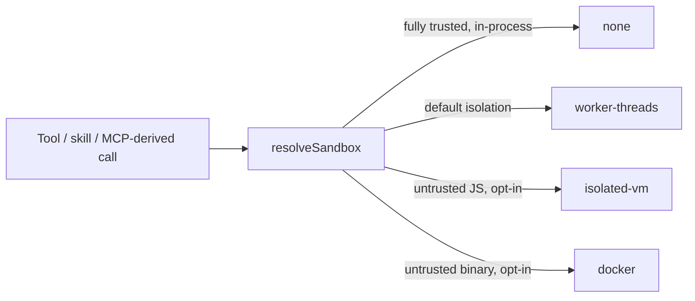
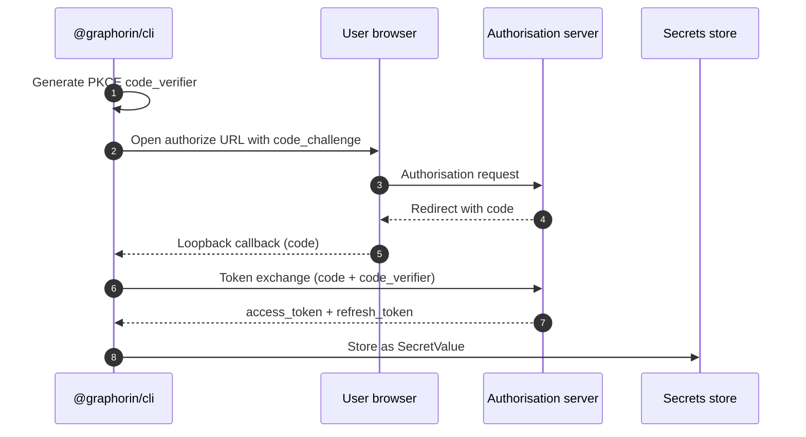
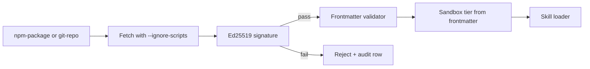
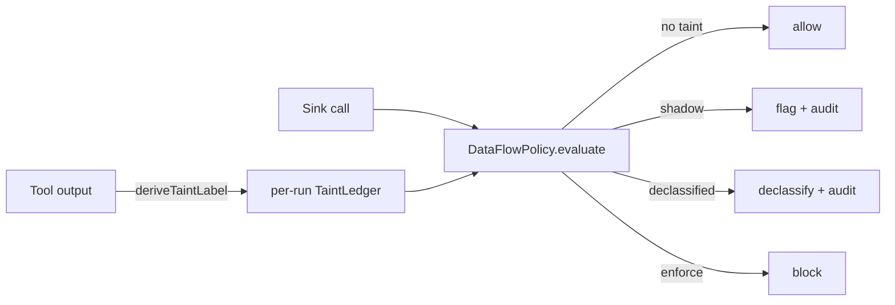

# Security

Security is a first-class subsystem in Graphorin, not an afterthought. `@graphorin/security` ships:

- **Secrets** — `SecretValue` wrapper, `SecretRef` URI scheme, OS keychain integration, optional encrypted-file store. See [Secrets](/guide/secrets) for the full sub-page.
- **Sandbox tiers** — `'none'`, `'worker-threads'`, `'isolated-vm'`, `'docker'`.
- **Server-token authentication** — HMAC-SHA256 with a deployment-wide pepper.
- **Audit log** — SQLite database with mandatory encryption-at-rest and a SHA-256 hash chain.
- **OAuth 2.1 with PKCE** — outbound flows for MCP servers and skill registries.
- **Supply-chain helpers** — Ed25519 signature verification for distributed skills.
- **Lateral-leak defense layer** — composes orthogonally with the agent runtime's safety primitives.
- **Provenance / data-flow policy** — opt-in, taint-based enforcement at the tool boundary that defuses the lethal trifecta (`@graphorin/security/dataflow`).

## Sandbox tiers



| Tier (resolved kind) | `sandboxPolicy` | Backed by | Used for |
|---|---|---|---|
| `'none'` | `'none'` | The Node.js process. | Fully-trusted first-party tools. |
| `'worker-threads'` | `'sandboxed'` | Node.js worker threads (built-in — no peer dependency). | **The default isolation tier** — MCP-derived tools and code-mode execution. |
| `'isolated-vm'` | `'isolated'` | [`isolated-vm`](https://github.com/laverdet/isolated-vm) (peer dependency, ISC). | Untrusted JavaScript skills. |
| `'docker'` | `'docker'` | [`dockerode`](https://github.com/apocas/dockerode) (peer dependency, Apache-2.0). | Untrusted binaries / full subprocess isolation. |

A tool declares its tier through `sandboxPolicy`; the executor maps that to a resolved kind (`'sandboxed' → 'worker-threads'`, `'isolated' → 'isolated-vm'`). As of the executor wiring this field is **enforced by the agent runtime on every call** — see [Tools](/guide/tools) and [Agent runtime](/guide/agent-runtime).

`isolated-vm` and `dockerode` are **opt-in peer dependencies** — they are not installed by default, so a base install pulls in zero native sandbox code. Add them only if you load untrusted code; `'none'` and `'worker-threads'` need nothing extra.

## Sensitivity model

Every message, memory row, tool result, and trace attribute carries a `Sensitivity` tag:

| Tag | Meaning | Where it can flow |
|---|---|---|
| `public` | No restrictions. | Anywhere. |
| `internal` | Operator-private but not user-secret. | Local trace + opt-in collectors; never to providers without `acceptsSensitivity: ['internal']`. |
| `secret` | User secret. | Never leaves the process. Memory rows tagged `secret` are filtered before any payload reaches a provider. |

The default for an unfamiliar provider is **deny everything except `public`** until you opt in. The default for an exporter is **never `secret`**, and you cannot override it.

## Server-token authentication

The standalone server (`@graphorin/server`) requires every authenticated REST / WebSocket / SSE connection to present a bearer token signed with HMAC-SHA256 against a deployment-wide pepper. The unauthenticated `/v1/health` probe is exempt so liveness checks work before token verification is wired. Tokens are generated and rotated through `graphorin token`:

```bash
graphorin token create --scope agents:invoke --ttl 30d
graphorin token list
graphorin token revoke <token-id>
```

The pepper itself is resolved at server boot through a `SecretRef` (typically stored under `keyring:graphorin_server_pepper` or the encrypted-file store). See [Secrets](/guide/secrets) for the resolution pipeline.

**Pepper strength.** Installing a pepper (`rotatePepper` / `rekeyTokens`) runs a weak-secret check: peppers below 32 bytes, with low Shannon entropy, or containing a long run of identical bytes (placeholder/test values) are rejected with a `WeakPepperError` whose `reason` explains the failure. Generate peppers with `crypto.randomBytes(32)` or the auth library's `generatePepper()`. The underlying heuristic is exported as `assessSecretStrength(bytes)` from `@graphorin/security` (and `@graphorin/security/hardening`) — a pure function returning `{ ok, reason, shannonBitsPerByte, maxIdenticalRun, … }` — so you can apply the same bar to your own passphrases.

## Audit log

Every privileged operation writes one row to the audit log:

- secret access (read / write / list);
- tool execution (start / end / approval);
- memory mutations (write / supersede / forget);
- skill installs (with signature verification result);
- token issuance / revocation;
- OAuth flows (initiation / token issuance / refresh).

The audit log lives in a dedicated SQLite database with **mandatory encryption-at-rest** (via [`better-sqlite3-multiple-ciphers`](https://github.com/m4heshd/better-sqlite3-multiple-ciphers)) and a **SHA-256 hash chain** that links every row to its predecessor. Tampering breaks the chain.

The CLI commands `graphorin audit list` / `graphorin audit verify` walk the chain and report any breaks.

## OAuth 2.1 with PKCE



The client is built on [`openid-client`](https://github.com/panva/openid-client) (MIT). Token storage uses the configured secrets store (OS keychain by default). Refresh happens lazily on the next call — no background daemon ever phones home.

**Refresh-token rotation.** When an authorisation server rotates refresh tokens (RFC 6749 §10.4 / OAuth 2.1), pass `revokePreviousOnRotation: true` to `refreshAccessToken(...)` to best-effort revoke the previous refresh token once the new one is issued. It is opt-in (default `false`) and revocation failures never fail the refresh.

## Supply-chain pipeline



Loading from `npm-package` or `git-repo` always:

- runs the install with `--ignore-scripts` enforced (no `postinstall` execution);
- fetches the publisher's Ed25519 public key from the configured well-known URL;
- verifies the package's bundled signature against the resolved key;
- writes one audit row recording success or failure.

Local `folder` installations are trusted-by-default but flow through the same validator pipeline.

## Lateral-leak defense layer

The agent runtime's defense layer composes orthogonally with the security primitives above:

| Layer | Purpose |
|---|---|
| `causalityMonitor` (`createAgent({ causalityMonitor })`) | Implements an Agentic Reference Monitor pattern. Every cross-agent flow is checked against the stated capability. |
| `mergeGuard` (`createAgent({ mergeGuard })`) | Per-child trust scoring + bias detection on the `'judge-merge'` fan-out strategy. |
| `protocolGuard` (`createAgent({ protocolGuard })`) | Control-character escape catalogue applied at protocol boundaries. |
| Commentary-phase trace sanitisation | At the session-output boundary, before any export. |
| Inbound sanitisation preamble | When non-trusted content is in the message list, a locale-resolved preamble is appended **after** the cache breakpoint. |

## Provenance / data-flow policy

The lateral-leak guards above match **patterns**; the data-flow policy (`@graphorin/security/dataflow`, opt-in, toward [CaMeL](https://arxiv.org/abs/2503.18813)) enforces **provenance**. It reuses the metadata Graphorin already attaches to every tool — trust class + source + sensitivity — to defuse the **lethal trifecta**: untrusted content + access to private data + an exfiltration/mutation sink. With all three present in one run, a prompt injection hidden in the untrusted content can drive the sink; the policy makes that flow fail closed (or, in shadow mode, merely report) unless an operator has explicitly declassified it.



The engine is pure — no I/O, no clock, no network: `deriveTaintLabel(...)` turns a tool's registration metadata into a `TaintLabel`, a per-run `createTaintLedger()` records every output's provenance, and `createDataFlowPolicy({ mode })` returns a verdict for each candidate **sink** (a `side-effecting` / `external-stateful` tool). Untrusted output is tagged from the trust class (`mcp-derived` / `web-search` / `skill-untrusted`); secret-tier output from `sensitivity: 'secret'` only (treating the default `'internal'` tier as sensitive would trip the gate on nearly every run).

A sink trips the policy on either of two signals:

| Signal | Fires when | Precision |
|---|---|---|
| `untrusted-to-sink` | a verbatim span of untrusted content appears in the sink's arguments | precise — direct exfiltration |
| `lethal-trifecta` | the sink fires while **both** untrusted **and** secret-tier data have entered the run, even without a provable verbatim carry | conservative — disable with `guardTrifecta: false` |

Three modes (`DataFlowMode`):

| Mode | Behaviour |
|---|---|
| `'off'` | Disabled — every flow allowed. |
| `'shadow'` | Audit-only: a tripped flow emits a `tool:dataflow:flagged` row + counter but never blocks. **Ship this first** to surface false positives against real traffic. |
| `'enforce'` | A tripped flow **blocks** the sink (the call yields a `dataflow_policy_blocked` error, surfaced as `tool.execute.error`) unless the sink's name is in `declassifySinks` — the explicit, audited operator escape hatch (`tool:dataflow:declassified`). |

Findings are **metadata-only** — they name the flow kind and the implicated source kinds, never the raw argument or output bytes. Taint is tracked in-memory per run (not persisted across suspend/resume), and verbatim detection is best-effort (it catches verbatim / near-verbatim forwarding, not paraphrase — which is what the trifecta signal covers). The policy **composes with code-mode**: each in-script tool call runs through the same sink gate, so an injection cannot exfiltrate through a sandbox either.

Wire it end-to-end with `createAgent({ dataFlowPolicy: { mode: 'shadow' } })` — see the [agent runtime guide](/guide/agent-runtime#provenance-data-flow-policy-dataflowpolicy) for the full configuration and event details.

## Threat model

Graphorin's design assumes a STRIDE threat model across eight trust boundaries:

1. User application <-> Graphorin runtime.
2. Runtime <-> provider adapter.
3. Runtime <-> tool execution.
4. Runtime <-> skill loader.
5. Runtime <-> MCP server.
6. Runtime <-> storage layer.
7. Runtime <-> standalone server (REST / WebSocket / SSE).
8. Standalone server <-> operator (CLI, OAuth flows, audit).

The full threat model is summarised in [Design principles](/reference/design-principles).

## Hardening

The CLI ships `graphorin doctor` — a single command that audits POSIX file modes on the secrets store, the audit log, and the database, plus the systemd unit template (where applicable):

```bash
graphorin doctor
```

Failures are categorised by severity and emit actionable remediation steps.

## Next steps

- [Secrets](/guide/secrets) — `SecretValue`, `SecretRef`, OS keychain, encrypted-file store.
- [Privacy](/guide/privacy) — the no-phone-home contract.
- [Observability](/guide/observability) — redaction + replay sanitisation.
- [Standalone server](/guide/standalone-server) — server-token auth, idempotency.

---

**Graphorin** · v0.3.0 · MIT License · © 2026 Oleksiy Stepurenko
