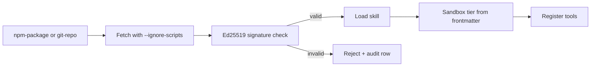

# Skills

`@graphorin/skills` ships a loader for the public **Agent Skills `SKILL.md` packaging format** (originally defined by Anthropic) with three-tier progressive disclosure, plus Graphorin-specific extensions namespaced under `graphorin-*` and `metadata.graphorin.*`.

::: info Compatibility statement
A skill written to the public `SKILL.md` packaging format loads in Graphorin without modification. Graphorin extensions live in their own namespace, never collide with the upstream fields, and are versioned through the bundled `anthropic-spec-snapshot.json`.
:::

## Highlights

- **Compatibility-first loader.** Author-time fields under the `graphorin-*` prefix and the spec-recommended `metadata.graphorin.*` bucket are honoured through a deterministic field-resolution algorithm.
- **Three-tier progressive disclosure.** Metadata (Tier 1) is parsed at load time. The skill body (Tier 2) is read on first `Skill.body()` call. Resources (Tier 3) are listed lazily; the bytes are only read when `SkillResource.read()` is invoked.
- **Conflict policy.** Direct collisions (upstream-base + matching `graphorin-*` set) honour the operator-resolved `conflictPolicy: 'warn' | 'error' | 'silent'`. The default is `'warn'`. The validator returns a typed `FrontmatterDiagnostic[]` so callers can route the report to logs, audit, or CI.
- **Spec-snapshot tracking.** A bundled `anthropic-spec-snapshot.json` records the upstream fields the framework recognises and the migration policy for every `graphorin-*` extension. The `pnpm run check-anthropic-spec` CI helper diffs the snapshot against the published specification.
- **Supply-chain aware.** Loading from `npm-package` and `git-repo` sources delegates to the supply-chain helpers in `@graphorin/security`. Untrusted skills install with `--ignore-scripts` enforced and a verifiable Ed25519 signature is required before the loader trusts the bytes.
- **Slash-command activation.** `/skill:<name>` parses into a structured activation request the agent runtime consumes alongside the model-emitted auto-activation requests.
- **Migration library.** `migrateFrontmatter()` is idempotent and dry-run by default.

## Stable sub-paths

```ts
import { loadSkills, loadSkillFromSource } from '@graphorin/skills/loader';
import { createSkillRegistry } from '@graphorin/skills/registry';
import {
  validateFrontmatter,
  resolveSkillField,
} from '@graphorin/skills/frontmatter';
import { migrateFrontmatter } from '@graphorin/skills/migration';
import { parseSlashCommand } from '@graphorin/skills/activation';
import { getSpecSnapshot, getKnownField } from '@graphorin/skills/spec';
import { SkillFrontmatterConflictError } from '@graphorin/skills/errors';
```

## Authoring a skill

A `SKILL.md` file is a Markdown document with YAML frontmatter:

```md
---
name: trip-planner
description: Plan multi-day trips with cost, transport, and lodging.
license: MIT
authors:
  - Oleksiy Stepurenko
disable-model-invocation: false
graphorin-tags:
  - travel
  - planning
metadata:
  graphorin:
    sandboxTier: isolated-vm
    sensitivity: internal
---

# Trip planner

Use this skill when the user asks to plan a trip across multiple days
or destinations. Always confirm budget, group size, and travel windows
before drafting an itinerary.

## Resources

- `cities.csv` — supported cities + IATA codes.
- `prompts/draft.md` — the canonical itinerary template.
```

The frontmatter `name`, `description`, and any other upstream-spec fields are honoured as-is. Graphorin-specific fields live under `graphorin-*` (legacy authoring slot) or `metadata.graphorin.*` (preferred).

## Loading skills

```ts
import { loadSkills } from '@graphorin/skills/loader';

const skills = await loadSkills([
  { kind: 'folder', path: './skills/trip-planner' },
  { kind: 'npm-package', packageName: '@my-org/skill-billing', version: '^1.2.0' },
  { kind: 'git-repo', url: 'https://github.com/my-org/skills.git', ref: 'v1.2.3' },
]);
```

The loader supports four source kinds:

| Source | Shape | Trust posture |
|---|---|---|
| `inline` | `{ kind: 'inline', skill }` | Programmatic, fully trusted. |
| `folder` | `{ kind: 'folder', path }` | Trusted by default; passes through the same validator pipeline. |
| `npm-package` | `{ kind: 'npm-package', packageName, version? }` | Untrusted; install delegated to `@graphorin/security/supply-chain` with `--ignore-scripts` enforced and an Ed25519 signature requirement. |
| `git-repo` | `{ kind: 'git-repo', url, ref? }` | Untrusted; shallow-clone via the supply-chain helper, pinned to a ref, signature-verified. |

## Field-resolution precedence

```text
upstream-base > metadata.graphorin.* > graphorin-* legacy > caller fallback
```

The validator walks this ladder for every recognised field. Direct collisions trigger the configured `conflictPolicy`.

## Slash-command activation

`/skill:trip-planner` parses into:

```ts
{
  kind: 'skill-activation',
  source: 'slash-command',
  name: 'trip-planner',
  args: { /* … */ },
}
```

Skills that opt out via `disable-model-invocation: true` are excluded from auto-activation but remain reachable through the slash command — useful for human-only workflows.

## Composition with `@graphorin/tools`

Skills register their declared tool calls into the same `ToolRegistry` your application owns. The registry's `'auto-prefix'` collision strategy (default for skill imports) namespaces conflicting names so that `weather.lookup` from a first-party tool does not clash with `weather.lookup` from a community skill.

## Supply chain

Untrusted skills (`npm-package`, `git-repo`) flow through `@graphorin/security/supply-chain`:



The skill installer never runs `npm postinstall` scripts on untrusted packages. The signature verifier resolves the publisher key over the configured well-known URL.

## Next steps

- [Tools](/guide/tools) — what skill tools register against.
- [Security](/guide/security) — sandbox tiers + signature trust model.
- [MCP client](/guide/mcp-client) — how MCP-derived tools coexist with skills.

---

**Graphorin** · v0.3.0 · MIT License · © 2026 Oleksiy Stepurenko
