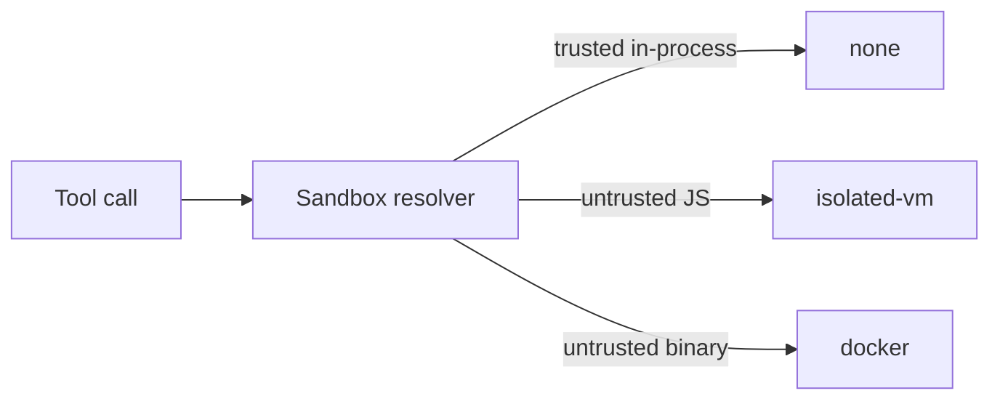

# Tools

`@graphorin/tools` ships the runtime building blocks every higher-level package uses to declare, register, and execute the tools the model can call:

- **`tool({...})`** - typed factory for declaring a Zod-validated tool. Inference flows from `inputSchema` / `outputSchema` into the `execute(input, ctx)` callback so you never repeat the input shape.
- **`createToolRegistry(...)`** - strategy-aware registry that hosts every registered tool, with cross-source collision policies.
- **`createToolExecutor(...)`** - runs `Tool[]` invocations with parallel-by-default dispatch, approval flow, sandbox-policy resolution, and a memory-modification guard.

## Declaring a tool

```ts
import { tool } from '@graphorin/tools';
import { z } from 'zod';

export const weather = tool({
  name: 'weather.lookup',
  description: 'Look up the current weather for a city.',
  inputSchema: z.object({
    city: z.string().describe('Full city name'),
    unit: z.enum(['celsius', 'fahrenheit']).default('celsius'),
  }),
  outputSchema: z.object({
    summary: z.string(),
    temperature: z.number(),
  }),
  sideEffectClass: 'read-only',
  sensitivity: 'public',
  preferredModel: 'fast',
  async execute({ city, unit }, ctx) {
    ctx.signal.throwIfAborted();
    const res = await fetch(
      `https://weather.example.com/v1?q=${encodeURIComponent(city)}&unit=${unit}`,
      { signal: ctx.signal },
    );
    const data = await res.json();
    return { summary: data.summary, temperature: data.temperature };
  },
});
```

The result is a fully typed `Tool` object. The `execute` callback receives the parsed input and a `ctx: ToolExecutionContext` with `signal`, scope-bound secrets, and the agent run identifiers.

## Tool classification

Every tool declares two safety attributes plus an explicit approval predicate:

| Attribute | Values | What it controls |
|---|---|---|
| `sensitivity` | `'public'` / `'internal'` / `'secret'` | Whether the result may flow into traces and exports unredacted, and which providers may see it. |
| `sideEffectClass` | `'pure'` / `'read-only'` / `'side-effecting'` / `'external-stateful'` | Idempotency-key requirements, audit emphasis, sandbox-tier defaults. |
| `needsApproval` | `boolean` or `(input, ctx) => boolean \| Promise<boolean>` | Whether the runtime suspends the run with a `tool.approval.requested` event before executing the tool. |
| `memoryGuardTier` | `MemoryGuardTier` (DEC-153) | Classification for the pre/post memory-snapshot guard. **Active when the agent has `memory` wired** (SDF-1); skipped with a one-time WARN otherwise - see [Memory-modification guard](#memory-modification-guard). |
| `preferredModel` | `'fast'` / `'balanced'` / `'smart'` or a `ModelSpec` | Per-tool model-tier hint. Resolved against the agent's tier map. |

Approval is **driven by `needsApproval`**, not by `sideEffectClass`. The latter is a classification used for idempotency checks, sandbox defaults, and audit emphasis; whether a specific call gates on a human is the operator's decision.

```ts
import { tool } from '@graphorin/tools';
import { z } from 'zod';

// your integration
declare function callPaymentApi(input: {
  orderId: string;
  amountUsd: number;
}): Promise<{ receiptId: string }>;

export const refundOrder = tool({
  name: 'refund.create',
  description: 'Issue a refund for a previously placed order.',
  inputSchema: z.object({ orderId: z.string(), amountUsd: z.number() }),
  outputSchema: z.object({ receiptId: z.string() }),
  sideEffectClass: 'external-stateful',
  sensitivity: 'internal',
  needsApproval: ({ amountUsd }) => amountUsd >= 100,
  async execute(input, ctx) {
    return await callPaymentApi(input);
  },
});
```

## Worked examples

A tool may ship up to **five** worked `examples` - `{ input, output, comment? }` triples validated against the tool's `inputSchema` / `outputSchema` at registration. The agent projects them onto the `ToolDefinition` it sends the provider, and the fold into the tool's model-facing **description** happens in the adapters themselves (as well as in `createProvider`, idempotently), so the model sees concrete input→output pairs next to the schema even on a raw-adapter setup (Anthropic reports complex-parameter accuracy rising 72% → 90% with worked examples). Example `comment`s also join the deferred-tool search index, so `tool_search` finds a tool by the phrasing its examples document:

```ts
import { tool } from '@graphorin/tools';
import { z } from 'zod';

// your integration
declare function lookupWeather(
  city: string,
  unit: string,
): Promise<{ summary: string; temperature: number }>;

export const weather = tool({
  name: 'weather.lookup',
  description: 'Look up the current weather for a city.',
  inputSchema: z.object({ city: z.string(), unit: z.enum(['celsius', 'fahrenheit']) }),
  outputSchema: z.object({ summary: z.string(), temperature: z.number() }),
  sideEffectClass: 'read-only',
  examples: [
    {
      input: { city: 'Paris', unit: 'celsius' },
      output: { summary: 'Clear', temperature: 21 },
      comment: 'Typical summer afternoon.',
    },
  ],
  async execute({ city, unit }) {
    return lookupWeather(city, unit);
  },
});
```

Whether examples ship is governed by `examplesEagerlyRendered`, which the registry resolves from `defer_loading`:

| Tool | Resolved `examplesEagerlyRendered` | Examples rendered? |
|---|---|---|
| Eager (`defer_loading` omitted or `false`) | `true` / left to the runtime | **Yes** - every step. |
| Deferred (`defer_loading: true`) | `false` | **No** - withheld even after `tool_search` promotes the tool. |
| Any, with explicit `examplesEagerlyRendered: false` | `false` | **No** - opt out without deferring the whole tool. |

This keeps large, deferred tool sets lean: a deferred tool adds nothing to the per-step context until `tool_search` surfaces it, and even then its examples stay out of context. Rendered examples are always capped at five.

## ToolRegistry

`createToolRegistry(...)` takes **no tool list**. You register each tool with its provenance (a `ToolSource`), then resolve any cross-source name collisions in one deterministic pass:

```ts no-check
import { createToolRegistry } from '@graphorin/tools';

const registry = createToolRegistry({ semanticScoreThreshold: 0.5 });

registry.register(weather); // source defaults to { kind: 'first-party' }
for (const memoryTool of memory.tools) registry.register(memoryTool);

// Collapse cross-source name collisions; first-party always wins.
registry.assertNoDuplicates('auto-prefix', { source: { kind: 'first-party' } });
```

The optional second argument to `register(...)` is the tool's `ToolSource` - `{ kind: 'first-party' }` (default), `{ kind: 'skill', skillName, trustLevel }`, `{ kind: 'mcp', serverIdentity }`, `{ kind: 'built-in', subsystem }`, or `{ kind: 'web-search', providerName }`. It drives both the auto-prefix namespace and the priority ladder. `assertNoDuplicates(strategy, ctx)` then resolves collisions through three strategies:

| Strategy | When to use |
|---|---|
| `'auto-prefix'` (default) | Default for skill / MCP imports. Renames losers with a stable namespace prefix (e.g. `linear.search_issues`) on collision. |
| `'priority'` | Use when the precedence ladder is enough - first-party > trusted-skill > untrusted-skill > MCP. |
| `'manual'` | Fail-fast on duplicates: throws `ToolCollisionError`. Use when you want explicit registration. |

> Using `@graphorin/agent`? You never call this directly - `createAgent(...)` assembles and collision-resolves one registry from `config.tools` + `config.skills` at warm-up and exposes it read-only as `agent.registry`. See [how the agent assembles and drives the registry](/guide/agent-runtime#tool-execution-in-the-loop).

## ToolExecutor

```ts no-check
import { createToolExecutor } from '@graphorin/tools';

const executor = createToolExecutor({
  registry,
  maxParallelTools: 8,
  approvalGate: {
    // Operator-supplied: prompt a human, then resolve once the decision is in.
    async request(call, approval) {
      return { granted: true }; // or { granted: false, reason: '…' }
    },
  },
});

// Run the model's tool calls for one step as a single batch.
const completed = await executor.executeBatch({ calls, runContext, stepNumber });
```

What you get out of the box:

- **Parallel-by-default dispatch.** Bounded concurrency via `maxParallelTools` (default `8`). Opt a single tool out with `executionMode: 'sequential'`.
- **Approval flow.** A tool's `needsApproval` predicate triggers a blocking gate; the runtime emits `tool.approval.requested` so a human can resolve it durably (granted / denied surface as `tool.approval.granted` / `tool.approval.denied`).
- **Per-tool secrets ACL scoping** via `@graphorin/security/secrets`'s `withChildToolSecretsContext`.
- **Sandbox-policy resolution** via `@graphorin/security/sandbox`. Four sandbox tiers - `'none'`, `'worker-threads'` (the default isolation tier), `'isolated-vm'`, `'docker'` - chosen per tool / per call.
- **Memory-modification guard hook.** Snapshot-before, verify-after; mismatches emit an audit row and a `tool.executor.memory_guard.mismatch.total{toolName,tier}` counter increment.
- **Hard-kill cancellation** with a configurable grace window (50 ms default). Cancellation surfaces `ToolError({ kind: 'aborted' })` and `setStatus('cancelled')` on the span.
- **Single-round tool repair** via the operator-supplied repair hook.
- **Per-execution `tool.execute` span** emitted via the run's tracer with rich `graphorin.tool.*` attributes.

> Using `@graphorin/agent`? `createAgent(...)` constructs this executor at warm-up and calls `executeBatch(...)` for you each step, bridging its events into `agent.stream(...)`. Approvals route through durable HITL instead of the in-process gate: the agent pre-screens `needsApproval` and suspends the run *before* dispatch, so its configured gate simply auto-grants. See [how the agent drives tool execution](/guide/agent-runtime#tool-execution-in-the-loop).

## Response budgets and pagination

Every tool result is bounded by `maxResultTokens` (default **16384**) - **text and structured (object/array) outputs alike**. When a result exceeds the cap, the executor applies the tool's `truncationStrategy` (`'middle'` / `'tail'` / `'spill-to-file'` / `'summarize'`); the bounded text is what reaches the model, never the full object. A structured output on the default `'middle'` strategy is routed through **spill-to-file by default**, so the full blob is preserved behind a `read_result` handle while only a bounded preview enters context. The 16k default sits deliberately below the ~25k single-result norm some providers tolerate; raise it per tool when a tool legitimately returns more, or set `maxResultTokens: 0` to disable the cap (the registry emits a WARN - uncapped results can blow the context window):

```ts no-check
export const bigReport = tool({
  name: 'report.export',
  // …
  maxResultTokens: 40_000,
  truncationStrategy: 'spill-to-file',
});
```

> The truncation budget is currently a fixed token count. Making it provider-aware - deriving the cap from the active model's context window via the token counter - is a planned enhancement tracked with first-class context management.

For tools that can return many rows, prefer **pagination over one large response**. The convention is a `limit` + `cursor` input and a `nextCursor` in the output, so the model fetches one bounded page at a time instead of truncating a giant blob:

```ts
import { tool } from '@graphorin/tools';
import { z } from 'zod';

const orderSchema = z.object({
  id: z.string(),
  placedAt: z.string(),
  totalUsd: z.number(),
});

// your integration
declare function queryOrders(args: {
  limit: number;
  cursor?: string;
}): Promise<{ orders: z.infer<typeof orderSchema>[]; nextCursor?: string }>;

export const listOrders = tool({
  name: 'orders.list',
  description: 'List orders, newest first. Pass the returned nextCursor to page.',
  inputSchema: z.object({
    limit: z.number().int().min(1).max(100).default(20),
    cursor: z.string().optional(),
  }),
  outputSchema: z.object({
    orders: z.array(orderSchema),
    nextCursor: z.string().optional(),
  }),
  sideEffectClass: 'read-only',
  async execute({ limit, cursor }) {
    return queryOrders({ limit, cursor });
  },
});
```

## Result handles and read_result

`'spill-to-file'` does more than truncate: the executor writes the **full** body to a run-scoped artifact (`<tmpdir>/graphorin-spill/<runId>/<toolCallId>.<ext>`, mode `0600`) and surfaces a structured `ResultHandle` on the `ToolResult`:

```ts
import type { ToolTrustClass } from '@graphorin/core';

interface ResultHandle {
  uri: string; // opaque, run-scoped - e.g. "graphorin-spill:<runId>/<toolCallId>.json"
  kind: 'spill-file' | 'resource-link'; // 'resource-link' = an MCP resource_link (see below)
  preview: string; // the bounded slice already inlined in context
  bytes?: number; // size of the full artifact
  mediaType?: string; // MIME type of the stored artifact, when known
  producerTrustClass?: ToolTrustClass; // who produced the stored body (TL-6)
}
```

**Lifecycle (TL-10).** Spill artifacts are run-scoped scratch: the agent deletes a run's directory when the run ends `completed` or `failed`; `awaiting_approval` and `aborted` runs **keep** theirs, so handles survive resume. The default writer also fires one best-effort sweep at construction removing run directories older than 7 days (orphans from crashed processes), and exposes `clear(runId)` / `sweep(ttlMs)` for custom schedules. Custom `SpillWriter`s may omit both and rely on external rotation.

**Taint survives the round-trip (TL-6).** Spill artifacts hold the *raw* body - written before sanitization so non-model consumers keep the full data - and `read_result` is a trusted built-in. To stop an untrusted body laundering to trusted on the way back in, the executor remembers each artifact's **producer trust class** (and readers may report one - the MCP resource reader always reports `'mcp-derived'`): when a handle whose producer is untrusted is read back, the content is **re-sanitized with the producer's policy** (`detect-and-strip-and-wrap`) and the dataflow ledger records the read under the **producer's** trust class, not `read_result`'s own. The producer map is in-memory per executor; for handles read in **another executor** (code-mode's quiet executor and the main one share a spill root) or in a **resumed process**, the default writer persists a `<file>.meta.json` taint sidecar (mode `0600`) next to each artifact and the default file reader reports the recorded class back, so the taint survives both boundaries. Custom `SpillWriter`s should persist `producerTrustClass` the same way; otherwise cross-process reads fall back to the reading tool's own class.

**Whole-body scan at spill time (W-156).** `read_result` pages are pattern-scanned independently, so an imperative phrase split across a page boundary would evade the per-page strip in both halves. The executor therefore scans the **full body once at spill time** - framework-side, before the writer runs, so custom `SpillWriter`s receive the signal too (the `write` opts carry `imperativePatternsPresent`; the default writer persists it in the taint sidecar). The scan reuses the operator's `imperativePatterns` / `imperativeBudgetMs`, and a scan timeout records unknown, never a clean verdict. When a tainted handle whose producer flagged patterns is read back, the executor increments the `tool.inbound.sanitization.cross-page-flag.total` counter - the per-page untrusted-content envelope is already unconditional for tainted reads, so the counter is an added operator signal, not the defense.

The agent inlines only `preview` (plus a one-line retrieval hint) - so a multi-megabyte result never enters the context window, **even when the tool returns a structured object** - and auto-registers the built-in **`read_result`** tool whenever at least one registered tool spills. The model then fetches just what it needs, by byte range or by line range:

```ts no-check
// model-issued call, paging through the spilled artifact:
read_result({ handle: 'graphorin-spill:run-42/orders.json', startLine: 1, endLine: 50 });
read_result({ handle: 'graphorin-spill:run-42/orders.json', offset: 4096, length: 2048 });
// → { content, bytes, totalBytes, eof }
```

The `uri` is **opaque**: the spill reader resolves it only within the spill artifact root, so a handle can never be used to read arbitrary files (a `..` traversal or a non-`graphorin-spill:` scheme is rejected). Handles are gated by **sensitivity**: a `sensitivity: 'secret'` tool is never spilled to the shared store - its body is truncated in place and no handle is produced. Operators that need a sandbox-aware artifact path inject their own writer + reader via `createToolExecutor({ spill })` and `createReadResultTool({ reader })`.

**External handles (`'resource-link'`).** The same machinery resolves non-spill handles. An MCP `resource_link` tool result surfaces a `resource-link` handle (the resource `uri`) instead of inlining the body; the agent resolves it on demand by composing extra readers after the spill reader - pass `createAgent({ resultReaders: [createMcpResourceReader({ clients })] })` so `read_result` pages an MCP resource exactly like a spilled artifact. Readers are tried in order and each rejects handles it does not own, so resolution falls through cleanly. See the [MCP client guide](/guide/mcp-client#large-resources-and-result-handles).

## Code-mode

Code-mode lets the model orchestrate many tools in one sandboxed script, so intermediate results stay out of context (the agent enables it with `toolInvocation: 'code-mode'` - see the [agent-runtime guide](/guide/agent-runtime#code-mode-toolinvocation-code-mode)). `@graphorin/tools/code-mode` ships the building blocks:

```ts
import { projectToolApi, createCodeExecuteTool, createCodeSearchTool } from '@graphorin/tools/code-mode';
import { runBridgedSource } from '@graphorin/security/sandbox';
import type { ToolRegistry } from '@graphorin/tools';

declare const registry: ToolRegistry; // the resolved registry from createToolRegistry(...)

// Project the resolved tools as a typed code API the model can read:
const projection = projectToolApi(registry.list());
projection.catalogue;            // name + one-line description, grouped by source
projection.signatureFor('list_orders'); // `tools.list_orders = (input: {…}): Promise<{…}>`
```

A tool's `outputSchema` is rendered into the signature's return type (`Promise<…>` instead of `Promise<unknown>`), so a model writing a `code_execute` script knows what each call returns and can chain them. The same `outputSchema` is projected onto the `ToolDefinition` sent to the provider for structured-output validation.

`createCodeExecuteTool({ projection, allowedTools, executeTool })` builds the `code_execute` tool. Its `executeTool` bridge is invoked for each `tools.<name>(args)` call the script makes; the agent wires it to `executor.executeOne(...)`, so a code-mode call is governed exactly like a direct one. `createCodeSearchTool({ projection, searchDeferred })` builds `code_search`, which returns matching signatures on demand.

Execution itself is `runBridgedSource(...)` from `@graphorin/security/sandbox` - a `worker-threads`-tier primitive that evaluates the source as the body of an `async (tools) => { … }` function, exposes `tools` as RPC stubs that round-trip to the host `dispatch`, blocks network/filesystem, enforces a wall-clock timeout + memory ceiling + a tool-call budget, and returns **only** the script's final value. The worker runs with an **empty environment**: it is constructed with `env: {}` and the runtime scrubs `process.env` before the script runs, so host environment variables (API keys, credentials) are never visible to model-written code. The worker can reach the host through nothing but the tool-call channel, and that channel serves only the `allowedTools` names - there is no path to the registry, the executor, or any other host object. As with the `worker-threads` sandbox tier, this is best-effort defence in depth, not a guarantee against process-level mischief by hostile code; layer `isolated-vm` / `docker` underneath when you need V8-grade isolation.

## Execution limits

Inline tools (the `tool({...})` closures the agent runs in-process) are bounded by an **enforced wall-clock timeout** (TL-4): the tier-resolved per-tool `timeoutMs` when set, else `createToolExecutor({ inlineToolTimeoutMs })` (default 60 s; an explicit executor option wins over tier defaults). Expiry fails the call with `ToolError({ kind: 'timeout' })` and the run continues; a tool that hangs and ignores `ctx.signal` can no longer block a run indefinitely. Sandbox tiers keep their own per-tier timeouts, and a sandbox's structured failure now maps onto the honest kind (tools-06): a sandbox `timeout` surfaces as `'timeout'`, a `sandbox-violation` or `memory-exceeded` as `'sandbox_violation'`. Tools whose upstream service rate-limits them can throw `ToolRateLimitError` (from `@graphorin/tools`) to surface `'rate_limited'` with a `retry after Nms` hint instead of a generic `execution_failed`.

## Memory-modification guard

Every tool declares a `memoryGuardTier` - one of `'pure'`, `'side-effecting-no-memory'`, `'memory-aware'`, `'unknown'`, or `'untrusted'`. When a memory-region reader is supplied, the executor snapshots the affected region before a memory-aware call, verifies it after, and audits any unexpected drift (`memory:modification:before` / `memory:modification:after`). **With `memory` wired on the agent this step is active** (SDF-1): the runtime binds a scope-aware region reader over the working-memory tier (the scope resolves from the in-flight run), so the snapshot/verify cycle runs for every guarded tier. Without `memory`, the guard is skipped and the agent emits a one-time WARN when any tool declares a `memoryGuardTier` - the silent no-op is visible.

## Sandbox tiers



| Tier | Backed by | When chosen |
|---|---|---|
| `'none'` | The Node.js process. | Trusted, in-process tools. Default for first-party tools. |
| `'worker-threads'` | Node.js worker threads (built-in - no peer dependency). | The default isolation tier; backs code-mode execution and any tool routed through a `sandboxResolver`. Runs with an empty `env` + a `process.env` scrub. |
| `'isolated-vm'` | [`isolated-vm`](https://github.com/laverdet/isolated-vm) (peer dependency). | Untrusted JavaScript tools (e.g. skills loaded from disk). |
| `'docker'` | [`dockerode`](https://github.com/apocas/dockerode) (peer dependency). | Untrusted binaries or full subprocess isolation. |

The two sandbox peers are opt-in and not installed by default. See [Security](/guide/security) for the threat model.

## Provenance / data-flow policy

The executor accepts an optional `dataFlowGuard` (P1-3) that enforces data-flow rules at the tool boundary using provenance rather than pattern scans - defusing the lethal trifecta (untrusted content + private data + an exfiltration sink). The agent wires it from `createAgent({ dataFlowPolicy })`; the pure engine lives in `@graphorin/security/dataflow`:

```ts no-check
import {
  createDataFlowPolicy,
  createTaintLedger,
  deriveTaintLabel,
} from '@graphorin/security/dataflow';

const policy = createDataFlowPolicy({ mode: 'enforce' });
const ledger = createTaintLedger(); // one per run
// after each tool output:
ledger.recordOutput(deriveTaintLabel({ trustClass, source, sensitivity }), outputText);
// before a sink runs:
const probe = ledger.inspectArgs(JSON.stringify(args));
const decision = policy.evaluate({
  toolName,
  sideEffectClass,
  carriesUntrustedVerbatim: probe.carriesUntrustedVerbatim,
  untrustedSeen: ledger.untrustedSeen,
  sensitiveSeen: ledger.sensitiveSeen,
  sourceKinds: ledger.untrustedSourceKinds,
});
// decision.action ∈ 'allow' | 'flag' | 'declassify' | 'block'
```

The executor consults the guard only for sinks (`side-effecting` / `external-stateful`); a `'block'` short-circuits to a `dataflow_policy_blocked` `ToolError`, and `tool:dataflow:flagged|blocked|declassified` audit rows are emitted for observability. Untrusted output is tagged from the trust class (`mcp-derived` / `web-search` / `skill-untrusted`); secret-tier output from `sensitivity: 'secret'`. See [the agent guide](/guide/agent-runtime#provenance-data-flow-policy-dataflowpolicy) for the end-to-end `dataFlowPolicy` config.

## Composition

Tools, [Skills](/guide/skills), and [MCP servers](/guide/mcp-client) all surface to the agent through the same `ToolRegistry`. From the model's point of view they are indistinguishable - declarative inputs, declarative outputs, declared safety attributes.

## Next steps

- [Skills](/guide/skills) - load skills written to the public `SKILL.md` packaging format.
- [MCP client](/guide/mcp-client) - talk to remote tool servers over Model Context Protocol.
- [Security](/guide/security) - sandbox and approval architecture.
- [Memory system](/guide/memory-system) - the eleven memory tools wired through `@graphorin/tools`.

