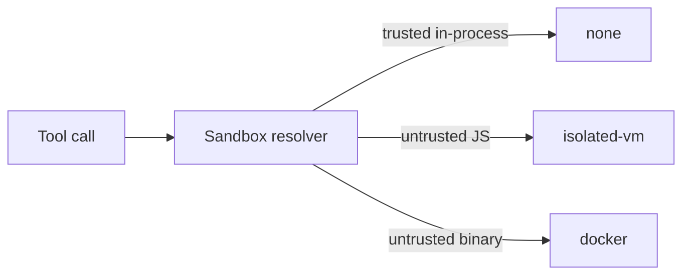

# Tools

`@graphorin/tools` ships the runtime building blocks every higher-level package uses to declare, register, and execute the tools the model can call:

- **`tool({...})`** — typed factory for declaring a Zod-validated tool. Inference flows from `inputSchema` / `outputSchema` into the `execute(input, ctx)` callback so you never repeat the input shape.
- **`createToolRegistry(...)`** — strategy-aware registry that hosts every registered tool, with cross-source collision policies.
- **`createToolExecutor(...)`** — runs `Tool[]` invocations with parallel-by-default dispatch, approval flow, sandbox enforcement, and a memory-modification guard.

## Declaring a tool

```ts
import { tool } from '@graphorin/tools';
import { z } from 'zod';

export const weather = tool({
  name: 'weather.lookup',
  description: 'Look up the current weather for a city.',
  inputSchema: z.object({
    city: z.string().describe('Full city name'),
    unit: z.enum(['celsius', 'fahrenheit']).default('celsius'),
  }),
  outputSchema: z.object({
    summary: z.string(),
    temperature: z.number(),
  }),
  sideEffectClass: 'read-only',
  sensitivity: 'public',
  preferredModel: 'fast',
  async execute({ city, unit }, ctx) {
    ctx.signal.throwIfAborted();
    const data = await ctx.fetch(`/weather?q=${encodeURIComponent(city)}&unit=${unit}`);
    return { summary: data.summary, temperature: data.temperature };
  },
});
```

The result is a fully typed `Tool` object. The `execute` callback receives the parsed input and a `ctx: ToolExecutionContext` with `signal`, scope-bound secrets, and the agent run identifiers.

## Tool classification

Every tool declares two safety attributes plus an explicit approval predicate:

| Attribute | Values | What it controls |
|---|---|---|
| `sensitivity` | `'public'` / `'internal'` / `'secret'` | Whether the result may flow into traces and exports unredacted, and which providers may see it. |
| `sideEffectClass` | `'pure'` / `'read-only'` / `'side-effecting'` / `'external-stateful'` | Idempotency-key requirements, audit emphasis, sandbox-tier defaults. |
| `needsApproval` | `boolean` or `(input, ctx) => boolean \| Promise<boolean>` | Whether the runtime suspends the run with a `tool.approval.requested` event before executing the tool. |
| `memoryGuardTier` | `MemoryGuardTier` (DEC-153) | The pre/post snapshot tier the executor enforces around the tool. |
| `preferredModel` | `'fast'` / `'balanced'` / `'smart'` or a `ModelSpec` | Per-tool model-tier hint. Resolved against the agent's tier map. |

Approval is **driven by `needsApproval`**, not by `sideEffectClass`. The latter is a classification used for idempotency checks, sandbox defaults, and audit emphasis; whether a specific call gates on a human is the operator's decision.

```ts
export const refundOrder = tool({
  name: 'refund.create',
  description: 'Issue a refund for a previously placed order.',
  inputSchema: z.object({ orderId: z.string(), amountUsd: z.number() }),
  outputSchema: z.object({ receiptId: z.string() }),
  sideEffectClass: 'external-stateful',
  sensitivity: 'internal',
  needsApproval: ({ amountUsd }) => amountUsd >= 100,
  async execute(input, ctx) {
    return await callPaymentApi(input);
  },
});
```

## ToolRegistry

```ts
import { createToolRegistry } from '@graphorin/tools';

const registry = createToolRegistry({
  tools: [weather, ...memory.tools],
  collisionStrategy: 'auto-prefix',
});
```

The registry resolves cross-source collisions through three strategies:

| Strategy | When to use |
|---|---|
| `'auto-prefix'` | Default for skill / MCP imports. Adds a deterministic prefix on collisions. |
| `'priority'` | Use when the precedence ladder is enough — first-party > trusted-skill > untrusted-skill > MCP. |
| `'manual'` | Fail-fast on duplicates. Use in production when you want explicit registration. |

## ToolExecutor

```ts
import { createToolExecutor } from '@graphorin/tools';

const executor = createToolExecutor({
  registry,
  maxParallelTools: 8,
  approvalGate: async (tool, input, runState) => {
    // Operator-supplied: prompt a human, persist the run, return
    // 'granted' / 'denied' once the decision is in.
  },
});
```

What you get out of the box:

- **Parallel-by-default dispatch.** Bounded concurrency via `maxParallelTools` (default `8`). Opt a single tool out with `executionMode: 'sequential'`.
- **Approval flow.** A tool's `needsApproval` predicate triggers a blocking gate; the runtime emits `tool.approval.requested` so a human can resolve it durably (granted / denied surface as `tool.approval.granted` / `tool.approval.denied`).
- **Per-tool secrets ACL scoping** via `@graphorin/security/secrets`'s `withChildToolSecretsContext`.
- **Sandbox-policy resolution** via `@graphorin/security/sandbox`. Three sandbox tiers — `'none'`, `'isolated-vm'`, `'docker'` — chosen per tool / per call.
- **Memory-modification guard hook.** Snapshot-before, verify-after; mismatches emit an audit row and a `tool.executor.memory_guard.mismatch.total{toolName,tier}` counter increment.
- **Hard-kill cancellation** with a configurable grace window (50 ms default). Cancellation surfaces `ToolError({ kind: 'aborted' })` and `setStatus('cancelled')` on the span.
- **Single-round tool repair** via the operator-supplied repair hook.
- **Per-execution `tool.execute` span** emitted via the run's tracer with rich `graphorin.tool.*` attributes.

## Memory-modification guard

Every tool declares a `memoryGuardTier`. The executor takes a snapshot of the affected memory region before the call, verifies after, and audits any unexpected drift. The default ships with read-only / append / replace / supersede / delete tiers; the `@graphorin/memory` tools wire themselves to the right tier automatically.

## Sandbox tiers



| Tier | Backed by | When chosen |
|---|---|---|
| `'none'` | The Node.js process. | Trusted, in-process tools. Default for first-party tools. |
| `'isolated-vm'` | [`isolated-vm`](https://github.com/laverdet/isolated-vm) (peer dependency). | Untrusted JavaScript tools (e.g. skills loaded from disk). |
| `'docker'` | [`dockerode`](https://github.com/apocas/dockerode) (peer dependency). | Untrusted binaries or full subprocess isolation. |

The two sandbox peers are opt-in and not installed by default. See [Security](/guide/security) for the threat model.

## Composition

Tools, [Skills](/guide/skills), and [MCP servers](/guide/mcp-client) all surface to the agent through the same `ToolRegistry`. From the model's point of view they are indistinguishable — declarative inputs, declarative outputs, declared safety attributes.

## Next steps

- [Skills](/guide/skills) — load skills written to the public `SKILL.md` packaging format.
- [MCP client](/guide/mcp-client) — talk to remote tool servers over Model Context Protocol.
- [Security](/guide/security) — sandbox and approval architecture.
- [Memory system](/guide/memory-system) — the nine memory tools wired through `@graphorin/tools`.

---

**Graphorin** · v0.2.0 · MIT License · © 2026 Oleksiy Stepurenko
