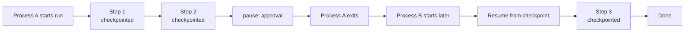

# Workflow engine

`@graphorin/workflow` is the durable workflow layer of the framework. It owns the synchronous-step execution loop, the Graphorin-named primitive set (`Directive`, `Dispatch`, `pause`, channel kinds `LatestValue` / `Reducer` / `Stream` / `Barrier` / `Ephemeral` / `AnyValue` / `ListAggregate`), the per-channel atomic merge resolver, the HITL `pause(...)` / `resume(directive)` lifecycle, and the `AbortSignal`-aware cancellation contract.

## Library-mode-first

Every primitive you need to write a small workflow ships from the npm package. No standalone server required:

- `createWorkflow({...})`
- `createNode({...})`
- `Directive`, `Dispatch`, `pause(value)`
- `latestValue`, `reducer`, `stream`, `barrier`, `ephemeral`, `anyValue`, `listAggregate`
- `InMemoryCheckpointStore`

For production, plug in `@graphorin/store-sqlite`'s `SqliteCheckpointStore` to get durable-by-default checkpoint persistence.

## Quick start

```ts
import {
  createNode,
  createWorkflow,
  Directive,
  InMemoryCheckpointStore,
  latestValue,
  listAggregate,
  pause,
} from '@graphorin/workflow';

interface OrderState {
  status: 'pending' | 'validated' | 'approved' | 'shipped';
  notes: ReadonlyArray<string>;
  decision?: 'approved' | 'rejected';
}

const checkpointStore = new InMemoryCheckpointStore();

const orderProcessing = createWorkflow<OrderState>({
  name: 'order-processing',
  channels: {
    status: latestValue<OrderState['status']>({ default: 'pending' }),
    notes: listAggregate<string>({ default: [] }),
    decision: latestValue<OrderState['decision']>(),
  },
  nodes: {
    validate: createNode({
      name: 'validate',
      run: async () => ({ status: 'validated', notes: ['validated'] }),
    }),
    awaitApproval: createNode({
      name: 'awaitApproval',
      run: async () => {
        const decision = pause<{ kind: 'approval' }, 'approved' | 'rejected'>({
          kind: 'approval',
        });
        return { decision, status: decision === 'approved' ? 'approved' : 'pending' };
      },
    }),
    ship: createNode({
      name: 'ship',
      run: async () => ({ status: 'shipped', notes: ['shipped'] }),
    }),
  },
  edges: [
    { from: '__start__', to: 'validate' },
    { from: 'validate', to: 'awaitApproval' },
    { from: 'awaitApproval', to: 'ship', when: (s) => s.decision === 'approved' },
    { from: 'awaitApproval', to: '__end__', when: (s) => s.decision !== 'approved' },
    { from: 'ship', to: '__end__' },
  ],
  checkpointStore,
});

const stream = orderProcessing.execute({}, { threadId: 'order-42' });
for await (const event of stream) {
  if (event.type === 'workflow.suspended') {
    const resumed = orderProcessing.resume(
      'order-42',
      new Directive({ resume: 'approved' }),
    );
    for await (const next of resumed) {
      console.log(next);
    }
  }
}
```

## Why durable



Every execution step ends with a checkpoint written through the pluggable `CheckpointStore`. A new process — even on a different machine — can pick up exactly where the previous one left off via `workflow.resume(threadId, directive)`. HITL is a primitive, not a bolt-on.

### What the checkpoint carries

Each checkpoint persists the merged state, the per-channel versions, **and the resumable frontier**: every pending pause (parallel pausers included), every `Dispatch` task that has not run yet, and every node that completed but whose outgoing edges have not been walked. Nothing in flight is lost at a suspend/crash boundary — a sibling that completed while another node paused still fires its edges after resume.

### Recovery matrix

| Latest checkpoint status | How to continue | What happens |
|---|---|---|
| `suspended` | `resume(threadId, directive)` | The paused node re-runs with the directive value; parallel pausers re-suspend with their own values intact. |
| `running` | `resume(threadId)` | Crash recovery — the process died mid-run; execution continues from the last completed step. Completed steps are never re-run. |
| `aborted` | `resume(threadId)` or `retry(threadId)` | A clean `AbortSignal` boundary stop. Completed tasks of the aborted step replay from their persisted writes. |
| `failed` | `retry(threadId)` | Successful sibling tasks of the failed step replay from their persisted pending writes — **only the failed work re-runs**. |
| `completed` | — | `resume` reports `resume-without-suspension`. |

### Concurrency control

Every checkpoint write is guarded by a compare-and-set against the latest stored checkpoint. Two racing resumes (even from different processes over one SQLite file) cannot both advance a thread: exactly one wins, the loser surfaces `checkpoint-version-conflict`. A second `execute()` on a thread whose latest checkpoint is still `running`/`suspended` is refused the same way; re-executing a terminal (`completed`/`failed`/`aborted`) thread is allowed. Within one `Workflow` instance, a concurrent second `resume` fails fast with `concurrent-resume-rejected`.

### The re-execution contract

Graphorin deliberately uses **snapshot-resume, not deterministic replay** (no Temporal-style event-sourced re-execution — that would handcuff all user code to determinism). The consequences you must design for:

- On resume, the paused node's body re-executes **from the top**. Earlier `pause()` calls inside the same body replay their already-delivered values in order; only the first unsatisfied `pause()` suspends again.
- **Side effects before a `pause()` run again on every resume of that node.** Make them idempotent, or move them into a separate upstream node (whose completed step is never re-run).
- A `pauseAt.before` static gate re-runs the gated node with *no* replayed values — operator approval of the node is not an answer to any programmatic `pause()` inside it.

### State must be JSON-safe

Checkpoint state must survive a JSON round-trip and this is enforced identically on every store: a `Map`/`Set`/`Date`/class instance in a channel fails the checkpoint immediately with the typed `state-not-serializable` error naming the channel and path — instead of round-tripping in dev (in-memory `structuredClone`) and silently degrading to `{}`/strings under the SQLite store.

### Durability modes

`durability: 'sync' | 'async'` persist every step; `'exit'` skips intermediate `running` checkpoints (only suspensions, failures, and completion are durable) — under `'exit'` there is no crash-recovery point between suspensions, and skipped checkpoints are never reported or parent-linked.

## Synchronous-step semantics

Tasks planned for an execution step run in parallel; their writes merge atomically per channel; the merged state is persisted; the next step plans against the new state. The semantics are documented for predictability under concurrent writes.

## Channel descriptors as merge strategies

| Descriptor | Merge behaviour |
|---|---|
| `LatestValue` | Overwrite; throws on a multi-write collision in the same step. |
| `AnyValue` | Last-writer-wins. |
| `Reducer((prev, next) => merged)` | Custom merge function. |
| `ListAggregate` | Append. |
| `Stream` | Append-only queue, optional uniqueness. |
| `Barrier(['a', 'b'])` | Keyed map of writer → value; **joins**: a node fed by 2+ of the barrier's writers is deferred until every writer in `from` has written, then runs exactly once with the complete map. |
| `Ephemeral` | Per-step value; not persisted. |

These names are part of the public API of `@graphorin/core/channels` and are not aliases for terms from any other workflow library.

## HITL via `pause(value)`

A node calls `pause(value)`; the engine catches the signal, persists state, and yields a `workflow.suspended` event with the supplied value attached. Calling `workflow.resume(threadId, new Directive({ resume }))` re-enters the paused node with the resumed value.

A node body may pause **several times**: each resume satisfies the next `pause()` in order (earlier ones replay their already-delivered values — see the re-execution contract above). Parallel nodes that pause in the same step each keep their own pending pause; resuming answers the first, and the others re-suspend untouched.

## Static `pauseAt`

Declare suspension points without hand-rolling `pause(...)` inside the node body:

```ts
createWorkflow({
  // …
  pauseAt: { before: ['shipOrder'], after: ['chargeCard'] },
});
```

## Dynamic parallelism via `Dispatch(node, args)`

A node returns one or more `Dispatch('processOrder', { orderId })` directives; the engine schedules each as a parallel task in the next execution step.

## Cancellation

```ts
const ac = new AbortController();
const stream = workflow.execute(input, { signal: ac.signal });
// later
ac.abort();
```

Aborting stops the run within the configurable grace window (default 100 ms) and produces a structured `WorkflowAbortedError`. Pending tasks see the same signal via `ctx.signal`.

## Stream modes

```ts
workflow.execute(input, { stream: 'updates' });
```

| Mode | Yields |
|---|---|
| `values` (default) | Final state at every step. |
| `updates` | Per-channel deltas. |
| `messages` | Message-shaped event projection (assistant turns + tool calls). |
| `tasks` | Task lifecycle events. |
| `checkpoints` | Checkpoint metadata. |
| `debug` | Everything, verbose. |
| `custom` | A node-defined trace. |

## Forking

`workflow.fork(threadId, fromCheckpointId)` creates a parallel timeline branched off a previous checkpoint without touching the original thread.

## Composition with `@graphorin/agent`

`@graphorin/workflow` does **not** depend on `@graphorin/agent`. The two compose orthogonally — a workflow node may invoke `agent.run(...)` directly from its `run(state, ctx)` body, but no import edge ever crosses between the two packages. Pick the right primitive for the job:

| Primitive | Lives in | Lifecycle | Durability |
|---|---|---|---|
| `Dispatch(...)` | `@graphorin/workflow` | per workflow execution step | checkpointed |
| `agent.fanOut(...)` | `@graphorin/agent` | per agent run (single agent step) | inline (no per-child checkpoint) |

Use `Dispatch(...)` when:

- the parallel work needs to **survive process restart**, OR
- the parallel tasks are durable graph nodes with their own edges, OR
- the parallel work spans **multiple workflow execution steps**.

Use `agent.fanOut(...)` when:

- the parallel work is inline within an agent's reasoning loop, AND
- the children are sub-agents, AND
- the result is consumed by the parent agent's continuing loop without checkpointing.

## Typed error surface

`WorkflowError` is the base class with a stable `code` discriminator. The full `WorkflowErrorCode` union covers:

`invalid-config`, `invalid-channel-write`, `multi-write-into-latest-value`, `unknown-node`, `thread-not-found`, `checkpoint-not-found`, `checkpoint-version-conflict`, `resume-without-suspension`, `concurrent-resume-rejected`, `workflow-aborted`, `workflow-cancel-timeout` (the cancellation grace expired with tasks still unsettled), `max-steps-exceeded` (the `maxSteps` runaway cap fired), `node-execution-failed`, `reducer-failed`, `state-validation-failed`, `dead-end`, `state-not-serializable`. (`cycle-detected` was removed: cycles are legal in this engine — runaway loops are bounded by `maxSteps`.)

Two of these are planning-honesty guarantees: a conditional fan where **no** edge fires and no `__end__` edge is satisfied raises `dead-end` instead of silently completing, and non-JSON-safe channel values raise `state-not-serializable` at the first checkpoint on every store.

## Pluggable observability

Pass the `tracer` from `@graphorin/observability` to record `workflow.run`, `workflow.step`, `workflow.task`, and `workflow.checkpoint` spans.

## Next steps

- [Agent runtime](/guide/agent-runtime) — pair workflows with agent runs.
- [Persistence](/guide/persistence) — wire a SQLite-backed checkpoint store.
- [Standalone server](/guide/standalone-server) — expose workflow lifecycle over REST.
- [Examples](/guide/examples) — durable approval workflow walkthrough in the repository.

---

**Graphorin** · v0.4.0 · MIT License · © 2026 Oleksiy Stepurenko
