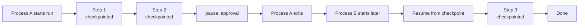

# Workflow engine

`@graphorin/workflow` is the durable workflow layer of the framework. It owns the synchronous-step execution loop, the Graphorin-named primitive set (`Directive`, `Dispatch`, `pause`, channel kinds `LatestValue` / `Reducer` / `Stream` / `Barrier` / `Ephemeral` / `AnyValue` / `ListAggregate`), the per-channel atomic merge resolver, the HITL `pause(...)` / `resume(directive)` lifecycle, and the `AbortSignal`-aware cancellation contract.

## Library-mode-first

Every primitive you need to write a small workflow ships from the npm package. No standalone server required:

- `createWorkflow({...})`
- `createNode({...})`
- `Directive`, `Dispatch`, `pause(value)`
- `latestValue`, `reducer`, `stream`, `barrier`, `ephemeral`, `anyValue`, `listAggregate`
- `InMemoryCheckpointStore`

For production, plug in `@graphorin/store-sqlite`'s `SqliteCheckpointStore` to get durable-by-default checkpoint persistence.

## Quick start

```ts file=order-workflow.ts
import {
  createNode,
  createWorkflow,
  Directive,
  InMemoryCheckpointStore,
  latestValue,
  listAggregate,
  pause,
} from '@graphorin/workflow';

interface OrderState {
  status: 'pending' | 'validated' | 'approved' | 'shipped';
  notes: ReadonlyArray<string>;
  decision?: 'approved' | 'rejected';
}

const checkpointStore = new InMemoryCheckpointStore();

export const orderProcessing = createWorkflow<OrderState>({
  name: 'order-processing',
  channels: {
    status: latestValue<OrderState['status']>({ default: 'pending' }),
    notes: listAggregate<OrderState['notes']>({ default: [] }),
    decision: latestValue<OrderState['decision']>(),
  },
  nodes: {
    validate: createNode<OrderState>({
      name: 'validate',
      run: async () => ({ status: 'validated', notes: ['validated'] }),
    }),
    awaitApproval: createNode<OrderState>({
      name: 'awaitApproval',
      run: async () => {
        const decision = pause<{ kind: 'approval' }, 'approved' | 'rejected'>({
          kind: 'approval',
        });
        return { decision, status: decision === 'approved' ? 'approved' : 'pending' };
      },
    }),
    ship: createNode<OrderState>({
      name: 'ship',
      run: async () => ({ status: 'shipped', notes: ['shipped'] }),
    }),
  },
  edges: [
    { from: '__start__', to: 'validate' },
    { from: 'validate', to: 'awaitApproval' },
    { from: 'awaitApproval', to: 'ship', when: (s) => s.decision === 'approved' },
    { from: 'awaitApproval', to: '__end__', when: (s) => s.decision !== 'approved' },
    { from: 'ship', to: '__end__' },
  ],
  checkpointStore,
});

const stream = orderProcessing.execute({}, { threadId: 'order-42' });
for await (const event of stream) {
  if (event.type === 'workflow.suspended') {
    const resumed = orderProcessing.resume(
      'order-42',
      new Directive({ resume: 'approved' }),
    );
    for await (const next of resumed) {
      console.log(next);
    }
  }
}
```

## Why durable



Every execution step ends with a checkpoint written through the pluggable `CheckpointStore`. A new process - even on a different machine - can pick up exactly where the previous one left off via `workflow.resume(threadId, directive)`. HITL is a primitive, not a bolt-on.

### What the checkpoint carries

Each checkpoint persists the merged state, the per-channel versions, **and the resumable frontier**: every pending pause (parallel pausers included), every `Dispatch` task that has not run yet, and every node that completed but whose outgoing edges have not been walked. Nothing in flight is lost at a suspend/crash boundary - a sibling that completed while another node paused still fires its edges after resume.

### Recovery matrix

| Latest checkpoint status | How to continue | What happens |
|---|---|---|
| `suspended` | `resume(threadId, directive)` | The paused node re-runs with the directive value; parallel pausers re-suspend with their own values intact. |
| `running` | `resume(threadId)` | Crash recovery - the process died mid-run; execution continues from the last completed step. Completed steps are never re-run. |
| `aborted` | `resume(threadId)` or `retry(threadId)` | A clean `AbortSignal` boundary stop. Completed tasks of the aborted step replay from their persisted writes. |
| `failed` | `retry(threadId)` | Successful sibling tasks of the failed step replay from their persisted pending writes - **only the failed work re-runs**. |
| `completed` | n/a | `resume` reports `resume-without-suspension`. |

### Concurrency control

Every checkpoint write is guarded by a compare-and-set against the latest stored checkpoint. Since D1 the CAS is **atomic at the store layer**: `CheckpointStore.put(..., { expectedLatestId })` performs the comparison and the insert in one transaction (the bundled in-memory and SQLite stores both implement it; a custom store that ignores the option falls back to the engine's best-effort pre-check). Two racing resumes (even from different processes over one SQLite file) cannot both advance a thread: exactly one wins, the loser surfaces `checkpoint-version-conflict`. A second `execute()` on a thread whose latest checkpoint is still `running`/`suspended` is refused the same way; re-executing a terminal (`completed`/`failed`/`aborted`) thread is allowed. Within one `Workflow` instance, a concurrent second `resume` fails fast with `concurrent-resume-rejected`.

Within one step, `maxConcurrentTasks` bounds how many planned tasks (including `Dispatch` fan-outs) execute simultaneously; tasks past the cap queue and start as slots free up. Absent, parallelism is unbounded.

### The re-execution contract

Graphorin deliberately uses **snapshot-resume, not deterministic replay** (no Temporal-style event-sourced re-execution - that would handcuff all user code to determinism). The consequences you must design for:

- On resume, the paused node's body re-executes **from the top**. Earlier `pause()` calls inside the same body replay their already-delivered values in order; only the first unsatisfied `pause()` suspends again.
- **Side effects before a `pause()` run again on every resume of that node.** Make them idempotent, or move them into a separate upstream node (whose completed step is never re-run).
- A `pauseAt.before` static gate re-runs the gated node with *no* replayed values - operator approval of the node is not an answer to any programmatic `pause()` inside it.
- **Pause order must be deterministic.** The replay is positional, and each delivered value is journaled together with the identity of the pause it answered (durable-primitive kind, awakeable/approval name). A body whose pause ORDER depends on time, state, or model output now fails loudly with the typed `pause-replay-divergence` error - naming the node plus the expected and actual pause - instead of silently handing a resume value to the wrong wait. Two plain `pause()` calls are indistinguishable and are never flagged; checkpoints written before this check replay their old values unverified.

### State must be JSON-safe

Checkpoint state must survive a JSON round-trip and this is enforced identically on every store: a `Map`/`Set`/`Date`/class instance in a channel fails the checkpoint immediately with the typed `state-not-serializable` error naming the channel and path - instead of round-tripping in dev (in-memory `structuredClone`) and silently degrading to `{}`/strings under the SQLite store.

The same gate covers everything else that rides the checkpoint (W-121): pause values and approval payloads, `Dispatch` args, satisfied resume values, and operator directives. A `Date` passed as `Directive({ resume })` fails at resume ENTRY (pseudo-channel `<directive>`), before the node body runs - previously it persisted as an ISO string and the body silently received a string on the next replay.

### Durability modes

`durability: 'sync'` persists every step; `'exit'` skips intermediate `running` checkpoints (only suspensions, failures, and completion are durable) - under `'exit'` there is no crash-recovery point between suspensions, and skipped checkpoints are never reported or parent-linked. (The former `'async'` mode was removed: it was byte-identical to `'sync'`; a legacy `'async'` input is coerced to `'sync'` with a one-time warning.)

## Synchronous-step semantics

Tasks planned for an execution step run in parallel; their writes merge atomically per channel; the merged state is persisted; the next step plans against the new state. The semantics are documented for predictability under concurrent writes.

## Channel descriptors as merge strategies

| Descriptor | Merge behaviour |
|---|---|
| `LatestValue` | Overwrite; throws on a multi-write collision in the same step. |
| `AnyValue` | Last-writer-wins. |
| `Reducer((prev, next) => merged)` | Custom merge function. |
| `ListAggregate` | Append. |
| `Stream` | Append-only queue, optional uniqueness. |
| `Barrier(['a', 'b'])` | Keyed map of writer → value; **joins**: a node fed by 2+ of the barrier's writers is deferred until every writer in `from` has written, then runs exactly once with the complete map. |
| `Ephemeral` | Per-step value; not persisted. |

These names are part of the public API of `@graphorin/core/channels` and are not aliases for terms from any other workflow library.

## HITL via `pause(value)`

A node calls `pause(value)`; the engine catches the signal, persists state, and yields a `workflow.suspended` event with the supplied value attached. Calling `workflow.resume(threadId, new Directive({ resume }))` re-enters the paused node with the resumed value.

A node body may pause **several times**: each resume satisfies the next `pause()` in order (earlier ones replay their already-delivered values - see the re-execution contract above). Parallel nodes that pause in the same step each keep their own pending pause; resuming answers the first, and the others re-suspend untouched.

### Durable timers, awakeables, and approvals

Three durable primitives ride the same pause substrate (so they survive restarts inside the checkpointed frontier):

```ts
import { awaitExternal, requestApproval, sleepFor, sleepUntil } from '@graphorin/workflow';
import { orderProcessing as workflow } from './order-workflow.js';

const threadId = 'order-42';
interface WebhookPayload {
  readonly paid: boolean;
}

// Durable timer: suspends with a persisted wake-at timestamp.
sleepUntil('2026-08-01T09:00:00Z'); // or sleepFor(ms)
// Fire one due timer manually (the timer driver below does this for you):
const { fired, nextWakeAt } = await workflow.tick(threadId);

// Durable promise (awakeable): suspends under a name until an external
// system resolves it.
const payload = awaitExternal<WebhookPayload>('payment-confirmed');
// ...elsewhere: workflow.resolveAwakeable(threadId, 'payment-confirmed', payload)

// Persisted approval: an awakeable specialized for human sign-off.
const decision = requestApproval<{ ok: boolean }>('deploy-prod', { env: 'prod' });
// ...elsewhere: workflow.approve(threadId, 'deploy-prod', { ok: true })
```

`getState(threadId).pendingPauses` surfaces the full pending set - timers carry `wakeAt`, awakeables/approvals carry `name` - so schedulers and approval UIs can render what a thread is waiting for. Resolving a name that is not pending fails with `pause-not-found`.

### Firing durable timers

Nothing needs to poll by hand: `createTimerDriver` ships with the package. The engine stamps the earliest due timer on every suspended checkpoint (`CheckpointMetadata.wakeAt`), the store enumerates due threads (`CheckpointStore.listSuspended` - implemented by the SQLite adapter and `InMemoryCheckpointStore`), and the driver ticks them on a poll loop that re-arms at `min(pollIntervalMs, earliest nextWakeAt)`:

```ts
import { createTimerDriver } from '@graphorin/workflow';
import { createSqliteStore } from '@graphorin/store-sqlite';
import { orderProcessing as workflow } from './order-workflow.js';

const store = await createSqliteStore({ path: './app.db' });
await store.init();

const driver = createTimerDriver({
  workflows: [{ workflow, checkpointStore: store.checkpoints }],
  pollIntervalMs: 30_000,
});
driver.start(); // library mode; driver.stop() on shutdown
```

On the server, wire the same driver through the lifecycle daemon instead: `createServer({ workflowTimers: { driver } })` starts and stops it with the process and reports `sweeps/fired/errors/nextWakeAt` under `checks.workflowTimers` on `/v1/health`. Per-thread tick failures are isolated (`onError`), and a `checkpoint-version-conflict` from two drivers racing the same thread is treated as benign - the store CAS already picked a winner. A custom `CheckpointStore` without `listSuspended` fails fast at `createTimerDriver` with a typed error rather than silently never firing. Threads suspended by versions before the `wake_at` column existed are invisible to the driver until one manual `tick` (or any resume) re-persists them.

### Per-node timeout and retry

```ts
import { createNode } from '@graphorin/workflow';

const run = async () => ({ fetched: true });

createNode({ name: 'fetch', run, timeoutMs: 30_000, retry: { maxAttempts: 3, backoffMs: 250 } });
// or workflow-wide: createWorkflow({ ..., nodeDefaults: { timeoutMs, retry } })
```

`timeoutMs` is a hard per-task wall-clock budget: on expiry the task's `ctx.signal` aborts (a well-behaved body stops; one that ignores the signal keeps running in the background, same contract as cancellation) and the task fails with `node-timeout`. `retry` re-invokes the body on thrown failures only - `pause(...)` suspensions, aborts, and timeouts never retry - with exponential backoff.

### Version pinning and divergence detection

`createWorkflow({ ..., version: '2.1.0' })` stamps the definition version into every persisted frontier. A resume whose stored version differs fails loudly with `workflow-version-mismatch` (override per call with `{ allowVersionMismatch: true }` after verifying compatibility). Independently, a resume whose frontier references nodes absent from the current definition fails with `workflow-divergence` - persisted state never silently replays through changed code.

### Step journaling (opt-in)

`createWorkflow({ ..., journalSteps: true })` narrows the crash-between-execute-and-persist window: before each step the engine journals a step-intent record against the parent checkpoint, and each completed task journals its channel writes as it finishes. Crash recovery from a `running` checkpoint then replays the journaled writes of completed tasks exactly once and re-runs **only** the unfinished ones - for the vast majority of crash points, finished work does not repeat. What remains is honest at-least-once for the task's side effects: the journal entry is written **after** the task finishes, so a crash between the effect completing and its writes landing re-runs that task on recovery. For strict once-semantics make the effect idempotent, exactly as the [re-execution contract](#the-re-execution-contract) requires around `pause()`. Costs one extra store write per completed task; the first step of a run has no parent checkpoint to journal against and re-runs whole on a crash.

## Static `pauseAt`

Declare suspension points without hand-rolling `pause(...)` inside the node body:

```ts no-check
createWorkflow({
  // …
  pauseAt: { before: ['shipOrder'], after: ['chargeCard'] },
});
```

## Dynamic parallelism via `Dispatch(node, args)`

A node returns one or more `Dispatch('processOrder', { orderId })` directives; the engine schedules each as a parallel task in the next execution step. Construct them via `dispatch(...)` / `new Dispatch(...)` - a bare `{ nodeName, args }` object is treated as channel writes (workflow-13), so a state shape that happens to use those keys is never silently swallowed as a task. `Directive.goto` remains a destructive operator escape hatch: it discards the restored frontier (pending pauses included) in favour of the single goto task.

## Cancellation

```ts
import { orderProcessing as workflow } from './order-workflow.js';

const input = {};
const ac = new AbortController();
const stream = workflow.execute(input, { signal: ac.signal });
// later
ac.abort();
```

Aborting stops the run within the configurable grace window (default 100 ms) and produces a structured `WorkflowAbortedError`. Pending tasks see the same signal via `ctx.signal`.

## Stream modes

```ts
import { orderProcessing as workflow } from './order-workflow.js';

const input = {};
workflow.execute(input, { stream: 'updates' });
```

| Mode | Yields |
|---|---|
| `values` (default) | Final state at every step. |
| `updates` | Per-channel deltas. |
| `messages` | Reserved for a future message-shaped projection (assistant turns + tool calls); **currently behaves as `updates`**. |
| `tasks` | Task lifecycle events. |
| `checkpoints` | Checkpoint metadata. |
| `debug` | Everything, verbose. |
| `custom` | A node-defined trace. |

## Forking

`workflow.fork(threadId, fromCheckpointId)` creates a parallel timeline branched off a previous checkpoint without touching the original thread.

## Composition with `@graphorin/agent`

`@graphorin/workflow` does **not** depend on `@graphorin/agent`. The two compose orthogonally - a workflow node may invoke `agent.run(...)` directly from its `run(state, ctx)` body, but no import edge ever crosses between the two packages. Pick the right primitive for the job:

| Primitive | Lives in | Lifecycle | Durability |
|---|---|---|---|
| `Dispatch(...)` | `@graphorin/workflow` | per workflow execution step | checkpointed |
| `agent.fanOut(...)` | `@graphorin/agent` | per agent run (single agent step) | inline (no per-child checkpoint) |

Use `Dispatch(...)` when:

- the parallel work needs to **survive process restart**, OR
- the parallel tasks are durable graph nodes with their own edges, OR
- the parallel work spans **multiple workflow execution steps**.

Use `agent.fanOut(...)` when:

- the parallel work is inline within an agent's reasoning loop, AND
- the children are sub-agents, AND
- the result is consumed by the parent agent's continuing loop without checkpointing.

## Typed error surface

`WorkflowError` is the base class with a stable `code` discriminator. The full `WorkflowErrorCode` union covers:

`invalid-config`, `invalid-channel-write`, `multi-write-into-latest-value`, `unknown-node`, `thread-not-found`, `checkpoint-not-found`, `checkpoint-version-conflict`, `resume-without-suspension`, `concurrent-resume-rejected`, `pause-not-found`, `workflow-aborted`, `workflow-cancel-timeout` (the cancellation grace expired with tasks still unsettled), `max-steps-exceeded` (the `maxSteps` runaway cap fired - counted PER INVOCATION of execute/resume/retry/tick since W-122, so long-lived timer/approval threads never trip it and a capped invocation is retryable; the opt-in `maxTotalSteps` adds a lifetime quota under the same code), `pause-replay-divergence` (W-120: the body's pause order diverged from the journal), `node-execution-failed`, `node-timeout` (a per-node `timeoutMs` expired), `reducer-failed`, `state-validation-failed`, `workflow-version-mismatch`, `workflow-divergence`, `dead-end`, `state-not-serializable`. (`cycle-detected` was removed: cycles are legal in this engine - runaway loops are bounded by `maxSteps`.)

Two of these are planning-honesty guarantees: a conditional fan where **no** edge fires and no `__end__` edge is satisfied raises `dead-end` instead of silently completing, and non-JSON-safe channel values raise `state-not-serializable` at the first checkpoint on every store.

## Pluggable observability

Pass the `tracer` from `@graphorin/observability` to record `workflow.run`, `workflow.step`, `workflow.task`, and `workflow.checkpoint` spans.

## Retention and cleanup

The engine writes a full JSON snapshot of the workflow state on every superstep, plus `workflow_pending_writes` rows; with `journalSteps` the step journal rides inside the state and inflates every snapshot. Storage therefore grows as roughly `state size x steps` per thread, and the engine itself never deletes anything: a finished thread is still needed for inspection and duplicate-resume refusal, and how long to keep it is an operator decision. Three primitives cover the lifecycle (the first two live on `CheckpointStoreExt`, implemented by both `@graphorin/store-sqlite` and the in-memory store):

- `pruneThreads({ beforeEpochMs, onlyTerminal })` - the retention sweep. A `(threadId, namespace)` pair qualifies when its latest checkpoint is older than the cutoff and (by default) terminal: suspended threads hold live HITL approvals and awakeables and survive the sweep unless you pass `onlyTerminal: false`. The sweep is namespace-scoped by construction - with a reused `threadId` (for example a session id shared by two workflows), pruning workflow A's finished thread never touches workflow B's suspended checkpoints.
- `compactThread(threadId, namespace, keepLast)` - in-place history compaction for long-lived threads. Resume always reads the latest tuple, so `keepLast >= 1` never breaks resumability. Compaction does delete time-travel/fork targets, and the oldest surviving checkpoint's `parentId` may point at a deleted row - `getTuple`/`list` never resolve parents and the CAS compares only the latest id, so this is safe, but forks from compacted history are gone.
- `deleteThread(threadId)` - full erasure of one thread across ALL namespaces (the host calls it when a thread's data must disappear, e.g. after exporting results). Because it is namespace-blind, never use it as a retention sweep - that is what `pruneThreads` is for.

Session-linked checkpoints (agent HITL suspends and threads attached via `Session.attachWorkflowRun`) are additionally erased by the session hard-delete cascade - see the erasure guide in [Privacy](/guide/privacy).

## Next steps

- [Agent runtime](/guide/agent-runtime) - pair workflows with agent runs.
- [Persistence](/guide/persistence) - wire a SQLite-backed checkpoint store.
- [Standalone server](/guide/standalone-server) - expose workflow lifecycle over REST.
- [Examples](/guide/examples) - durable approval workflow walkthrough in the repository.

